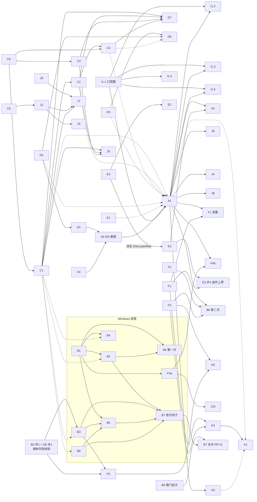

# 开发执行计划（2026-09-23 起）

> 主开发者按第一性原理定计划；细节由 11 路 Opus 子代理分组查实（每条改哪里、门、成本都指回代码行或 HANDOVER 行），1 路整合，2 路审查，1 路按审查改。
> 本文是审查修订后的正文。各组详稿（约 300 KB，03:26 版）见 `deliverable/开发执行计划_2026-09-23_各组详稿.md`；详稿与本文第 6／8 节的统稿勘误不一致时，以本文为准。
> 【待决定】共 94 条，按编号回答即可；先答第 5 节开头那几条（决 01～04、34、35），排期取决于它们。
> ★ 2026-09-23 下午追加 决 95～100（第 5 节末尾），来自 F6 落地（`§0.-19`）、对抗审查与两次归因（`§0.-20`）；决 04 有了新证据（W06 端到端，`§0.-17` 庚）。

---

# 开发执行计划（2026-09-23 起，按两份审查意见改过）

写给业主。按「可以做错，不可以让人以为的和事实不一样」来写。每个数都带出处，查不到的写「未查到」，推出来的写「推断」。

**基准。** 本摘要（第 1～5、7、8 节）按分支 `claude/tender-faraday-bvs4in` 的 **1fdeeca** 核，03:38 复查，与 origin 同步。
- 1fdeeca 与 5b41fac 的 HANDOVER 行数相同（8526 行）。a43707b 只改了 :84 一行。所以按 5b41fac 写的 HANDOVER 行号在 1fdeeca 上照样成立。
- a468063 与 ae8d110 的 HANDOVER 逐行相同，比 5b41fac 少约 10 行。
- 行号凡引自 a468063 的，都在括号里写明「a468063」。没写的，一律指 1fdeeca。
- 旧版开头写「A～H 组按 a468063／ae8d110 核」，这句不对。C、D、H 组实际用的是 5b41fac 的行号，J1 有一处用的是 a468063 的。逐条勘误见第 6 节统稿第 14 条。

**全文（含第 6 节七组原稿，约 300 KB）在** `/tmp/claude-0/-home-user-Pt-Optimize/edf845d6-9a14-5b5e-9737-df190eaf0db5/scratchpad/plan/开发执行计划_2026-09-23.md`。那份文件是 03:26 的版本，没有按审查意见改过。它和本摘要不一致的地方，以本摘要第 6 节的统稿清单为准。

## 1. 一句话现状

- **已落地：**
  - 0.5 mm 舌保温格、三关入口（FinalCheck）、伸长报告、舌保温可行窗口、牌号灰显、δ 退役、寿命注记。
  - N 网格修复并入合并树。
  - `R48MStopTolCostTests` 门 d 换了参照，在 Linux 上过了（5b41fac）。换法是开发者先定的，要业主追认，见决 21。
  - 文档 v7.0 三份草稿已入库（1fdeeca）：`docs/Pt_理论模型_v7.0.md`、`docs/Pt_工程师版_v7.0.md`、`docs/APP使用说明书_v7.0草案.md`，外加两份 docx。
- **没落地：**
  - **还没有一份设计在最终口径下解出来、三关全过。** 最终口径指 20 mm、0.025 K、段解地板、N 网格、0.5 格。
  - Linux 预跑（`R48LFineMeshEndToEnd`，不是 A1 首选的 `R48MMergedResolve`）还在跑。W06 活页 `/tmp/R48_L_细网格_W06_2026-09-23_013041_进行中.log` 在 03:37 那一行写着累计 127.0 min，仍在导航档。导航闸是 2.5 h（`R48LFineMeshEndToEndTests.cs:59`），剩约 23 min。推断这一跑很可能被切断。它和 wtW3 的测试、F6 工作流在同一台机器上跑（审查 2 在 03:30 用 ps 见到）。W08 还没开跑。
- **新红（a43707b）：** `R48MStopTolTwoPointTests` 的注射支在合并树上红。13.074 那一点只跑 74 轮就收敛，门槛是 300 轮以上，门判「守的是空气」。病因是 N 网格把根挪了约 0.2 mm。证据已入库（`…两点门_…021244.txt`、`…停机容差阶梯_两点_…021244.txt`），HANDOVER.md:84 已填好。要在新网格上重找贴根点。a43707b 把这一步排在 F6 之后，这个次序是开发者定的，要业主认，见 D7 和决 92。
- **网格无关一档都没往下走。** `R48NMeshGateTests` 门 d 仍有 1/3 不过（审计 gaps 2）。
- **合并树的 Windows 门一道没跑：** 全 sln 编译、UiWiring、全快套件、抓图都没跑。LineDump 六个 SHA 要在 Windows 重录，而且要先修墙钟字段。
- **交叉验证：** 四家族只有旧口径的数，汇总表同口径的是 0/8 格。拓扑阶段 3 和 DOE 没有证据。
- **铜镍没入库。**
- **PR #1：** 是 draft，领先 `feat/geom-and-flange-accounting` 8 个提交，落后 0 个（`git rev-list`），可以快进。

## 2. 总览表

**图例**
- 状态：✗ 没做，◐ 部分，✅ 有证据。
- 「覆盖」：这道门覆盖需求的哪一部分。查不到的写「未知」。
- 人时、机时都取自各组草稿，出处见第 6 节各条。
- 「Win」：要不要业主的 Windows 机。
- 「决」：第 5 节的编号。
- 标「（新）」的门，仓库里还没有（grep 为空）。
- 门名一律写「类名＋门字母」，因为「门 d」在两个类里各有一道。

| 编号 | 名称 | 完成定义一句 | 覆盖 | 状态 | 依赖 | 人时／机时 | Win | 决 |
|---|---|---|---|---|---|---|---|---|
| A1 | W08／W06 最终口径端到端重解 | R48MMergedResolve 两档：FineRefined、判「可行」、三关按 ①②③、铂重和窗口 | 只 W08、W06 两份设计 | ◐ Linux 预跑中（跑的是 R48LFineMeshEndToEnd） | A4（W3 那次重跑）；I1.1 步1 口径戳；决 01 | 5 h／R48MMergedResolve 每档≤7.5 h（求解闸 4 h＋窗口闸 3 h＋约 0.5 h）；选决 02 (b)(c) 另加每档≤11 h | 是 | 01-04 |
| A2 | 不可行时盘径和舌半宽杠杆 | 热点拆解表＋两个形状点真解＋上界出处表 | 条件项；只两个形状点 | ✗ 条件项 | A1；E3 步1；决 93（U 探针） | 12 h／几分钟＋1～2 天 | 是 | 05-08、93 |
| A3 | 网格无关阶梯 | 1.0／0.5／0.25 三档 Converged、非 Undecidable、峰在细区 | 1 份设计 × 3 档；升温八设定点不覆盖（决 11） | ✗ | 步1 无；步3 A1 | 5 h＋／约 3 h＋R48NMeshGateTests 门 d 12.9 min | 是 | 09-11 |
| A4 | 无跨解残留重验 | 六种次序签名逐位全等 | 六种次序；跨轮热启动不覆盖（决 12） | ◐（09-17 旧码过） | W1 一次无依赖；W3 重跑在 D1 之后 | 3 h／每次 Win 30～45 min，共两次 | 可选 | 03、12 |
| B1 | 全 sln 编译＋装钩子 | 0 错误，hooksPath=.githooks | 全 sln 编译 | ✗ | 无 | 0.5 h／数分钟 | 是 | 无 |
| B2 | UiWiring 靶按变因重记 | 退出码 0，两跑逐位同，容差不动 | 一个走查靶（合计容差 2.0 g）；其它页未知 | ✗ | B1；决 01 | 1～1.5 h／8～10 min | 是 | 13、14、01 |
| B3 | LineDump 六 SHA 重录 | 修墙钟字段后，两跑六 SHA 逐位同 | 六个算例的全部公开成员（排除机时量后） | ✗（Linux 红） | 步1-3 无；步4-5 B1 | 4～6 h／Win 18 min，新字段每批另加一次 | 是 | 15、16 |
| B4 | ClampFace c／Recipe d 在 Win 确认 | Win 过，不改记录 | 两条门 | ✗ | B1 | 0.3 h／0 | 是 | 25 |
| B5 | 「应为 1462」换实数 | 计数门绿（含 D5 明细、K2 步6） | 只核总条数 | ✗ 推算数 | B1、B3、B8、各新门；W6 复核 | 0.5 h／10 min，每加门一次改 | 是 | 无 |
| B6 | 重抓界面图（含 F5） | --uishot 退出码 0，逐张目视 | 抓到的档；目视，无门 | ✗ | B1、B2；第二次在 F1～F3 之后 | 1 h／约 5 min，共两次 | 是 | 17 |
| B7 | 并主线＋带钩子提交 | 至少一次钩子四道门真跑；PR #1 快进合并 | 钩子四道门；不含慢门 | ✗ | 首次钩子：B1、B2、B3、B5、B8；合并：B9 | 1.1 h／每次 17～20 min（推断） | 是 | 18-20 |
| B8 | R48MStopTolCostTests 门 d 换参照 | 四行 ≤0.05 K，加单元数前提检查 | 只四行（10／20 mm × 细／导航） | ◐ 已按决 21 选项 A 改（5b41fac），Linux 过，待业主追认；Win 未跑 | 无 | 0.5 h／Win 13～15 min | 是 | 21、22 |
| B9 | 发布前慢门批次（新增） | 带「慢」标签的门全部跑完，每道一行结果 | 96 个带 `Trait("速度","慢")` 的测试文件（grep） | ✗ | W1～W5 各项 | 2～4 h 人时整理（推断）／总机时未查到，推断至少 2 夜 | 是 | 94 |
| C0 | F 系列改前基线 | 8 行＋门 b 等存成带时刻的文件 | 改前的 8 行＋门 b 等 | ✗ | 无；钉在 1fdeeca（F6 之前） | 1～2 h／12 min＋慢门 1.3～1.8 h | 是 | 24 |
| C1 | F6 孔边面上定电位 | a′、环带、R48NMeshGateTests 门 b 绿、开关关逐位 | 门 b 盘径 3 点（归因 F6）；舌半宽 5、孔径 2 点未归因 | ✗（wf_f80f6568 在做） | C0 | 6～8 h／慢门 1.3～1.8 h＋重解最坏 19 h | 重录要 | 01、25 |
| C2 | F3 面发热 | 闭合 1±1e-6 | 闭合一条 | ✗ | C1 | 5～7 h／并入 C1 批 | 重录要 | 26、27 |
| C3 | F4 分区按份额 | 和账、体积 ≤0.1 %、硬判据逐位 | 未知 | ✗ | C0 | 2～3 h／约 24 min | 是 | 28 |
| C4 | F7 细区半径解耦 | 半径不随舌长变，热点门 null | 未知 | ✗ | C0、C1、C2 | 3～5 h／1.3～1.8 h＋重解 | 重录要 | 29 |
| C5 | 图纸幻影料 | 区间门 ≤0.1 %／≤0.1 W | 未知 | ✗ | 无；步3 Win＋Rhino | 7～10 h／每层多几秒 | 是 | 30、31 |
| D1 | 雅可比按管侧指纹缓存 | 三道门（逐位、次数、键完整） | 按决 32 所选范围 | ✗ | D4 | 6～8 h／约 2.5 h | 可选 | 32 |
| D2 | 走格真路径留痕 | 真求解计数 ≥1，或业主认可结案口径 | 计数≥1 只证明走过；其余未知 | ✗ | 无 | 2～3 h（＋4～6）／0～1.5 h | 否 | 33 |
| D3 | 段解地板阶梯 | 因子阶梯文件（只量） | 只量，不判 | ✗ | 要在 A1 正式跑前定 | 4～6 h／约 1 h | 改则要 | 34、01 |
| D4 | 放大余量 1.1 | 比值表＋源码门 | 8 例 | ◐（8 例表） | 要在 A1、D1 前定 | 4～6 h／40～60 min | 改则要 | 35、01 |
| D5 | 1410／1224 | 分类计数明细 | 分类计数 | ✗ | 与 B5 同跑 | 2～3 h／10 min | 是 | 36 |
| D6 | 阈值出处＋轮数门 | 出处表、轮数门、LineDump 两跑同 | 轮数门；墙钟门见决 22 | ✗ | 步1=B3 步1；参照等 D3、D4、C 组 | 5～7 h／约 22 min＋ | 部分 | 22、23 |
| D7 | 两点门在新网格上重找贴根点（新增） | R48MStopTolTwoPointTests 注射支在合并树上按门槛判红为病、判过为治 | 注射支现在覆盖 0 | ✗（a43707b 红） | C1～C4（它们还会动网格）；决 92 | 2～4 h（推断）／约 59 min（a43707b 两条合计） | 否 | 92 |
| E1 | 保温 k(T) 出处 | ①② 层 KSourceNote 非空，逐点门 | ①② 层 | ✗ | 采集；换系数要在 A1 前 | 3～4 h＋采集／8 min（换系数约 5 h） | 换则要 | 37-40 |
| E2 | 圆盘分内外环 | 同厚逐位、只动外环、接线 10/10 | 未知 | ✗ | E4、决 05 | 2～3 人日／约 1.1 h＋一次 LineDump 重录 | 抓图 | 41-44 |
| E3 | 搜索上界出处 | 8 个字面量一处定义，停在上界时说实话 | 8 个字面量 | ◐ | 步1-3 无；步4 A1；DiscLayerMax 等 E4 的决定 | 约 1 人日／约 5 h 并行 | 抓图 | 07、45 |
| E4 | 圆盘保温能否超 20 mm | 业主原话落到常量和门 | 业主原话一条 | 待决定 | 探针无依赖（用 J3 那份设计） | 4 h／1.5 h | 抓图 | 46 |
| F1 | 窗口扩到其它旋钮 | 快门 7 条＋真量慢门 | 一次只动一根旋钮、一片 | ✗ | 代码无；真量 A1 | 2～3 人日／每份 3～6 h | 是 | 47-51 |
| F2 | 段表牌号过齐全度 | R48FSegGradeTests（新） | 段表牌号 | ✗（有真问题） | 无 | 4～6 h／约 10 min | 是 | 52-54 |
| F3 | 外推伸长说真话 | R48FElongExtrapTruthTests（新） | 外推段 | ✗ | 无 | 3～4 h／22～50 min | 否 | 55 |
| F4 | 界面一键 ①②③ 存档 | F4a／F4b 存档带时刻 | ①②③ 存档 | ✗ | F4a：B1；F4b：A1 | 6～10 h／2～3.5 h（F4b 另加求解） | 是 | 56 |
| F5 | N 并入后重抓全套图 | 并入 B2＋B6 | 同 B2、B6 | ✗ | 同 B6 | 见 B2、B6 | 是 | 17 |
| H1 | 物性按牌号接线验收 | 六条（纯铂逐位、PtRh10 进链、说真话门翻面等） | 六条；密度、熔点未按牌号（决 57） | ◐（wtW1 在写） | B3 步1 与首次重录；wtW1 | 12～17 h／3～5 h＋一次 LineDump 重录 | 部分 | 57-60 |
| H2 | 铜镍入库 | 出处逐位门、铜电阻率对账、差胀可见 | 未知 | ✗ | 步1-3 无；其余 H1、F3 | 10～30 h／约 25 min | 抓图 | 61-64 |
| H3 | 铜排总热导说明 | 说明与行为一致的门 | 一道一致性门 | ✗ | 无 | 1～2 h／快套件一次 | 抓图 | 65 |
| I1.1 | 汇总表与口径戳 | R48ICrossFamilyTableGateTests（新）4 条 | 4 条门；表同口径 0/8 格 | ✗ | 无 | 5～7 h／约 7 min | 否 | 66 |
| I1.2 | 求解器行 | 两格按 A1 结果填 | 两格 | ◐ | A1、I1.1 | 1 h／算在 A1 | 否 | 02、04 |
| I1.3 | 解析 A 线行 | 新报告，每个输入指回输出 | 未知 | ◐ 旧口径 | A1、I1.1 | 8～10 h／<40 min | 脚本 | 67 |
| I1.4 | 几何粗网 DOE | R48IShapeDoeTests（新），每点带戳和停因 | DOE 点，看决 06 | ◐ 旧口径 | I1.1；S1 要 A1；决 93 | 8～12 h／7～90 机时 | 是 | 06、07、93 |
| I1.5 | 拓扑阶段 3 | 同路同网格判三份 | 一份三判 | ✗ | I1.1、A1、业主拷文件 | 6～9 h＋业主 0.5～1 h／<1 h | 是 | 68 |
| I2 | R 线结论进 HANDOVER | 庚节，DocRefTests 过 | 文档引用门 | ◐ | 无 | 2～3 h／7 min | 合代码则要 | 69 |
| J1 | #9 r₁/r₂ | 待办行照实，可选比价仪器 | 未知 | ◐ | 步2 A1 | 3.5 h／20 min～4 h | 否 | 70、91 |
| J2 | #12 图纸对解析整线对账 | 6 条判据数差 ≤ 容差 | 6 条判据 | ✗ | 步1-2 无；C5 | 约 1.5 d／约 25 min＋Win 1 h | 部分 | 71 |
| J3 | LevelSolver | 业主定接不接 | 未知 | ✗ | 步1 无；J2 | 0.5 h～4 d／8～10 h | Rhino | 72 |
| J4 | #15 Pt_Heater1 端到端 | 7 环全程，判据全过或停因 | 7 环 | ✗ | A1、决 72 | 约 1 d／5～25 h | 是 | 73 |
| J5 | 四叉树各向异性 | 格数少、判据差 ≤ 加密一档 | 未知 | ✗ | C1-C3 | 0.5 h～6 d／1～2 h | 改则要 | 74 |
| J6 | R3 最省验收 | 「去一格」证书 | 去一格 | ◐ | A1 | 约 1 d／2.2～3.7 h | 是 | 75 |
| J7 | R6／R13 形状族与孔位 | 业主决定后登记或接线 | 未知 | ◐ | J9、J2、C1 | 1 h～3 d／一轮约 2 h | 视选项 | 76 |
| J8 | R10 一轮内协同 | 协同算例门 | 未知 | ◐ | A1 | 1～4 d／2～4 h 起 | 改则要 | 77 |
| J9 | R12／R13 状态格与孔心重测 | 状态照实，孔位扫描 | 孔心扫描 | ◐ | 无 | 0.5 d／10 min～1 h | 否 | 78 |
| J10 | R9／R16 分母 | 旗标清单门 | 旗标清单 | ◐ | F4 | 1.5～2 d／秒级 | 否 | 79 |
| K1 | 文档 v7.0 定稿 | 占位符清零、业主审过 | 占位符计数 | ◐ 草稿已入库（1fdeeca）；【待补】140＋69＋5 处（grep -o） | A1；A3、C1 若动数 | 22～28 h／10～20 min＋图 | 图要 | 80-86 |
| K2 | HANDOVER 维护规矩 | 两道新门（HandoverSectionRefTests、LandingSectionShapeTests，都是新），实数替推算 | 两道新门 | ◐（步7 已由 a43707b 做掉） | 步6 = B5 | 4～6 h／约 7～10 min | 步6 | 87、88 |
| K3 | APP 说明书 | 两道新门，业主定写几处 | 两道新门 | ✗ | 决 89；F1、F3 | 7～10 h／约 7 min 起 | 是 | 89、90 |

**新字段规矩（凡给 LineResult、DesignSpec、Verified 等加公开成员的项）。**
- 原因：`R48LineDumpTests.cs:27-29` 会转储算例的全部公开成员（含 Base），和 LineResult 的全部公开成员。
- 受影响的项：
  - F1 步6，给 LineResult 加字段；
  - E2，DesignSpec 加新字段；
  - H1，Verified 加 `grade`；
  - E4 选 (d)；
  - 决 65 选 A。
- 这些项二选一：
  - 在 W3 批次之前落地；
  - 或者自带一次 Windows LineDump 重录，约 18 min，外加约 0.5 h 人时（推断）。变因写「新增成员 X」，数值行必须零差。
- 拟合、克隆、存档、界面、门，都要接全。

## 3. 依赖图

实线表示必须先做。虚线看第 5 节决 01，也就是规则改动放在 A1 正式解之前还是之后。A3 → K1 是「若动数」，也画成虚线。

图里没画的项，互不依赖，随时能做：C5 步1-2、D2 计数、D5 明细、E1 采集、E4 探针、H3、I2、J1 步1、J9、K2 步1-5、K3 步2-7。

改图时修正了这几处：
- 删掉了 D2 → A1。D2 是计数和留痕，不挡 A1，表里也写的是「无」。
- 加了 I1.1 → A1，因为 A1 的结果要带口径戳。
- F4 拆成 F4a 和 F4b。按决 56，F4a 可以用旧 W08。
- 加了 C1 → J7。
- E4 → E3 标明了方向。
- A4 分成两次跑。
- B6 分成两次抓。
- B7 分成首次钩子和合并两步。

## 4. 执行顺序与里程碑

**人手：** 一个开发者（本云端会话，兼做 Linux 跑），加业主的 Windows 机。Windows 机只做 Windows 步骤，跑夜间长跑。

**日历：**
- 按工作日算，第 1 天是 09-23。**人时按每天 8 h 折算**，这是本计划的假设。业主若另定，重排。
- 机时照各组草稿估，夜间长跑按「一夜」计。
- 业主审稿、供应商数据、拓扑文件拷入，这三样的日历时间不估，照实写「看业主」。

**同机并跑。** 凡是计时的数，都在证据文件头和提交说明里写「同机并跑」，并写明当时同机还在跑什么。要不就等 Linux 预跑和工作流停了再量。适用于：A4 Linux、D3／D4 计时、D6 步2 的门 c（约 22 min）、C0 Linux、E4 探针。

**两条路线，由决 01 选：**
- **路线甲「先改后解」：**
  - 先落地规则改动：C1、C2、C4（加 C3），D3／D4 的改动，E1 换系数（数据到了才换）。
  - 再做一次 Windows 重录批次，然后跑 A1 正式解。
  - 交付的数就是最终数。A1 只跑一次。
- **路线乙「先解后改」：**
  - A1 在第 2～3 天夜里就在 Windows 上按现有规则跑。
  - 交付的数带着已知的网格台阶：R48NMeshGateTests 门 b 盘径 ±0.4 %，C1 待决 a(2)。
  - 以后每改一条规则，A1 就要按所选测试再跑一轮：
    - R48MMergedResolve 两档并行，一夜，每档≤7.5 h；
    - R48LFineMeshEndToEnd 两份串行，最坏 19 h（C1 草稿），是两夜。
  - 每改一条，还要加一次重录批次。

下面按路线甲排。路线乙的差别写在每一波末尾。

### W0　第 1 天（09-23）：业主答决定，云端做无依赖的小项

- **业主：** 先答第 5 节「先答」那一组，它们决定 A1 什么时候跑、用什么跑。决 01 最迟第 3 天答，没答的话 W2 不开工，只做 W1 和两条路线共有的项。其余决定可以陆续答。
- **云端并行做下面几项，** 每项单独提交，提交说明写三段：
  - B3 步1：排除墙钟字段，加快门（即 D6 步1）。规则见统稿第 19 条。
  - A1 步2-3：标签改成「最终口径」，结果分段落盘。
  - I1.1 步1：口径戳。
  - E3 步1：查上界出处（git log -S）。
  - I2、H3、K2 步1-5。K2 步7 已由 a43707b 做掉，不再做。
  - B8 的单元数前提检查。
- **Linux 预跑：** 继续跑，不杀。被切断的话，照实登记「切断」，这是决 04 的直接证据，当天报给业主。A4 在 Linux 上原样跑一次，标「同机并跑」。
- **出口门：**
  - Linux 快套件，除了下面列的已知红以外全绿。已知红出自 HANDOVER.md:55-57、:59-65，都在 1fdeeca 上：
    - `HandoverGateCountTests`（计数门，镜像少了界面测试，必红）；
    - `R48NMeshGateTests` 门 b 三条，共 10 点：盘径 3、舌半宽 5、孔径 2（scratchpad/wtMN_fast.log:671）；
    - `R48ClampFaceGateTests.c`；
    - `R48ClampRecipeTests.d`。
  - 已知红的慢门另列，W0 不跑：
    - `R48LineDumpTests`：六个 SHA 全红（:80）；
    - `R48MStopTolCostTests` 门 c：335 s 对 219 s（:81）；
    - `R48MStopTolTwoPointTests` 注射支（:84，a43707b）；
    - `R48NMeshGateTests` 门 d：1/3 不过（审计 gaps 2）。
  - 每个提交都带三段说明。

### W1　第 2～3 天：Windows 定基线，云端只量不改

- **Windows**（业主机，约半天人工加一夜）：
  - B1：编译，装钩子。
  - 全快套件跑一次。B4、B5 试跑，D5 明细一起出。只记红表，不改「应为」。
  - B2：UiWiring 跑两次。B6 第一次抓图。
  - selfcheck 实跑一次（决 19 选项 A）。
  - `R48MStopTolCostTests` 门 d 记录跑（B8，13～15 min）。
  - `R48NMeshGateTests` 门 d 重跑（A3 步1）。参考耗时 12.9 min，6 路并发，出自 `网格修复_门d_收敛门_判决vs细_W08_…195938.txt:18`。
  - A4 Windows 第一次（30～45 min）。
  - C0 Windows 基线（约 12 min 加慢门），钉在 1fdeeca。
- **云端：**
  - B3 步2-3：diff 归类，查 AllOk 为什么翻转。
  - D6 步2-3：M 树对合并树的门 c，约 22 min，标「同机并跑」。
  - D3、D4 只量，约 1 h 加 40～60 min，标「同机并跑」。
  - D2 计数。
  - C0 Linux，钉在 1fdeeca。scratchpad 里已有 `f6_base.log`（03:11），它是否覆盖 C0 的范围，未查到。
  - E4 探针（约 1.5 h，用 J3 那份设计）。
  - F2、F3、C5 步1-2、K1 步1-5、K3 步2-7。K3 的门要到 Windows 上验。
  - C1 由 wf_f80f6568 在做，本计划接手它落地的结果，不另写一份。scratchpad 的 `f6_after.log` 在 03:38 的末两行是「Total time: 12.2805 Minutes」「EXIT 1」。红在哪，未查。
- **出口门：**
  - B1 0 错误。
  - Windows 快套件日志入库，每条红都有说明。
  - UiWiring 两跑逐位相同。
  - A4 六份签名全等，按决 03 定用 Linux 还是 Windows 的结果。
  - C0 带时刻的文件存在。D3、D4 量表入库。
- **路线乙：** 这一波的夜里，Windows 就跑 A1。两档并行一夜有撞 4 h 求解闸的风险，因为 09-18 那次就是同机并跑时撞的闸（HANDOVER.md:475）。串行要两夜，这一条是推断。

### W2　第 4～13 天：规则改动（只有路线甲有这一波）

已排的量合计 53～80 h：C1～C4 16～23 h，D1 6～8 h，H1 12～17 h，E1 3～4 h，D3／D4 改默认 0～4 h，F1 16～24 h。按每天 8 h 算要 7～10 天，所以这一波排成 10 个工作日（推断）。

- **云端写，Linux 验：**
  - C1（6～8 h，接手工作流的结果）→ C2（5～7 h）→ C4（3～5 h）；C3（2～3 h）并行。
  - D1（6～8 h），前提是决 35 没选 D。
  - D3／D4 按决定改默认值。
  - H1 验收（12～17 h），等 wtW1 的代码进分支后做。
  - E1：数据到了就换系数。
  - F1 代码部分（2～3 人日）。按新字段规矩，F1 步6 要么在 W3 之前落地，要么自带一次 LineDump 重录。
  - D7：C1～C4 落地后，在新网格上重找贴根点（看决 92）。
- **归因：** 每条改动都带「改回」参数，出一份「开 − 关」归因文件。C 组的慢门合成一轮跑，1.3～1.8 h。
- **出口门：**
  - Linux 快套件全绿。R48NMeshGateTests 门 b 若仍红，按决 25 登记成新开放项。
  - C 组慢门的归因文件入库。
  - 每个改了默认值的提交都写变因。
  - D7 有结果，或者按决 92 登记。
- **路线乙：** 这一波推到 W5 之后，A1 要再跑一次。

### W3　第 14 天：Windows 重录批次（一次做完）

- **顺序：**
  1. LineDump 跑两次并录（B3 步4-5，约 18 min）。
  2. ClampFace c／Recipe d（B4）。C1 已落地的话，这里是重录。
  3. UiWiring（B2）。
  4. `R48MStopTolCostTests` 门 d（B8，或按 C4 重做参照）。
  5. A4 Windows 第二次（30～45 min）。D1 的雅可比缓存正是跨解残留的来源，所以 A1 要依赖这一次。
  6. 全快套件，定「应为」的实数（B5 = D5 步2 = K2 步6）。
  7. 第一次带钩子提交（B7，每次 17～20 min，推断）。
  8. F4a（B1 之后就能做，放在这里和 Windows 批次一起）。
- **LineDump 再录的规矩：** H1 合入后，以及新字段规矩列出的各项落地后，LineDump 只许按「新增成员」这一类变因再录，每次约 18 min（见统稿第 3 条）。
- **出口门：**
  - LineDump 两跑六个 SHA 逐位相同。
  - 每个重录的数旁边都写着「旧 → 新、变因、两份证据文件名」。
  - A4 第二次六份签名全等。
  - 钩子四道门真跑过一次，过了，或者按决 18 登记。

### W4　第 15～16 天起（两夜起）：A1 正式解

- **Windows：**
  - `R48MMergedResolve` W08／W06 两档，每档最多约 7.5 h。闸是求解 4.0 h（`R48MMergedResolveTests.cs:60`）加窗口 3 h（`InsulWindow.cs:111`）。
    - 并行一夜，有撞 4 h 求解闸的风险（推断，理由同 W1）。
    - 串行要两夜。
    - 选哪样，看决 04。
  - 决 02 选 (b) 或 (c) 时，再跑 `R48LFineMeshEndToEnd` 两档。闸是导航 2.5 h、细网格 7 h（`R48LFineMeshEndToEndTests.cs:59、62`），串行最多约 22 h，要多 1～2 夜。
  - D1 门 1 若要在 Windows 上证，也放在这里。
- **云端：**
  - 读 Linux 预跑结果写对照。这只在决 02 选 (b) 或 (c) 时同口径，因为预跑跑的是 `R48LFineMeshEndToEnd`。
  - 读 Windows 结果，写 HANDOVER 新节。
- **出口门：** A1 两档的判词登记好（✅／◐／✗），结果文件带口径戳。撞了闸就照实写「切断」。

### W5　第 17～20 天：A1 之后的核验

- **A1 可行时：**
  - A3 阶梯（约 3 h）；J6 去一格证书（2.2～3.7 h）；F1 真量（每份 3～6 h）。
  - H1 配对重判（3～5 h）。
  - I1.2；I1.3（<40 min 加脚本）；I1.5（业主拷来文件后 <1 h）。
  - E3 步4（约 5 h 并行，要看决 07）。
  - F4b；J1 步2 和 J8 步1 按决定做。
- **A1 不可行时：** 做 A2（拆解几分钟，两个形状点约 1～2 天机时）。A3 照样在停机那份设计上跑，结果照实判读（A3 风险那一条）。
- **出口门：**
  - A3 三条同时满足，或者照实登记 Undecidable。
  - 汇总表至少把求解器、解析两类共 4 格填上。
  - J6 证书文件入库。

### W6　第 21 天起：长跑、慢门批次与文档

- **长跑：** I1.4 DOE 方案甲要导航 13～24 机时，加细网格 18～42 机时，要跑好几夜，看决 06。J4 要 5～25 h，看决 73。
- **B9 发布前慢门批次：**
  - 逐道列出机时。已记的数：
    - A1 那一级每档 7.5～11 h；
    - 两点门两条 59 min（a43707b）；
    - `R48MStopTolCostTests` 门 d 在 Linux 上 20 m 15 s（5b41fac）；
    - `R48NMeshGateTests` 门 d 12.9 min；
    - C 组慢门 1.3～1.8 h；
    - LineDump Win 约 18 min；
    - 门 c 约 22 min。
  - 其余的写「未查到」。HANDOVER 里没有「慢门全套」的总耗时（grep 为空）。
  - 推断至少要 2 夜，看决 94。
- **「应为 N」：**
  - W5、W6 还要加门：I1.1 四条，K2、K3 各两道，F1 七条，还有 A3、J6 的门。
  - 每个加门的提交，在同一个提交里改「应为」，变因写「新增门 X，n 条」。
  - 发布前在 Windows 上复核一次。
- **K1：** 填数，出 docx／PDF，审查两轮（22～28 h）。
- **K3：** 导出。
- **B6 第二次：** 等 F1～F3 的界面改完后再抓一次。
- **B7 合并 PR #1：** 放在 B9 之后。
- 业主审稿要多久，不估。
- **出口门：**
  - DocFinalizeTests（新）过。
  - 业主放行 v7.0。
  - B9 每道慢门都有一行结果。
  - Windows 计数门按实数绿。
  - PR #1 合进 `feat/geom-and-flange-accounting`。
  - HANDOVER 里没有【填入中】【待补】。

### W7　按业主决定（没排进 W0～W6 的项）

- **项和人时：**
  - E2：2～3 人日；
  - H2：10～30 h；
  - J2：约 1.5 d；
  - J3：0.5 h～4 d；
  - J5：0.5 h～6 d；
  - J7：1 h～3 d；
  - J9：0.5 d；
  - J10：1.5～2 d；
  - C5 步3：要 Windows 加 Rhino，3～4 h。
- **合计：** 按每人日 8 h 折算，约 56～190 h 人时（推断）。
- 下面的合计不含这一波。

**合计（都是推断）**
- **路线甲：**
  - 到「A1 有正式判词」约 16 个工作日。
  - 到「文档可以送审」，按 W0～W6 已排项的低端约 214 h 算（审查 2 的加总），每天 8 h，约 27 个工作日。高端没有合计。
  - 不含 DOE 的多夜长跑、W7 和业主审稿。
- **路线乙：**
  - 到 A1 判词约 3 个工作日。
  - 规则改完后，A1 要再跑一轮：R48MMergedResolve 约多 1 夜，R48LFineMeshEndToEnd 约多 2 夜。
  - 另加一次重录批次，约半天。
- **最大的不确定：** A1 会不会撞时间闸。
  - 走决 02 (a) 时，看 R48MMergedResolve 的 4 h 求解闸和 3 h 窗口闸。
  - 走 (b) 或 (c) 时，看 R48LFineMeshEndToEnd 的 2.5 h 导航闸。09-18 就撞过这道闸（HANDOVER.md:475，a468063 为 :465），当时也是同机并跑。

## 5. 【待决定】清单（按编号回答即可）

各组里同一件事的决定已经合并，合并处写了来源。成本都是草稿里的估计。

**先答这几条（排期取决于它们）**

决 05、07、08、38、46 也会让 A1 重跑或重判，所以也放进这一组。它们要是在 A1 之后才答，A1 可能要再跑一轮：R48MMergedResolve 约一夜，R48LFineMeshEndToEnd 约两夜（推断）。

- **决 01　规则改动放在 A1 正式解之前还是之后。** 最迟第 3 天答。来源：C1 a；B2、B4、B8 的「F6 前后」；D3、D4 的「须在最终重解前定」；E1 依赖。
  - (a) 先改后解（路线甲）：A1 只跑一次，交付的就是最终数；A1 推迟到约第 16 天（推断）。
  - (b) 先解后改（路线乙）：约第 3 天 A1 有判词；交付的数带着已知的网格台阶；之后每改一条，A1 再跑一轮（一到两夜），再加一次重录批次。
  - (c) 折中：只把 D3／D4 定为「不改默认」，C 组放到后面。
- **决 02　A1 交付证据用哪份**（A1-1）。
  - (a) 只用 R48MMergedResolve，走生产件，每档约 7.5 h。
  - (b) 只用 R48LFineMeshEndToEnd，有导航对细网格的对照，但三关是手调的，每档约 11 h。
  - (c) 两份都跑，多 1～2 夜。
- **决 03　Linux 的数能不能当记录**（A1-2、A4-1、C0）。
  - (a) 只作预跑，以 Windows 为准（A4 多约 45 min）。
  - (b) 同进程自比的逐位门（A4）算，跨平台逐位比的不算。
  - (c) 注明平台末位差后都算。
- **决 04　撞上时间闸怎么办**（A1-3、I1.2）。按测试分开答。
  - R48MMergedResolve（决 02 选 (a) 或 (c) 时）：求解闸 4.0 h（`R48MMergedResolveTests.cs:60`），窗口闸 3 h（`InsulWindow.cs:111`）。
    - (a) 报「切断」。
    - (b) 跑之前加大求解闸，写明理由；加多少请业主定，每档多出的时间就是加的量。
    - (c) 两档串行，不并行，多一夜。
  - R48LFineMeshEndToEnd（决 02 选 (b) 或 (c) 时）：导航闸 2.5 h，细网格闸 7 h（`R48LFineMeshEndToEndTests.cs:59、62`）。
    - (a) 报「切断」。
    - (b) 导航闸加到 4 h，写明理由，多 1.5 h。
    - (c) 只跑 B 段，省 2.5 h，丢掉 D 段的对照。
  - 现在的 Linux 预跑（R48LFineMeshEndToEnd W06）要是被切断，就是这一条的直接证据。
- **决 34　段解地板**（D3）。
  - A：三个都留，照付 +8 %（HANDOVER.md:398），0 人时。
  - B：先量再定，4～6 h 人时加约 1 h 机时。
  - C：量完只留起作用的，再加 4 h 人时，外加重录一轮。
- **决 35　放大余量 1.1**（D4）。
  - A：保持 1.1，只补比值表，4～6 h。
  - B：量到雅可比时改成 1.0。
  - C：改成 1.2。
  - D：不量雅可比，余量 1.2（这样 D1 不用做）。
  - B、C、D 都要重录一串门，其中有 LineDump 和 UiWiring。
- 决 05、07、08、38、46 见下面各组。

**主链与形状**

- **决 05　内置设计的盘半径能不能离开 30**（A2-1）。
  - (a) 允许，约 1～2 天机时。
  - (b) 不允许，只做拆解，报「最终口径下不可行」。
- **决 06　形状搜索做多大**（A2-4、I1.4）。完整搜形状要几天机时。DOE 有三个方案：
  - 甲：盘 × 宽比 × 舌长 140，导航 13～24 机时加细网格 18～42 机时。
  - 乙：甲再加舌长 150，导航机时翻倍。
  - 丙：只重跑 U 那三个点加 S1，7～9 机时。
  - 另问：舌长 150 扫不扫。
- **决 07　舌保温上界 20、板厚上界 6**（A2-2、E3-1、E3-2、I1.4、E3-4）。
  - 舌保温：(a) 保持 20，照印「无出处」；(b) 取 80；(c) 请现场给数；(d) 不设上界。
  - 板厚：统一到 6、统一到 8，或请现场给数。
  - 改大要重跑 A1（约一夜）。选 (b) 或 (d) 要先跑放开探针（约 5 h 并行）。
- **决 08　热侧温差预算 HotOverTcMaxK 改不改**（A2-3）。
  - 现状：默认 5 K（`LineRunner.cs:328`、`DesignInputs.cs:100`），缺口 15.8～16.9 K（§0.-17 戊）。
  - 改了以后，判据本身的含义跟着变，至少要重判三关，机时未查到。求解器要是拿它当目标，还要重解，约一夜（推断）。
  - 旧版写「改了不花机时」，没有出处，已改。
- **决 09　网格复核容差**（A3-1）。
  - (a) 保持 0.5 K，报「结论稳」和倍数。
  - (b) 收到 0.1 K，可能要加 0.125 mm 一档、放开 maxCells，推断每档要几个小时。
- **决 10　`R48NMeshGateTests` 门 d 在 R32 上仍红**（A3-2）。
  - (a) 红着交，写明原因。
  - (b) 开工单做 C3／C1。
- **决 11　升温的八个设定点要不要各走一次阶梯**（A3-3）。推断每份设计 10 h 以上。
- **决 12　跨轮热启动要不要纳入残留门**（A4-2）。
  - (a) 不纳入，写明不覆盖。
  - (b) 纳入，每档多 3～6 min。
- **决 92　两点门的贴根点什么时候重找**（D7，新增）。a43707b 已按 (a) 排了次序，请追认或改选。
  - (a) 等 F6（C1～C4）之后再找，约 59 min 机时，找之前注射支覆盖 0。
  - (b) 现在就找，F6 之后再找一次，机时约翻倍（2 × 59 min，推断）。
  - (c) 先照红登记，不找。
- **决 93　`wip/r48_U` 的三个探针合不合**（新增）。
  - 现状：HANDOVER.md:23 写「不合」，这是开发者定的，和 :21 的 R 线一样没请业主认。A2 步骤和 I1.4 步1 要从 U 分支拷三个探针，这本身就是部分合入。
  - (a) 认可只拷三个探针，每个都标来源提交，约 1 h（推断）。
  - (b) 整个 U 分支不合，A2、I1.4 的探针重写，人时未查到。
  - (c) 按 U 原样合入（生产代码一行没改，:23），要过一次快套件，约 7 min。

**Windows 收尾**

- **决 13　UiWiring 合计超出 ±2.0 g**（B2，`tests/UiWiring/Program.cs:846-854`）。
  - A：按 N 的体积精确积分重记，0.3 h。代价是这个锚从此不再独立于网格。
  - B：让它红着，钩子会挡提交。
- **决 14　expectedBad 集合变了**（B2，`tests/UiWiring/Program.cs:902`）。照实改集合，或者先查因（1～2 h）。
- **决 15　LineDump 机时量怎么排除**（B3）。
  - A：测试里按规则排除，0.5 h。规则是名字以 Sec／Seconds 结尾的 double 全排除，见统稿第 19 条。
  - B：在 Core 加标记，约 1.5 h。
  - C：不修，这道门永远红。
- **决 16　要不要另记一套 Linux 的 SHA**（B3）。要：约 1 h。不要：只在 Windows 上判。
- **决 17　界面图存哪里、抓多少**（B6、F5）。
  - A：入库，每套约 9.4 MiB（`uishot_M_0918c` 28 档，9.87 MB）。
  - B：放在 wip 分支，0 成本。
  - C：放发布附件，约 0.5 h。
  - 另问：每轮抓全套（10～40 min），还是只抓改到的页。
- **决 18　R48NMeshGateTests 门 b 红着，钩子过不了**（B7）。
  - A：用 `--no-verify` 提交，在「不覆盖」里写明。
  - B：等 C1 修。注意 C 组的更正：只有盘径 3 点归因到 F6，舌半宽 5 点、孔径 2 点没有归因。
  - C：给门 b 点名放行，约 0.5 h，不建议。
- **决 19　selfcheck A 段对着老记录**（B7）。
  - A：先实跑一次，看红在哪（4～10 min）。
  - B：按变因改靶，约 2 h。
  - C：等 A1 写回新记录。
- **决 20　main 分支怎么办**（B7）。main 与本分支没有共同祖先。
  - A：不动。
  - B：合进去（历史里会有两个根），约 0.5 h。
  - C：打标签后强推，约 0.2 h。
- **决 21　`R48MStopTolCostTests` 门 d 的导航网格对齐到半径 59**（B8）。5b41fac 已经按 A 做了，参照也换了，请追认。
  - A：追认，0 成本。
  - B：回到半径 50。回退代价：revert 5b41fac 的测试改动，重跑约 20 min（5b41fac 记的是 20 m 15 s），重跑参照另加 1.5 h 人时和约 10 min 机时。
- **决 22　门 c 这道墙钟门**（B8、D6 合并；指 `R48MStopTolCostTests` 门 c）。
  - A：只报不判，判定交给轮数门，0.5 h。
  - B：两道都判，墙钟门只在 Windows 空闲时有效。
  - C：在 Windows 上重量墙钟参照，约 11～15 min，仍然依赖机器。
- **决 23　轮数门系数**（D6）。1.5 倍，还是 1.2 倍。
- **决 94　发布前慢门批次怎么跑**（B9，新增）。
  - (a) 全套一次跑完，推断至少 2 夜，总机时未查到。
  - (b) 分批跑，每批写明覆盖哪些门，多几夜。
  - (c) 先跑一次只量耗时的清点（机时未查到），再定。

**网格与求解器规则**

- **决 24　C0 基线的靶取 Windows 还是 Linux。** 建议两份都存，靶取 Windows。基线钉在 1fdeeca。
- **决 25　F6 落地后的逐位门和遗留红点**（C1 b、c；B4）。
  - 逐位门：(1) 在 Windows 重录，约 1 h；(2) 显式传「F6 关」，不重录。
  - 遗留红点：(1) 登记成新开放项；(2) 另外查因，人时未知。
  - B4 从「确认」变成「重录」时，变因的写法请业主同意。
- **决 26　F3 的命令行仪器要不要一起切**（C2 a）。切：多 2～3 h，旧证据的数从此复现不了。
- **决 27　接不接受「面发热」作交付口径**（C2 b）。不接受就报闭合差 0.2～0.9 %。
- **决 28　跨界格的温度峰算哪一区**（C3）。
  - (1) 两区都算；
  - (2) 算份额过半的那一区；
  - (3) 峰仍按形心。
- **决 29　细区半径规则**（C4）。三种都要付一轮全记录重录。
  - (1) 只按盘和孔取，再加余量；
  - (2) 取整到粗格步长的倍数；
  - (3) 按导航解的热点定。
- **决 30　图纸幻影料修不修**（C5 a）。
  - 修：7～10 h，其中 3～4 h 要在 Windows 加 Rhino 上做。
  - 不修：R47 那一行改成 ◐，并写明。
- **决 31　界面几何分析的固定 0.5 步要不要改用区间**（C5 b）。

**停机与成本**

- **决 32　雅可比缓存的范围**（D1）。
  - A：只在一次 Solve 内。
  - B：再加无法兰基线（＋3 h）。
  - C：进程级（人时＋4 h、机时＋2～3 h，还要重跑 A4）。
- **决 33　走格真路径**（D2）。
  - A：只做计数，2～3 h。
  - B：再加注射构造（人时＋4～6 h、机时＋1～1.5 h）。
  - C：找自然算例（3～4 h，找不找得到未知）。
- **决 36　1410／1224**（D5）。
  - A：写「无法复原」结案。
  - B：等复核方的原始输出。

**保温**

- **决 37　k(T) 的出处从哪来**（E1）：供应商数据表、现场实测，还是手册文献。
- **决 38　数据和默认值对不上时换不换系数**（E1）。换：两份设计重解，约 5 h 并行，另加 Windows 重录。
- **决 39　线性不够时要不要改成分段表**（E1），约 1 人日。
- **决 40　k 的拟合容差定多少 %**（E1）。
- **决 41　内环带宽的口径**（E2）：现场给 mm 数、按焊脚或板厚的倍数，还是工程师输入。
- **决 42　E2 排不排进来，需求状态登记 ✗ 还是 ◐。** 排进来要 2～3 人日，外加一次 LineDump 重录。
- **决 43　命令行旧路 PlateThermal2D 跟不跟**（跟要＋0.5 人日）。
- **决 44　保温搜索里每片圆盘变量要不要拆成两个**（每片格点再乘 41）。
- **决 45　保温搜索进不进生产，40 层上界怎么定**（E3-3）。
- **决 46　圆盘保温能不能超过 20 mm**（E4）。
  - (a) 不超过，约 1 h。
  - (b) 可以到 60，搜索上界改成 120 层，探针机时约乘 3。
  - (c) 不设上界，报告写明「超过多少没验证过」。
  - (d) 做成求解器旋钮，2～3 人日，还要重解和一次 LineDump 重录。
  - 另问：默认值 20（`DesignSpec.cs:215`）动不动。

**窗口与界面**

- **决 47　板厚「做得出来的档」怎么算**（F1）。
  - 甲：按 0.01 图纸格。
  - 乙：按供料公差（业主给数）。
- **决 48　动板厚时环厚怎么办**（F1）。
  - 甲：跟着板厚走。
  - 乙：绝对厚度不变（多约 2 h）。
- **决 49　圆盘保温窗口只量整线值，还是先接上逐片**（F1）。
- **决 50　新窗口开关默认开还是关**（F1）。
  - 开：终验多 3～6 h。
  - 关：报告写「没量」。
- **决 51　要不要量联合偏差窗口**（F1-5 与 J8 步1 同类，只排一个）。
  - 每加一种，每份设计约多 0.5 h。
  - 在业主答之前，F1 对 P 路四片同扫那种联合偏差登记 ✗。
- **决 52　段表下拉要不要显示灰行**（F2）。
  - 甲：约多 3 h。
  - 乙：约 1 h，但工程师看不出为什么缺了某个牌号。
- **决 53　命令行里的六牌号名单改不改**（F2）。
- **决 54　段表要不要进方案档**（F2），约 3～4 h。
- **决 55　1000 °C 以上的外推伸长能不能用来定现场余量**（F3，只由业主判）。
  - 甲：认可。
  - 乙：不认可。
  - 丙：先印一个带宽（4～6 h）。
  - 丁：找实测数据（来源未查到）。
- **决 56　F4a 用哪份设计。** 旧 W08（写明不可交付），还是等 A1。另问：「一键」按 F4a 算完成，还是必须 F4b。

**物性与铜镍**

- **决 57　R48 登记行怎么记**（H1）。
  - A：记 ◐。
  - B：记 ✅，前提是密度、熔点也按牌号接（另要 1～2 天，外加一次全判据重跑）。
- **决 58　非纯铂做到哪一步**（H1）。
  - A：只做配对重判（3～5 h）。
  - B：再做 PtRh10 完整求解。闸是导航 2.5 h 加细网格 7 h，可能停机。
- **决 59　PtRh10 常温段热导率怎么取**（H1）。
  - A：照用 42.5 并标注。
  - B：改成 38 或 30（约 1 h，要出处）。
  - C：升温关只作参考。
- **决 60　比热 ±7 % 够不够拿来判升温关**（H1）。
- **决 61　镍怎么处理**（H2）。先请回答：镍在这条线上用在哪（未查到）。
  - A：入库，保持灰显，3～4 h。
  - B：入库并放开可选，1～2 天，外加全判据重跑。
  - C：从下拉里拿掉 Pd、Ni、Cu，约 2 h。
- **决 62　铜电阻率两份来源怎么合**（H2，M6）。
  - A：改成线性律，约 1 h。
  - B：保留单点，其余温度答「无数据」，1～2 h。
  - C：删掉 Cu 行，约 1 h。
- **决 63　CuK 用 385 还是 397**（H2，`BusbarSizing.cs:26` 现为 385.0），约 0.5 h。
- **决 64　450 °C 的铜电阻率。** 照用线性律并标外推，还是买 Matula 1979 来核。
- **决 65　铜排总热导填 ≥0 时怎么处理**（H3）。
  - A：用填的值（约 1 h，加公开字段的话按新字段规矩多一次 LineDump 重录）。
  - B：保持按 k·A/L 算，把这一栏改名为开关（约 1 h）。
  - 另问：配套清单要不要补上导热需截面（约 2 h，会动数）。

**交叉验证**

- **决 66　汇总表放哪、「最优」怎么定义**（I1.1）。
  - 放哪：甲，HANDOVER 加一份 tsv；乙，只放 HANDOVER（多 1～2 h）。
  - 最优：甲，铂重最小；乙，还要求每片窗口装得下一层。乙每个设计多约 1 h；按旧口径的数，很可能得出「没有最优」。
- **决 67　A 线**（I1.3），三问：
  - 1616 g（J=11）那份要不要做整线判？要 2.5～9.5 h 机时，而且 J 从 10 推到 11 要业主拍板。
  - W06 做不做 A 对拍？多 3 h。
  - 在 Linux 装 numpy，还是只在 Windows 跑？
- **决 68　拓扑**（I1.5）。
  - 怎么拿进来：甲，拷文件（业主约 0.5 h）；乙，推成私有仓库；丙，作子模块（与方案 `deliverable/拓扑优化_密度法_方案_2026-09-12.md:53`「Pt_Topo 有自己的 sln，不进主 sln」冲突）。
  - 收不收编：甲，只作交叉验证的一行；乙，回 APP（2～3 人日）。
  - 两个「阶段 3」按哪个算。
- **决 69　R 线**（I2）。HANDOVER.md:21 写「不合」，这是开发者定的，请业主定。
  - 代码：甲，不合；乙，只合 Core，默认关（6～10 h，外加 Windows 重录）；丙，全套接线（2～3 人日，外加 Windows 重录）。
  - 10 份证据拷不拷进来（0.5 h）。
  - 登记表加不加「反向设计」一行（建议 ◐）。

**待办旧项**

- **决 70　#9 r₁/r₂**（J1）。
  - 甲：划成 ✅（0.5 h）。
  - 乙：先补比价仪器（人时＋3 h，机时 20 min～4 h）。
  - 丙：保持 ◐，只改措辞。
- **决 71　图纸路对解析路的整线对账**（J2）。
  - 容差：甲，取网格加密一档的位移；乙，取余量的 10 %；丙，只要求判词相同。
  - 图纸路的地位：甲，作等价入口，要修到能过；乙，界面上标「只作参考」。
- **决 72　LevelSolver**（J3）。
  - 甲：接（3～4 d）。
  - 乙：不接，但改靶（1～1.5 d）。
  - 丙：照实标注（0.5 d）。
  - 丁：删掉（0.5 h）。
- **决 73　Pt_Heater1 端到端**（J4）。
  - 甲：完整跑（10～25 h）。
  - 乙：固定形状，只验 6 环（5～6 h）。
  - 丙：并进 J6。
- **决 74　四叉树**（J5）。
  - 甲：全做（4～6 d）。
  - 乙：只补实数（1.5 d）。
  - 丙：挂起（0.5 h）。
- **决 75　「最省」验到哪一层**（J6）。
  - 甲：单旋钮局部最省。
  - 乙：再加家族比较。
  - 另问：「新增一级」算不算 R3 的必要部分（3～5 d）。
- **决 76　离散形状族与孔位**（J7）。
  - 形状族：甲，入候选（2～3 d）；乙，只作手选；丙，继续挂着。
  - 孔位：甲，求解器搜；乙，场规则；丙，默认规则。
- **决 77　一轮内协同**（J8）。
  - 甲：全做（3～4 d，机时乘 3）。
  - 乙：只做仪器（1 d）。
  - 丙：挂起。
- **决 78　场定孔心要是输给默认规则，孔心用哪个**（J9）。
- **决 79　探针功能进不进 APP，清单分母用什么**（J10）。
- **决 91　回填循环写死 `j < 4`**（J1 旁见，`LineDesignPage.cs:523、527、532、536`），要不要另登记到 R1。

**文档与交接**

- **决 80　不带版本号的两份 v5.0 文档怎么办**（K1-1）。
  - A：覆盖成 v7（0.5 h）。
  - B：不动，但门会继续核一份作废的文档，与首条规矩冲突。
  - C：门改指 v7，旧文件标作废（1 h）。
- **决 81　A1 解不出可行设计时 v7.0 发不发**（K1-2）。
  - A：照发，写明缺口。
  - B：等解出再发。
  - C：只发理论部分。
- **决 82　Y 形挖孔前后的场图**（K1-3）。
  - A：在最终口径下重跑（Windows 3～8 h）。
  - B：沿用 v6.1 的图，标明旧口径。
  - C：撤掉，这需要业主撤掉 R44 的这一条。
- **决 83　Rhino 截图由谁做、什么时候做**（人工约 1 h，要 Rhino 8）。
- **决 84　R44 业主没看过却标了 ✅。** 改成 ◐，还是保持。
- **决 85　论文版里判据代号要不要全禁。**
- **决 86　三份 v7.0 草稿（1fdeeca 已入库）里的【待决定】逐条裁定**（另附总表）。
  - 数目有两种数法：
    - 含「待决定」的行数，理论模型、工程师版、说明书分别是 27／14／6（grep -c）；
    - 「【待决定」出现次数分别是 29／15／6，共 50（grep -o）。
  - 1fdeeca 的提交说明写的是 27／14 处，没算说明书。
  - 旧版写「60 条」，没有出处，已改。
- **决 87　HANDOVER 已有 1 MB，怎么办**（K2）。
  - A：不动。
  - B：09-13 之前的节移到归档（约 3 h，要改 4 道门）。
  - C：只挪「应为」那一行的沿革链（0.5 h）。
- **决 88　R49 起的登记编号要不要与「R48 阶段」的叫法分开。**
- **决 89　操作说明写几处**（K3）。
  - A：只写程序内一处（约 1 h）。
  - B：md 由程序生成（3～4 h，外加一道一致性门）。
  - C：几处都手写（不推荐）。
- **决 90　伸长、设计寿命在说明书里单独成节，还是并进参考行**（各约 1 h）。

**2026-09-23 下午追加（F6 落地、对抗审查与归因之后；出处 HANDOVER `§0.-19` 丙／戊／庚、`§0.-20`）**

- **决 04 的新证据**（不是新决定）：W06 端到端细网格第二遍（F6 前的合并树，5.77 h）——导航档一遍就结构性停机（片3 管孔净流入法兰侧九根旋钮穷尽），第二遍从未开始；同一设计只换网格，最热铂高出热偶读数在导航网格上 +0.651、细网格上 −0.053，**裕度翻转** ⇒ 导航网格不可用于该判据。F6 后门 c／门 f 又量到导航对判决 +0.7～+1.3 K 的系统偏差（门 2 K 内）。
- **决 95　F6 后暴露的三条红门槛门怎么处置**（`§0.-19` 丙 1、2；阈值都没动）。
  - (a) `R48NSliverGateTests.门1`／`门4`：Heater1 ×0.25 档舌端电极角那一格成了全体 J 峰（改前被孔边整格钉的假峰盖住），三档极差 6.02 %（门 5 %）。选项：A 给舌端电极角建模（压接面与外张斜边的夹角，工单，估 1～2 天）；B 改门的「实格峰」口径把电极角格另列（属改门，要写依据）；C 留红交付并在文档写明。
  - (b) `R48NMeshInjectTests.门e`：对照支导航 − 判决抽热 −0.525 W（门 0.5 W），是导航网格的真实离散误差（F6 前被两处错抵消）；注入支分辨力由 7.2 倍降到 1.34 倍。选项：A 门 e 与对照门槛一起重议（写出新依据）；B 留红；C 与决 04 合并（导航档去留）。
- **决 96　`R48NMeshInjectTests.门f_对拍` 的历史基线去留**：门写死 N 改前判决网格四行、判「改后位移 ≤ 0.5 K／0.5 W」；F6 的整线位移 +1.2～+1.5 K 已超它，重录等于把 F6 吞进「改前」。选项：A 退役（它问的问题——网格修复动了多少——已由 §0.-19 庚 门 f 回答）；B 改成对 F6 后新基线的复现门（变因 F6，两跑逐位相同）；C 留红。
- **决 97　「段电流连续根」工单的时机**（G2 归因：`FindCurrent` 二分返回中点 ⇒ 段电流量化 2.6e-3 A ⇒ G(x) 分段常数 ⇒ 停机轮数是首达时间彩票，29→60→119 轮就是三次抽签；诊断拷贝上改连续根后 33 轮、判据值差 ≤ 0.0005 K）。修法会以毫开尔文级动全仓所有经 `FindCurrent` 的数。选项：A 并进决 01 路线甲，在 A1 前与其它规则改动一次改完、W3 一次重录；B A1 后单独一轮（再一次重录批次）；C 不改，成本门 c 的判读改成机器无关口径（轮数 × 单元），接受轮数彩票。
- **决 98　图纸路径孔弧缺口／孔径失配要不要判不了，尺怎么定**（`§0.-20`，现在只量不判）。(a) 缺口多长时把吃孔边场的判据标判不了（实测缺 2.0 mm 时孔边 J 峰虚高 49 %、其余判据量差别不大于导航档）；(b) 失配尺用一个栅格步还是 s/√2（栅格步会漏掉导航档 +0.3 mm）；(c) 说明句要不要挂到「· 法兰 J_max」附注。
- **决 99　局部热稳定报出值的修法**（F3 #33：top-12 预筛漏掉舌自由段正中的真最小值，报出值乐观 3.5～5.5 倍；参考量；F6 前就有）。修法是全格精算 + 两道门；连带 `LocalStabRMm` 进 `MeshVerify` 峰位核对，修后落点 r ≈ 66～70 mm 超出 49 mm，所有设计的加密复核会变「不算数」。选项：A 修并扩细化半径（所有加密复核重跑，约一夜）；B 修，另设门守峰位不扩半径（要写出依据，不许把它移出峰位名单）；C 先只印全格最小值、不判。
- **决 100　「场给的孔心位置只印不用」规则要不要用 F6 后的场重看**（`形状族_对比.txt` 下游）：`DesignSpec.cs`／`Solver.cs` 注释与台账 R12 引的是 09-09 的数（双舌片槽心 68°／107°），入库版本 90°，F6 后 73°。选项：A 用 F6 后的场重跑 09-09 那组实测再定；B 保留规则、只改注释里的数；C 不动。
- 待列：决 101 图纸对拍栅格步 0.5 离群（+0.678 W 不收窄）的处置，等 G3 归因出来再写。

## 6. 各组原稿（统稿后）

七组草稿全文照录，一条内容没删：A 最终重解，B Windows 收尾，C 网格与求解器规则，D 停机与成本，E 保温，F 窗口与界面，H 物性与铜镍，I 交叉验证，J 待办旧项，K 文档交接。全文见开头给的文件路径，第 6 节在「## 6. 各组原稿（统稿后）」之下。组用三级标题，条用四级标题（I1 的子项用五级），共 57 个条目标题（52 个四级加 5 个五级）。

统稿只做三件事：
- 统一标题层级；
- 在原文里用〔统稿：…〕注明每处改动；
- 按下面的清单改掉矛盾。

每一处改动的依据，都重新打开源码或查过 git。全文文件是 03:26 的版本，第 14～22 条和第 1、2、7、12、13 条的修订没有写回全文。两处不一致时，以本清单为准。

**统稿改了什么**

1. **HEAD 与已落地的事。** 各组写的基准不一样（a468063、ae8d110、5b41fac）。03:38 复查，本地头是 **1fdeeca**，比 02:52 那次多了两个提交。
   - 5b41fac 做了这些事：
     - 提交了 `R48MStopTolCostTests.cs` 门 d 换参照；
     - 提交了 HANDOVER §0.-17 己节；
     - 把门 c 的证据 `R48_M_停机容差绝对目标_细网格成本_本次开跑于2026-09-23_014351.txt` 和四行对拍（…021515.txt）入了库。
     - J3 引的数（4.859／3.04／0.034，4247.43 g）就是这份门 c 证据里「生产默认」那一行，是同一份文件。
   - a43707b（03:13）：`R48MStopTolTwoPointTests` 在合并树上红，两份证据（…021244.txt）入库，HANDOVER.md:84 的【填入中】已填好。
   - 1fdeeca（03:22）：文档 v7.0 三份 md 和两份 docx 入库。
   - 据此改了这些地方：
     - C 组「工作树上有别人没提交的改动」、D 组「己节未提交」、A1 与 J6「J3 不在库里」，都改成已满足。
     - B8 步骤 1、2 标为已做（5b41fac），Linux 上 `R48MStopTolCostTests` 门 d 过了。状态写「已按决 21 选项 A 改，待业主追认」。
     - B8 还剩两件：单元数前提检查（grep「不可比」为空，没做），和 Windows 记录跑。
     - B8 细网格两行的参照，实际取自 09-19 的 021749（含 J 截断），不是草稿写的 195938。导航两行的参照仍然取自 195938（见四行对拍文件的「参照出处」列）。
     - K1：「草稿在 wtW2」「新文件 docs/Pt_理论模型_v7.0.md」改成「已入库（1fdeeca）」。
     - K2：「§0.-17 己表挂着【填入中】（HANDOVER.md:84）」改成「已由 a43707b 填好」。K2 统稿注「两点门文件未入库，结果未读」改成「已入库，结果是红」。
     - B7：「领先 5 个」改成「领先 8 个，落后 0 个」。
     - 新增 D7、B9 两项。
2. **墙钟字段名单（B3 对 D6）。**
   - D6 说 `RampSeconds`、`EmptyTubeSeconds` 是物理量，这与源码不符。`LineRunner.cs:980` 的注释写的是「三关各自的耗时秒（**机时量**，不进判读…）」，字段在 :981（:979 是空行）。`FinalCheck.cs:115、134` 赋的是 `sw.Elapsed.TotalSeconds`。
   - 按 B3 的写法，这些字段都排除，另见第 19 条。
   - B3 步1 与 D6 步1 合成一次做。
3. **LineDump 重录时机（B3 对 H1）。**
   - B3 说等 #7（H1）落地再录，H1 说在 H1 合入前先录。
   - 统一为：先录一次，变因按 B3 的四类写。H1 合入后，只许按「新增成员」这一类变因再录一次，数值行必须零差。
   - F1 步6、E2、E4 选 (d)、决 65 选 A，按第 2 节末的新字段规矩同样处理。
   - 每次多一次 Windows 跑，约 18 min。
4. **重复项合并。**
   - F5 并入 B2 和 B6。
   - D5 步2、K2 步6 并入 B5。
   - A2 步5、6 并入 E3 步1、4。
   - A2 与 I1.4 共用 U 的三个探针，只拷一次，拷不拷看决 93。A2 步3 就是 I1.4 步2。
   - J6 里「交出三关全过的设计」就是 A1。
   - F1 待决 5 与 J8 步1 只排一个。
   - K3 移交出来的两处界面接线，分给 F2 步1 和 F1 步7。
5. **别名。**
   - E 组的「Q9」、J 组的「S1」都指 A1。
   - B 组的「#11」、I 组的 wf_f80f6568 都指 C1（F6）。
   - B 组的「#7」指 H1。
   - I2 的「D 线」指 K1。
6. **HANDOVER 节号。**
   - A1 写「§0.-18」，I1.1 写「§0.-18I」，K2 规定「每次落地新开 §0.-18、§0.-19」。统一按 K2 规矩 a：节号在提交时按落地顺序取下一个负号，草稿里的号只是占位。
   - 登记表的新行（E 组的保温行、I2 的反向设计行、K2 的 R49／R50）统一由 K2 步4 编号。
7. **行号漂移和「应为 1462」。**
   - 「应为 1462/1462」这一行，B5 写 :8380（a468063／ae8d110），K2 写 :8390（5b41fac 起）。两个都对，各按自己的基准。
   - HANDOVER.md:65 还有一句「合并后应为 1462 条」。计数门认的是「应为 N/N」这种写法，所以门只数 :8390 那一处。B5 落地时两处都要改，或者把 :65 标成沿革。
   - A1 引的 HANDOVER.md:1678-1679、:465 是 a468063 的行号，I1.2 引的 :1688-1689、:475 是 5b41fac／1fdeeca 的行号，指的是同一段。
8. **J6 引的 Solver 行号。**
   - 草稿写的是 `Solver.Set／Get`（:2075、:2113）和 `QuantThickMm`（:2516）。
   - 复查结果：`Get`（:2061）和 `Set`（:2105）是 private；公开口是 `KnobValue`（:2094）和 `SetKnob`（:2096）；`QuantThickMm` 在 :2643，与 F1 一致。已改。
9. **J2 里幻影料的修法。** J2 写「修法属于 F3／F4」。按 C 组，幻影料归 C5（栅格区间）；F3、F4 对应的是 C2、C3。已改。
10. **`R48MStopTolCostTests` 门 c 轮数翻倍的原因。**
    - B8 写「轮数翻倍不是机器差」；D 组写「N 网格与平台末位差两个变因还没分开」。
    - B8 那句是推断，以 D6 步2 的实测为准。已在 B8 加注。
11. **单元数与耗时。** D 组量到「单元多 4 倍，每轮只多约 20 %」，J5 写「时间对单元数超线性」。两条都照记，因为比的网格不一样。J5 省格数能省多少时间，以实测为准。
12. **钩子耗时。** 三个数的来源和它们不一致的原因：
    - D5 写 10～15 min，取自落地计划 :28。
    - B7 按分项估 17～20 min，是推断，没实测。
    - 钩子横幅写「约 7 分钟」（`.githooks/pre-commit:29`）。原文是「动到会影响判定的档，跑自检门（约 7 分钟；--no-verify 可跳过）」，这句只讲自检门一段。HANDOVER.md:8486 记的「已缩到约 7 分钟（2026-08-24）」也是自检门各段的实测（A 146 s、B 129 s、C 55 s、D 40 s…）。
    - 不一致的原因：7 min 只是自检门，17～20 min 是四道门合计的推断。08-24 之后自检门有没有变长，未查到。
    - 以 B7 实测为准。实测后改横幅那句，写明「全钩子约 X 分钟」，约 0.1 h。改 `.githooks/` 本身会触发钩子。
13. **R48NMeshGateTests 门 b 的红点数。** B 组和 §0.-17 丙只写了盘径 3 点。C 组查到合并树上三根共 10 点：盘径 3、舌半宽 5、孔径 2（scratchpad/wtMN_fast.log:671）。以 C 组为准。所以决 18 选 B，也可能等不到门 b 变绿。
14. **行号勘误（第 6 节原稿，按审查 1 逐条核过）。**

    | 计划位置 | 原稿写的 | 改为 |
    |---|---|---|
    | A 组（两处）、A1 成本 | 判决网格一次约 188 s（HANDOVER.md:360） | :364（a468063）／:374（1fdeeca） |
    | A3 | 0.25 档片0 约 61322 格（:440） | :442（a468063）／:452（1fdeeca） |
    | A 组成本 | 导航网格一次整线约 35 s（:1700） | :1710（a468063）／:1720（1fdeeca） |
    | B7 | 每次整线解多量雅可比 10～14 s（:390） | :387（a468063）／:397（1fdeeca） |
    | F1 | §0.-13U ④ 3「板厚、环倍率、圆盘保温的窗口同理该量」（:270） | :843（a468063）／:853（1fdeeca） |
    | E 组成本 | 抓图前先解一次整线 1.4 分钟（:532） | :555（a468063）／:565（1fdeeca） |
    | K1 成本 | 细网格整线约 146 s，门 c 参照（:52） | :364（a468063）／:374（1fdeeca），或 §0.-10 的 :1350（1fdeeca） |
    | D 组 | N 的 MeshRules（:46） | :47（:46 是 SliverKappaMin） |
    | J2 | Pt_Heater1 盘R35、5070 g（:3313 起） | 节头 :3316，数在 :3342-3345（1fdeeca） |
    | J1 | ③ 内级台阶半径（:1565 起） | :1565 是 a468063；1fdeeca 为 :1575 |
    | J1 旁见 | 回填循环 `LineDesignPage.cs:522、527、533、536` | :523、527、532、536 |
    | I1.5／决 68 | 方案 :84「Pt_Topo 有自己的 sln，不进主 sln」 | `deliverable/拓扑优化_密度法_方案_2026-09-12.md:53` |

    另外，C 组的 :425、:492-497、:511，D 组的 :395、:397、:398，H 组的「M6 在 :2813」，都是 5b41fac／1fdeeca 的行号。在 a468063 上要各减约 10 行，例如 +8 % 在 a468063 是 :388。
15. **门名一律写全。**
    - 「门 d」在两个类里各有一道：
      - `R48NMeshGateTests` 门 d（:575，网格收敛门，A3、第 1 节「1/3 不过」说的是它）；
      - `R48MStopTolCostTests` 门 d（四行对拍，B8 说的是它）。
    - 门 b、门 c 同理。
    - 原稿里凡是只写「门 d」「门 c」「门 b」的，都按上下文读成对应的类名。
16. **还不存在的门，一律标「（新）」。** 这些门 grep 仓库为空：
    - R48ICrossFamilyTableGateTests、R48IShapeDoeTests；
    - R48FSegGradeTests、R48FElongExtrapTruthTests；
    - DocFinalizeTests、R48AMeshLadderTests；
    - HandoverSectionRefTests、LandingSectionShapeTests。
17. **「不做」。** F1 覆盖率一句（全文约 :1197）原写「P 路四片同扫那种联合偏差，本项不做，列入【待决定】」。改为「本项未排，登记 ✗，见决 51」。
18. **开发者先定、事后请追认的事，照实标。**
    - 5b41fac 的导航网格对齐到半径 59，换了参照（决 21）。
    - a43707b 把重找贴根点排在 F6 之后（决 92）。
    - HANDOVER.md:21 的 R 线「不合」（决 69）。
    - HANDOVER.md:23 的 U 线「不合」（决 93）。
19. **墙钟字段名单补全（B3 步1）。**
    - 已查到的：
      - `LineResult.JacobianAmpSec`（`LineRunner.cs:1025`，:1910 赋值）；
      - `RampSeconds`、`EmptyTubeSeconds`（:981）；
      - 嵌套的 `LineResult.TabInsulWindow`（:955）。它的类型 `InsulWindow.Result` 有 `public double Seconds`（`InsulWindow.cs:132`），:361 赋的是 `sw.Elapsed.TotalSeconds`。
    - 六个算例会不会填 TabInsulWindow，未查到。B3 步1 先查这一点。
    - 规则改成「名字以 Sec／Seconds 结尾的 double 全部排除，含嵌套成员」。
    - 再加一道自证门：故意漏排一个，门要能抓到。
20. **A4 跑两次。** 第一次在 W1。第二次在 W3，放在 D1 之后、A1 之前，因为 D1 的雅可比缓存正是跨解残留的来源，决 32 C 也写了要重跑 A4。
21. **Linux 预跑是哪一跑。** 预跑是 `R48LFineMeshEndToEnd`，有 2.5 h 导航闸。A1 首选的 `R48MMergedResolve`（决 02 a）没有单独的导航闸，它的闸是求解 4.0 h 加窗口 3 h。原稿里「A1 会不会撞 2.5 h 导航闸」「决 04 (b) 跑之前加到 4 h」这两句，只对决 02 的 (b)、(c) 成立。已按测试分开写。
22. **Win 列更正。** D4、E1、I2、J5、J8 原写「否」，D1 原写「否」，按各自的决定改成「改则要／换则要／合代码则要／可选」，理由见第 5 节对应的决。

## 7. 本计划的证据规则

每一项要三样东西都在，才能标「完成」。缺一样就不标。

1. **门。**
   - 就是第 2 节「完成定义」里写的那道门，写明门名（类名＋门字母）、条数。
   - 门绿要附日志。只印不判的门，要写明它只印。
   - 每道门都写覆盖率（「覆盖 x/y」或「未知」），不许只写「绿」。第 2 节「覆盖」列是起点，做完后按实填。
2. **证据文件。**
   - 要带开跑时刻，路径形如 `deliverable/<名字>_本次开跑于<日期>_<时刻>.txt`，由 `DeliverableOut.Stamped`（`Pt_Optimize.Tests/DeliverableOut.cs:34`）或门自己写。
   - 文件头写平台（Linux／Windows）、分支和提交号。计时的写明是否「同机并跑」。
   - I1.1 落地后，文件头还必须带口径戳：圆盘保温、网格版本、停机容差和地板、舌保温格、判决网格。
   - 被时间闸切断的，文件首行写「切断」。
   - 在 Linux 镜像里跑出来、没入库的文件，只能写成「Linux 预跑，未入库」。
3. **HANDOVER 行。**
   - 按 K2 的规矩写一节：甲 起因，乙 改了什么，丙 跑了什么，丁 不覆盖，戊 成本，己 待决定。
   - 同时改三处：
     - 登记表那一行的 ✗／◐／✅ 和覆盖率；
     - 待办队列那一行；
     - 落地审计里对应的那一行（`deliverable/落地审计_2026-09-23.md`）。
   - 标 ✅ 的必须指向证据文件。

另外几条：

- **状态只用 ✗／◐／✅。** 开发者不替业主取舍。需要取舍的，写成【待决定】，列出选项和成本，交到第 5 节。开发者已经先做了的，照实写「已按选项 X 做，待追认」，并写出回退代价。
- **重录任何数。**
  - 都写旧值 → 新值、变因（哪一节、哪个改动）、两份证据文件名。逐位门还要写「两跑逐位相同」。
  - 数值变了、又说不出变因的，不许重录，先查因。
  - 「应为 N」随加门的提交一起改，变因写「新增门 X，n 条」。
- **提交说明分三段：** 跑了什么（门名、平台、耗时）／不覆盖／成本（人时、机时）。只改文档的提交不会触发钩子（`.githooks/pre-commit:21-22` 的 WATCH 名单里没有 docs 和 HANDOVER），所以要在说明里写明另外跑了哪几道文档门。
- **平台。** 跨平台逐位比的门，以 Windows 为准。Linux 结果只作预跑，除非决 03 另有决定。
- **新字段。**
  - 凡是加了公开字段，都要接全：拟合、克隆、存档、界面、门。
  - 在 W3 之前落地，或者自带一次 LineDump 重录（见第 2 节末）。
  - 界面上不出现判据代号和命令行开关名。
- **慢门。** 发布前全部跑完，就是 B9。机时引 HANDOVER 或 deliverable 里已记的数，推出来的写「推断」，没有的写「未查到」。
- **行号。** 引 HANDOVER 行号时，不是 1fdeeca 的，要写提交号。
- **本计划本身。** 每项做完后，在本计划对应那一行后面补一句「完成：门名／证据文件／HANDOVER 节号」，不改原来的计划文字。

## 8. 两份审查意见的处理记录

复核在 03:38 做，基准 1fdeeca。

**审查 1（引文核对）**
- 一 1、2（基准过期、各组基准不一）：采纳。git log 核实了 a43707b、1fdeeca 的内容；`rev-list` 0/8。见开头「基准」和统稿第 1、14 条。
- 二（12 处行号）：采纳，全部列进统稿第 14 条。其中 `LineRunner.cs:980`、`pre-commit:29`、方案 :53 我自己又打开核过。
- 三 1（2.5 h 只属 FineMesh）：采纳。`R48MMergedResolveTests.cs:60`、`InsulWindow.cs:111`、`R48LFineMeshEndToEndTests.cs:59、62` 都核过。活页更新到 03:37，累计 127.0 min。
- 三 2（门 d 重名）：采纳，见统稿第 15 条。
- 三 3、4（J3 证据是门 c 那份；B8 导航两行仍取 195938）：采纳，见统稿第 1 条。
- 三 5（:65 也写 1462）：采纳，见统稿第 7 条。
- 三 6（钩子 7 分钟）：采纳，另加一点。横幅原文说的是「自检门（约 7 分钟）」，只讲一段，不是整个钩子。所以 7 min 与 17～20 min 不算互相矛盾，是口径不同。已在统稿第 12 条写明，横幅照样改。
- 三 7（新门标「新」）：采纳，见第 2 节和统稿第 16 条。

**审查 2（规矩和一致性）**
- 1（两点门红）：采纳，新增 D7、决 92。K2 步7 标为已完成。
- 2（文档已入库；60 条没出处）：采纳。我自己 grep 了：行数 27／14／6，出现次数 29／15／6，【待补】140／69／5。两种数法都写上了，见决 86。
- 3（预跑快撞闸，同机）：采纳。时刻更新到 03:37。
- 4（行号基准）：采纳。
- 5（「不做」）：采纳，见统稿第 17 条。
- 6（先定后追认，含 U 线）：采纳。B8 状态已改，决 21 补了回退代价，新增决 93。
- 7（覆盖率列）：采纳。「覆盖」列里多处照实写「未知」。
- 8（Win 列）：采纳。
- 9（新字段与 LineDump）：采纳，见第 2 节末的规矩。
- 10（TabInsulWindow）：采纳，已核 `LineRunner.cs:955`、`InsulWindow.cs:132、361`。六个算例填不填，未查到。
- 11（「应为 N」过期）：采纳。
- 12（慢门批次）：采纳，新增 B9、决 94。96 个文件已 grep 核过。
- 13（两个长跑的闸混写）：采纳，决 02、04 和合计都已改。
- 14（并行一夜偏乐观）：采纳，改成推断，并写了串行的选项。
- 15（依赖图）：全部采纳。
- 16（A4 过期）：采纳，A4 在 W3 再跑一次。
- 17（先答名单）：采纳，加入 05、07、08、38、46。决 08「不花机时」已改。
- 18（未排项）：采纳，新增 W7 并给出区间。
- 19（人时排不下）：采纳。按每天 8 h，W2 拉到 10 天，合计重算，标推断。
- 20（门名）：采纳。
- 21（已知红不明确）：采纳。W0 出口门逐条列出，出处 HANDOVER.md:55-57、:59-65。
- 22（决 01 不当出口门）：采纳。
- 23（横幅误导）：采纳，理由补充同审查 1 三 6。
- 24（与工作流撞车）：采纳。另查到 `f6_after.log` 在 03:38 的末两行是「Total time: 12.2805 Minutes」「EXIT 1」，红在哪未查。`f6_base.log` 覆盖不覆盖 C0，未查到。
- 25（计时标同机并跑）：采纳。

两份审查里，没有判定为错的条目。有一处要补充：审查 2 第 23 条和审查 1 三 6 说的横幅「约 7 分钟」，横幅原文指的是自检门一段。
