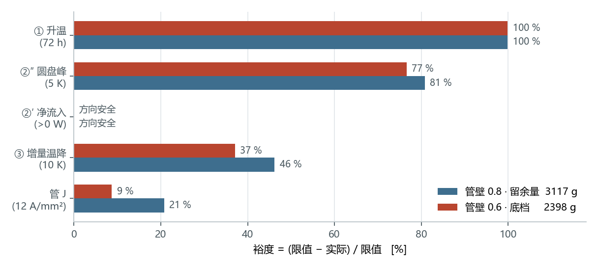
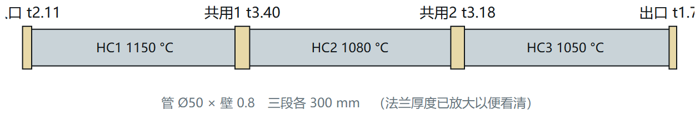
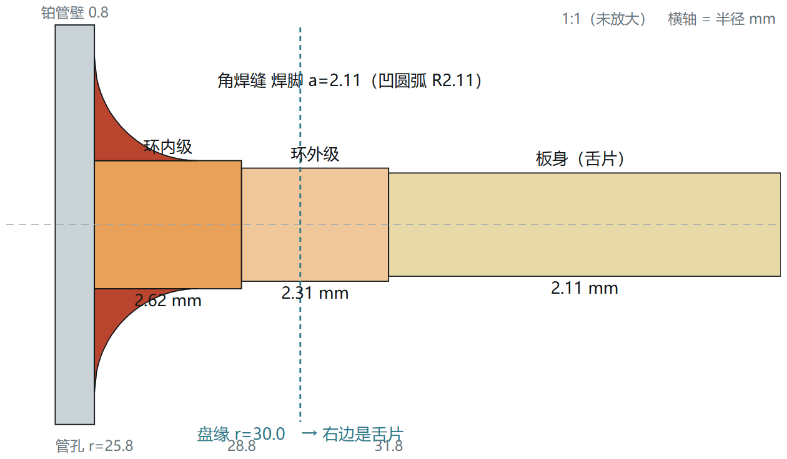
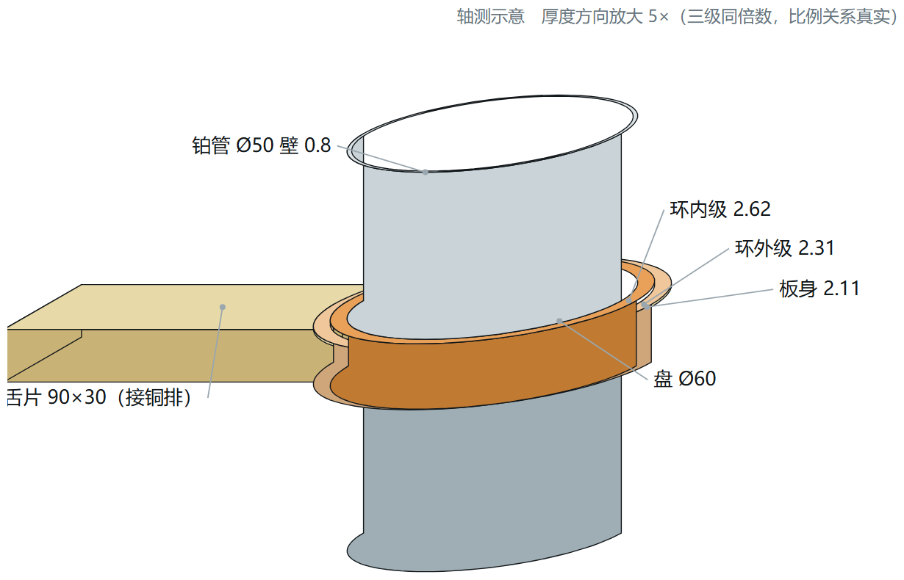
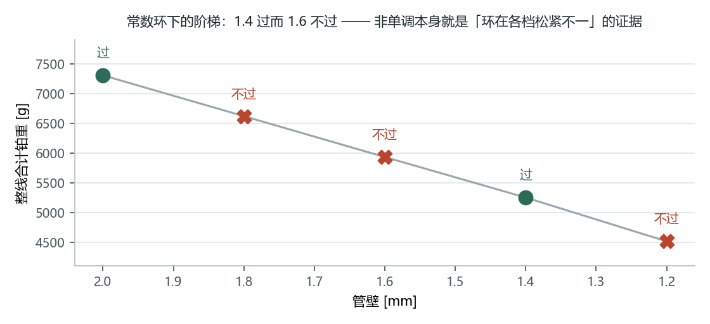

# 这份文件回答什么

三件事，其余不谈：

1. **定案是什么、怎么选。**
2. **想改动时，动哪个旋钮、代价多少。**
3. **哪些结果会「看着对但其实错」，以及怎么当场识破。**

推导过程在《铂金直接加热整线的用量优化》（论文版）。这里只给结论、数字和判断方法。

\newpage

# 1  一页看懂

这条线要在「能造能用」的前提下，把三段铂管加四片法兰的**总铂重**降到最低。
「能造能用」不是形容词，是五条**有出处的判据**（第 3 节）。

已定案两档，**都全判据通过**：

| 档 | 总铂重 | 相对现状 7141 g | 咬住它的 |
|---|---|---|---|
| **管壁 0.8 · 留余量** | **3117 g** | $-56\ \%$ | 无 —— 每条判据都有裕度 |
| **管壁 0.6 · 底档** | **2398 g** | $-66\ \%$ | 焊接烧穿下界（余量 **0**）＋ 管 J 10.96/12（余量 9 %），**两条同点** |

**这个取舍属于业主，不属于计算。** 它取决于两件现场判断：

- 手工 TIG 能不能稳定焊 0.6 mm 壁的管？
- 0.6 mm 壁跑 11 A/mm² 敢不敢？（现场给的一般上限是 15，0.6 时 12 是极限）

两条都点头就用 0.6 档，省 719 g；有一条犹豫就用 0.8 档。
**0.8 档不是「保守方案」，它同样是算到底的最优解**，只是把余量留在了工艺侧。

\newpage

# 2  定案构型

三段 $\varnothing50$ 铂管串联，四片法兰兼作电极。控温点 1150 / 1080 / 1050 °C。

**中间两片是共用片**：两侧段电流相位差 120°，它承担 $\sqrt3$ 倍电流，
发热按平方走，是端片的 **3 倍**。现场失效全部卡在这两片，不是巧合。

## 2.1 尺寸表

| | 管壁 0.8 | 管壁 0.6 |
|---|---|---|
| 管 内径 / 段长 / 壁厚 | $\varnothing50$ / 300 mm / **0.8** | $\varnothing50$ / 300 mm / **0.6** |
| 管外保温 | 5 mm | 5 mm |
| 圆盘 | $\varnothing60$ | $\varnothing60$ |
| 舌片 | $90\times30$，等宽 | 同左 |
| 舌根圆角 | $R3$ | 同左 |
| **板厚**（入口/共用1/共用2/出口）| **2.11 / 3.40 / 3.18 / 1.76** | **1.82 / 2.91 / 2.71 / 1.49** |
| 管孔渐变环 内级倍率 | $\times1.24$ | $\times1.22$ |
| **舌保温**（四片）| **18.7 / 1.6 / 1.4 / 3.9 mm** | 同左 |
| 压接段 | 舌端往回 40 mm，夹 450 °C | 同左 |
| 管 / 法兰 / 合计 | 2466 / 652 / **3117 g** | 1842 / 557 / **2398 g** |

## 2.2 两条别改成「统一规格」的地方

**① 四片板厚不能等厚。** 共用片比端片厚 60–90 %。这是 $\sqrt3$ 倍电流经平方律放大的
直接后果，等厚要么共用片烧、要么端片白花铂。

**② 舌保温四片差 12 倍**（18.7 vs 1.4 mm）。端片要靠保温**保住**发热，
共用片本身发热过剩、几乎要**裸露散热**。
好消息是这个旋钮**不花铂**（只是纤维），所以铂重只由板厚和舌片尺寸决定。

## 2.3 管孔那一圈：两级渐变环 + 两道角焊缝

从管孔往外是**两级台阶**，越靠近管孔越厚，压制孔周的电流集中。
**注意环的外半径已经越过盘缘** —— 圆盘上从孔到缘几乎被两级环占满，
「板身」那个厚度只出现在舌片上。所以环倍率动的不是「孔边一圈」，是**整个圆盘**。

管孔两面各有一道**角焊缝**，剖面是**凹圆弧**（自熔小角焊缝被表面张力拉成凹面），
焊脚 $a=\max(\text{板厚},\ \text{管壁})$。它是**额外堆上去的金属**，
孔边真实厚度 $=$ 环内级 $+2a$ —— 入口片 0.8 档是 6.84 mm，环内级的 2.6 倍。

**焊缝在电学上是帮忙的**：孔周正是电流密度峰值所在，加厚按比例压低那里的电流密度。
但**不要按三角形估料** —— 凹面只有三角形的 **43 %**，按三角形算会把好处高估 2.3 倍。

\newpage

# 3  五条判据

## 3.1 判据表与限值出处

**每条限值都有来源。没来源的限值一律不许用来判过与不过。**

| 判据 | 判什么 | 限值 | 出处 |
|---|---|---|---|
| ① 升温 | 空管升到 1150 °C 的时间 | 72 h | 业主「$\le$ 3 天」 |
| ②′ 管孔净流入 | 热往哪边流 | $>0$ | 总纲：**为负即法兰比管热**，方向性判据 |
| ②″ 圆盘区最高温 | 圆盘峰 $-$ 管温 | 5 K | 现场控温精度 $\pm5$ K |
| ③ 法兰增量温降 | 有法兰 vs 无法兰的管根温差 | 10 K | 总纲；**业主明确：贴着热偶误差定的** |
| 管 J | 管的电流密度 | 12 A/mm² | 现场：一般上限 15，壁 0.6 时 12 是极限 |
| 管壁下界 | — | 0.6 mm | 手工 TIG 烧穿下界（自动 TIG 0.3、激光 0.1） |

**只报数、不判**的参考量：法兰 $J_{\max}$（限值 10 **无依据**，实测 34）、
整片最高温、管强度利用率（蠕变已被业主划掉）、玻璃温降（**现场实测 20 K，
模型 21.9 K —— 全模型唯一校准点**）。

## 3.2 ③ 的 10 K：必须说清楚的一件事

| | |
|---|---|
| 出处 | 现场铂热偶 $>1000$ °C 的误差 $\pm10$ K |
| 物理依据 | **未知 —— 没有数据** |

**不得据此声称「超过 10 K 也安全」，也不得声称「真实限值是 X」。**
10 K 就是要遵守的要求。但知道刻度来源后有两条推论：

1. **不该把设计点摆在 10 上** —— 摆在测量地板上的判定分不出真假；
2. **不该拿它当控制靶** —— 加厚板会让 ③ **变大**（$+149\ \mathrm{K/mm}$，正号），
   靶设在 8 会让优化器加厚板把判据推向限值，**花铂金把判据推坏**。

## 3.3 看判据表的方法

**裕度那一列比「✓」有用。**

本项目最常见的错就是**贴着限值判过与不过**。曾经用 0.02–0.08 K 的差别决定了
约 700 g 铂金 —— 而那点温差只对应 **14 mW**，占段功率 **5 ppm**，
现场任何仪器都测不出来。

> 看到 ✓ 先问两句：
> **这个裕度比数值噪声大吗？比现场能分辨的尺度大吗？**

判据只有三态：过 / 不过 / **无法判定**。**无法判定一律不算通过。**

\newpage

# 4  四个旋钮

想改动设计时，先看这张表 —— 它是实测出来的，不是估的。

| 旋钮 | 直接管住 | 增益 | 花不花铂 | 备注 |
|---|---|---|---|---|
| **板厚** | ③ | $+149$ K/mm | **花** | 最强的旋钮；**注意是正号** |
| **环倍率** | ②″ | 一步 $0.14$ K | 花一点 | $\mu\approx2.5$ 后饱和 |
| **舌保温** | ③ 的余量 $\to$ ②″ | $-0.011$ K/mm | **不花** | 慢，但上限 80 mm，行程足 |
| **舌根圆角** | ②″ 的病灶 | $R3\to R10$ 约 $+2.4$ g/片 | 花极少 | 对症，但网格 2 mm 看不清 |

## 4.1 加厚板是**双向**的，别只算一边

加厚板同时做两件相反的事：

- 单位面积发热变小（$\propto 1/t$）—— 有利；
- 横向导热变强，从管子抽走的热变多 —— **不利，③ 变大**。

所以 $\partial③/\partial t_{板}$ 是 **$+149$ K/mm 的正号**。
「哪里热就加厚哪里」在这个系统里会把 ③ 推坏。

## 4.2 舌保温不是 ②″ 的旋钮，但它能救 ②″

直接扫舌保温 **80 倍**（0.05 → 4.0 倍），②″ **纹丝不动**。
它管的是 ③ 和 ②′。

但它能**间接**救 ②″：保温给 ③ 腾出余量 $\Rightarrow$ 板可以选得更厚 $\Rightarrow$
**厚板才是 ②″ 的解药**。等效增益 $-0.011$ K/mm，挪 0.1 K 约需 9 mm 保温。

> 这是本项目最贵的一课：**一个旋钮「有效」不代表它是直接的。**
> 按「相关性」搭的控制律崩了五版，按真实通路搭才成。

## 4.3 管保温 5 mm 别乱动

扫描显示它对 ③ 的杠杆极大（$-59.5$ 到 $+121.3$ K），看着很诱人。
但 ②″ 会**反向同步炸掉**，②′ 冲到 $-266$ W（热大量倒灌进管子）。

机理：管保温薄 $\Rightarrow$ 管散热猛增 $\Rightarrow$ 电流大；
而法兰包着 20 mm 没同比例增加 $\Rightarrow$ **法兰反过来比管热**。

**现用的 5 mm 恰好在拐点上。** 这个值原本是个没量过的默认值 —— 它碰巧是对的，
但这只有量过才知道。

## 4.4 盘径与舌片

- **缩小圆盘直径**是本问题里少有的「三者同向」：省铂、放松焊接下界、
  改善端片热平衡（缩盘减少电学死区的净散热）。现已缩到 $\varnothing60$。
- **舌片有效发热长度 = 舌长 − 压接长**。90 mm 舌片扣掉 40 mm 压接段只剩 50 mm ——
  铜排把那一段短接了，它**不发热**。想靠缩短舌片省铂，会先把发热段砍没。

\newpage

# 5  五个会骗人的坑

**共同点：不报错、输出格式正常、数值看着合理 —— 但结论是错的。**
这类错在本项目一天之内出现过五次，每次都推翻一条结论。

## 5.1 代理量当原量

拿邻近的量顶替判据、靶值或收敛度量。

| 发作 | 表现 |
|---|---|
| 拿「偏离本段控温点」当管根温度 | 据此宣布一条已验证的关系式被证伪 |
| 拿 ②′ 当 ③ 的控制靶 | 优化器在**白削薄** —— ③ 明明只有 6.5（限 10） |
| 拿一个会在两端间切换的标量当收敛度量 | 残差里出现 $-21$ K、$-52$ K 的假跳变，而物理场一直光滑 |
| 只报峰值半径不报坐标 | 「孔边一圈」和「舌根两个角」被压成同一个数，对策打偏 |

**怎么识破**：判据要拆开看时，**导出判据自己用的那两个数**，不要拿相关的量替。
位置类信息一律报 $(x,z)$，不报半径。

## 5.2 默认值当需求

冻结的占位值被当成给定条件。**已发生十次。**
管保温 5 mm、舌根圆角 R3 都是这么来的（后来证明前者对、后者需要动）。

**怎么识破**：**每个冻结值都扫一遍**，哪怕最后证明它是对的。
「它一直是这个值」不是依据。

## 5.3 参数写成绝对值

依赖项一动，对策就静默失效或被悄悄重画。

实例：管孔渐变环最初写成**绝对半径**，而管孔半径 $=25+$ 管壁。
每换一档管壁，环就被悄悄重画一遍。更糟的是台阶厚度写成 $\max(\text{台阶厚},\text{板厚})$，
板厚超过 2.4 mm 时**环完全消失** ——
**整条可行性阶梯从来没有环，而它一路正常出数。**

修好之后可行管壁从 2.0 掉到 1.4，$7265\to5252$ g（$-28\ \%$）。

**怎么识破**：结果**非单调**就是信号。上图里 1.4 过而 1.6 不过 ——
物理上没有理由，那就是某个东西在各档松紧不一。

## 5.4 修一个漏一个

新旋钮写在旧旋钮的提前返回之后，永远轮不到执行。
优化器报「两个旋钮都到位」停机，实际 ②″ 还差 $+0.01$。

**怎么识破**：报「都到位」时，**把每个判据的实际值打出来看**，不要信汇总行。

## 5.5 校验量选错

**这是最危险的一类，因为它发的是虚假的通过证。**

交付 3DM 原来只校验「包围盒沿 Y 的跨度 = 板厚」，一路报「19 项全吻合」，
而实际法兰只有计算值的 **43 %**（孔没挖、焊角没画、环多长出去了）。
那个量分辨不出这些 —— 它只验方位，不验材料。

现在改成**逐件质量对账**（质量是唯一把所有几何细节都卷进去的标量）：

| 件 | 3DM | 计算模型 | 差 |
|---|---|---|---|
| 铂管 | 2464.8 g | 2464.8 g | $+0.00\ \%$ |
| 入口片 | 130.2 | 129.8 | $+0.30\ \%$ |
| 共用片 1 | 216.6 | 215.3 | $+0.60\ \%$ |
| 共用片 2 | 201.5 | 200.4 | $+0.56\ \%$ |
| 出口片 | 107.6 | 107.4 | $+0.24\ \%$ |
| **合计** | **3120.6** | **3117.6** | $\mathbf{+0.10\ \%}$ |

**怎么识破**：问一句「**这个校验管得到我怕出错的那一维吗？**」
管不到就换一个量。

\newpage

# 6  用程序

启动 `Pt_Optimize.exe`，按 **F1** 或点「使用说明」页签 —— 里面有界面地图与按钮全表。

## 6.1 三件最常做的事

| 想做什么 | 怎么做 |
|---|---|
| 看定案档、用多少铂 | 「整线设计」页 $\to$ 定案档 ▾ $\to$ **载入定案** $\to$ **核算整线** |
| 出图纸交加工 | 「整线设计」页 $\to$ 选档 $\to$ **导出定案 3DM** |
| 改参数试试 | 改左侧参数表或本页控件 $\to$ **核算整线**（分钟级，可取消） |

## 6.2 两个必须知道的行为

**「核算整线」走的是页面上的参数，不是定案档。**
「载入定案」有两项控件表达不了 —— **管孔渐变环**与**逐片舌保温**，
载入后输出框会把它们列出来。要**复现定案数**，用「导出定案 3DM」或命令行
`--cli --busbarplan --wall 0.6`。

**判据表上方有一行收敛信息，先看它。** 未收敛时会打
「下面每个数都不可引用」—— **那是字面意思**。

\newpage

# 7  还需要现场给的数

按影响排序。**前两条直接决定能不能用 0.6 档。**

| 量 | 现在按什么算 | 一旦不同，影响多大 |
|---|---|---|
| **焊接方法** | 手工 TIG，烧穿下界 0.6 mm | 自动 TIG 到 0.3、激光 0.1，**差一个量级**。0.6 档正被它咬住，余量为 0 |
| **法兰 J 的许用值** | **无依据**，现取 10 并降为参考量 | 法兰 J 实测 **34**。这条一旦成为硬判据，结论大幅改变 |
| ③ 的物理依据 | 只知刻度来自热偶误差 | 决定能否把设计点从 10 K 往外放 |
| 铜排表面状态 | 氧化铜 $\varepsilon=0.7$ | 抛光铜只有 0.05，**差 14 倍**，散热段长度直接翻几倍 |
| 铂表面发射率 | 0.18 | 总散热 $\pm40\ \%$，是最大不确定源 |

## 7.1 建议的验证顺序

1. **段电流与段电压** $\to$ 校验电阻，反推平均金属温度（最容易做，信息量最大）
2. 保温外表面温度 $\to$ 校验散热模型（现模型系统性偏高 2–4 倍，未标定）
3. **法兰红外测温，并记下峰值在哪** $\to$ 校验 ②″ 与「峰在舌根凹角」这个判断
4. 法兰前后 0–150 mm 轴向温度分布 $\to$ 校验 ③
5. 升温过程中共用片的温升曲线 $\to$ 校验「升温阶段烧断」这条主失效模式

## 7.2 一条已知但未解的事

段与法兰的热耦合**环路增益约 0.96** —— 离热失控（1.0）只差 4 %。

这既是求解收敛慢的原因，也是一项**该汇报的设计裕度**：
系统对「法兰变热 $\to$ 抽热变化 $\to$ 管根变化 $\to$ 法兰更热」这个回路的阻尼只有 4 %。
现有两档的剩余误差已压到 0.65 / 0.75 K，判据可用；但这个数字本身值得让现场知道。

---

*配套文件：《铂金直接加热整线的用量优化》（论文版，含全部推导与验证）、
程序内 F1 图文说明书（按定案档实时生成）。*
