# 这份文件回答什么

四件事，其余不谈：

1. 现役设计是什么、咬住它的是什么。
2. 想改动时，动哪个旋钮、哪些形状值得试、代价多少。
3. 哪些结果会「看着对但其实错」，以及怎么当场识破。
4. APP 怎么用：三分钟上手、每个按钮做什么、卡住了看哪里。

推导过程在《铂金直接加热整线的用量优化》（理论模型 v6.1）。这里只给结论、数字和判断方法。v6.1 补的三样：现役记录在新链下的判据与场图（2.4 节）、法兰「初始值 → 结果值」并列表与算完后的边界环境（4.5、4.6 节）、侧 Y 形的 3DM 与挖孔前后的场图（4.3 节）。

# 1 一页看懂

这条线要在「能造能用」的前提下，把几段铂管加各片法兰的总铂重降到最低。「能造能用」不是形容词，是一张有出处的判据表（第 3 节）。

v6.0 起，尺寸不是拍的，是一条因果链算出来的：**20 °C/h 升温需要多大电流 → 按电流密度 J（预设 10 A/mm²）定法兰每个截面 → 温度场和电流场决定孔开在哪 → 剩下的旋钮由求解器调 → 全体截面终验 J < J + 1**。形状（盘径、舌宽、锥形舌、挖不挖孔）由搜形状给出。

| 现役设计记录 | 总铂重 | 咬住它的 |
|---|---|---|
| 管壁 0.8 · 留余量（3 段 4 片） | 3547 g（管 2465 + 法兰 1082） | 按 v6.0 链解一次（导航网格）：热学判据都过（管孔净流入 1.1 W、法兰增量温降 4.7 K、圆盘区 −0.2 K）；卡住它的是「法兰截面 J」27.7 > 11——舌片按 J = 10 要加厚到 2.03／3.51 mm（2.4 节） |

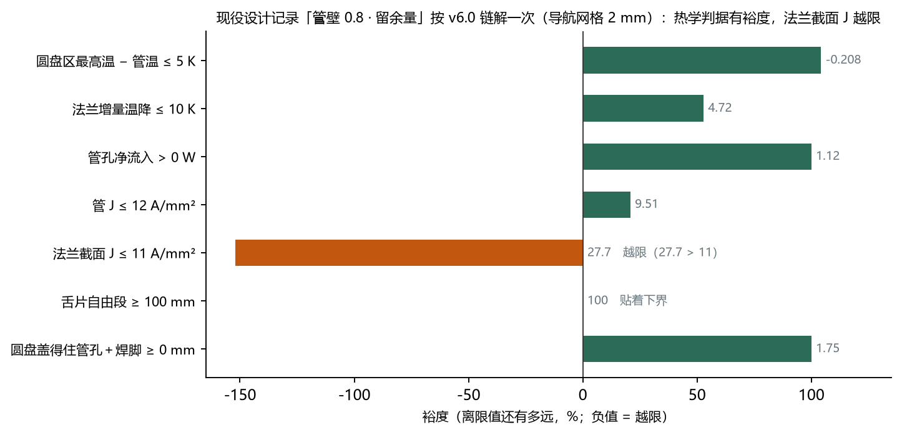

# 2 现役构型

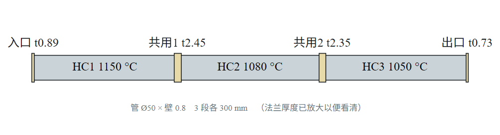

三段 Ø50 内径的铂管串联，控温点 1150／1080／1050 °C。中间两片是共用片：两侧段电流相位差 120°，它承担 √3 倍电流，发热是端片的 3 倍。现场失效出在这两片（共用片升温烧断）。

## 2.1 尺寸表

| 项 | 管壁 0.8 · 留余量 |
|---|---|
| 管 内径 / 段长 / 壁厚 | 50 / 300 mm / 0.8 |
| 管外保温 | 5 mm |
| 圆盘 | Ø60 |
| 舌片 | 140 × 60，等宽，舌根圆角 R3 |
| 板厚（入口/共用1/共用2/出口） | 0.89 / 2.45 / 2.35 / 0.73 mm |
| 舌保温（四片） | 0.4 / 0.4 / 0.5 / 0.3 mm |
| 管孔渐变环 | 倍率 1.00（不需要环） |
| 压接段 | 舌端往回 40 mm，夹 450 °C |
| 管 / 法兰 / 合计 | 2465 / 1082 / 3547 g |

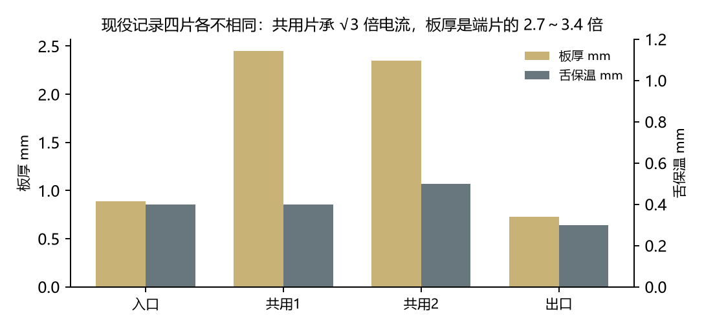

## 2.2 两条别改成「统一规格」的地方

- **四片板厚不能等厚。** 共用片承 √3 倍电流，发热按平方走是端片的 3 倍；等厚要么共用片烧、要么端片白花铂。
- **舌保温各片各定。** 它不花铂（只是纤维），是守「抽热窗口」的主力：抽得太少热往管里灌（烧断），抽得太多把管根拉冷。

## 2.3 管孔那一圈：焊缝

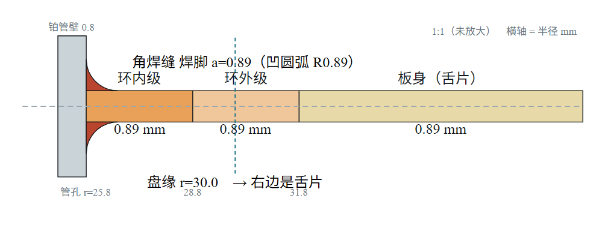

焊缝在电学上是帮忙的：孔周正是电流密度峰值所在，加厚按比例压低那里的电流密度。但别按三角形估料。本档没有渐变环：舌片加宽到 60 mm 之后孔周不再拥挤；舌片一窄回去，尖峰和环都会回来。

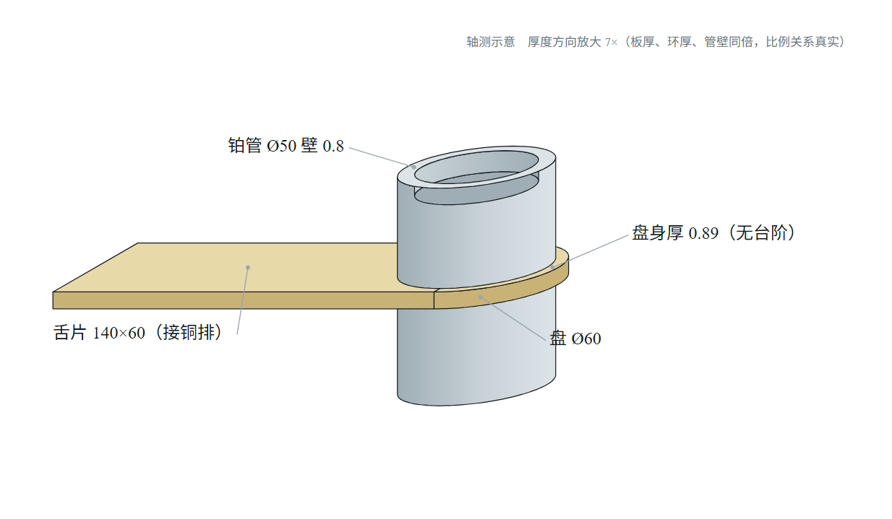

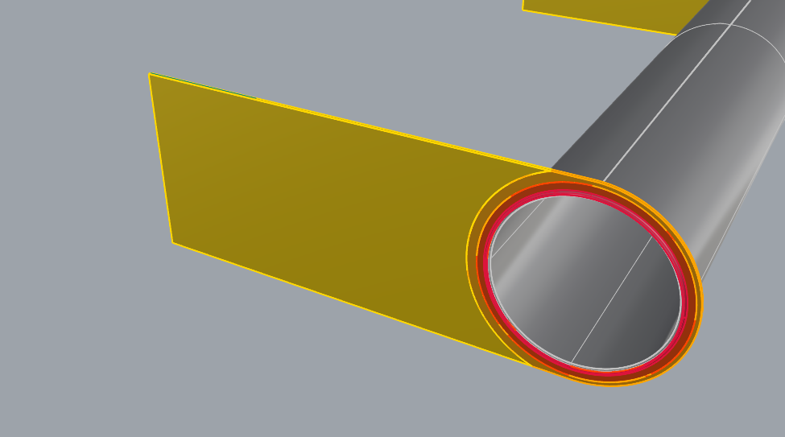

## 2.4 现役记录按新链算：热学全过，舌片截面不过

把「管壁 0.8 · 留余量」按 v6.0 的因果链解一次（形状、厚度、保温都照记录，不调）：法兰增量温降 4.7 K、管孔净流入 1.1 W、圆盘区最高温 − 管温 −0.2 K，热学三条全过；但**「法兰截面 J」27.7 A/mm²，限 11，不过**——记录自己的升温峰值电流 1214 A（共用片 2102 A），出口片舌片 0.73 × 60 = 43.8 mm² ⇒ 27.7 A/mm²。记录里舌片厚等于板厚（0.73～2.45 mm），按 J = 10 定截面，舌宽 60 的端片舌片至少 2.03 mm、共用片至少 3.51 mm。这份记录能用来对照，不能照它加工舌片。

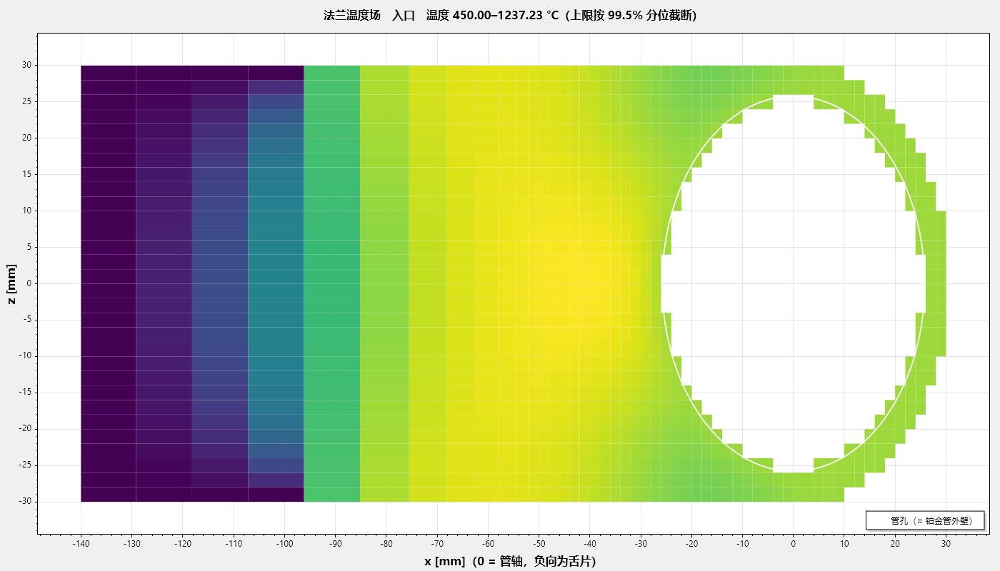

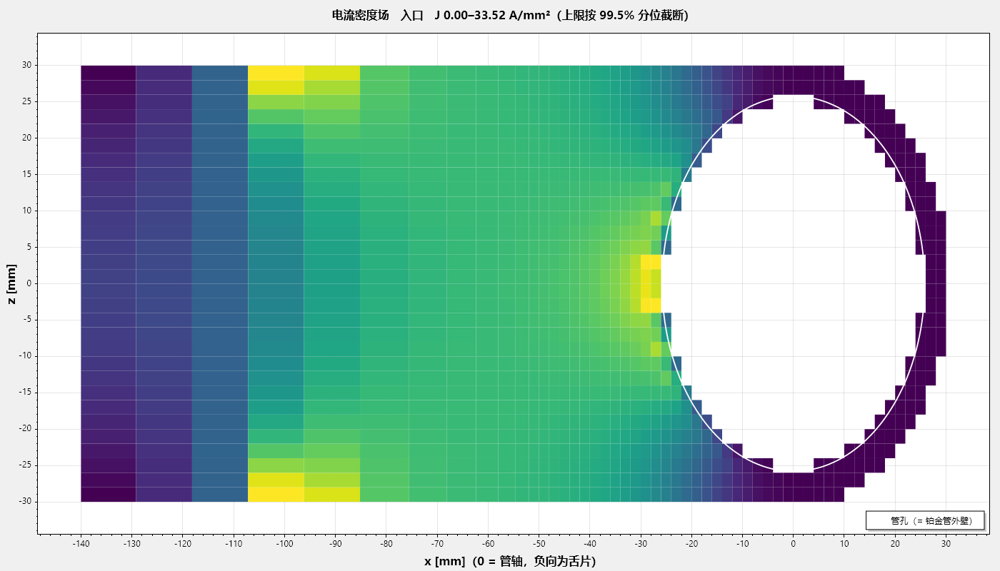

怎么看场图：白线是管孔（= 铂管外壁），x 轴 0 在管轴、负向是舌片；色标上限按 99.5 % 分位截断，所以最亮的一格不一定是最大值。看电流场找「不走电流的地方」——那是开槽的候选；看温度场找「比管热的地方」——那是要加保温或减厚的地方。

# 3 判据表

## 3.1 判据与限值出处

每条限值都有来源。没来源的限值一律不许用来判过与不过。

| 判据 | 判什么 | 限值 | 出处 |
|---|---|---|---|
| 升温 | 20 °C/h 空管升温所需电流折成的管 J 峰值 | 管 J 许用 | 闭式 |
| 管孔净流入 | 热往哪边流 | > 0 W | 总纲：为负即法兰比管热 |
| 圆盘区最高温 − 管温 | 圆盘峰比管温高多少 | 5 K | 现场控温精度 ±5 K |
| 法兰增量温降 | 有法兰 vs 无法兰的管根温差 | 10 K | 业主定，按热电偶误差取 |
| 管 J | 管的电流密度 | 12 A/mm²（参数表可改） | 现场：一般 15，壁 0.6 时 12 是极限 |
| 法兰截面 J | 设计电流 ÷ 每个必经截面面积 | 设定 J + 1 | 按 J 定尺寸的终验 |
| 舌片自由段 | 铜排装不装得下 | ≥ 100 mm | 现场铜排长 100、宽 60–80 |
| 圆盘盖得住管孔＋焊脚 | 能不能焊 | ≥ 0 | 可造性 |
| 管壁下界 | — | 0.6 mm | 手工 TIG 烧穿下界（自动 0.3、激光 0.1） |

只报数、不判的参考量：升温到位用时（集总）、整片热稳定、局部热稳定、法兰最高温、法兰 J_max（场逐点峰值，只作诊断；那一行印的 /10 是标尺不是限值）、升温期法兰−管峰值、管↔法兰热收支。

## 3.2 「法兰增量温降」的 10 K：必须说清楚的一件事

出处是现场铂热电偶的误差，物理依据未知。不得据此声称「超过 10 K 也安全」，也不得声称「真实限值是 X」。10 K 就是要遵守的要求。但知道刻度来源后有两条推论：设计点别贴着 10 摆（摆在测量地板上的判定分不出真假）；别拿它当控制靶（加厚板会让它变大，靶设在 8 会让优化器花铂把判据推坏）。

## 3.3 看判据表的方法

**裕度那一列比「✓」有用。** 0.05 K 量级的温差只对应十几毫瓦，现场任何仪器都分辨不出来，不能拿它判过与不过。看到 ✓ 先问两句：这个裕度比数值噪声大吗？比现场能分辨的尺度大吗？

**两列口径不一样，看右边那列。** 记录值是粗网格（2 mm）上算的；加密复算后的值才是能拿去决定的数（盘 Ø56 案例：粗网格全过，加密到 0.125 mm 法兰增量温降 11.76 K 越限，重解后才过）。判据只有三态：过／不过／无法判定，无法判定一律不算通过。

# 4 想改动时：旋钮与形状

## 4.1 求解器自己调的旋钮

| 判据不过 | 它会动 | 花不花铂 |
|---|---|---|
| 管孔净流入 | 外级环倍率、外级环半径、板厚 | 花 |
| 法兰增量温降（抽热太多） | 舌保温 → 圆盘背侧槽 → 舌孔孔径 → 舌孔拉长比 | 舌保温不花；挖料反而省 |
| 圆盘区最高温 | 舌保温、环倍率、内级环半径 | 花一点 |

求解器从约束盒的下角出发（板厚 = 焊接下界与按 J 定截面的下界取大、舌保温最薄、无环无槽无孔），旋钮只增不减，每根抬到刚好过为止。你不用告诉它起点，也不用给初值。它比价的规则是：先看补得上补不上，再看每克铂买到的裕度。旋钮全部到顶仍不过，它会说「厚度到头，该改形状」。

## 4.2 加厚板是双向的，别只算一边

加厚板同时做两件相反的事：单位面积发热变小（有利）；横向导热变强，从管子抽走的热变多（不利，法兰增量温降变大）。所以 ∂增量温降/∂板厚是正号，「哪里热就加厚哪里」在这个系统里会把判据推坏。按 J 定截面之后板厚多半在下角就够了，缺口由不花铂的舌保温和挖料补。

## 4.3 值得试的形状

| 形状维 | 谁管 | 什么时候值得试 |
|---|---|---|
| 盘径 | 搜形状 | 缩小圆盘同时省铂、放松焊接下界、改善端片热平衡，三者同向 |
| 舌宽 | 搜形状 | 加宽舌片电阻降、孔周不再拥挤，可以省掉渐变环 |
| 锥形舌（两边与圆盘相切） | 搜形状翻转试 | 舌根宽、截面按 J 可以更薄；面积更大铂重两头拉，只能算出来比 |
| 舌孔 / Y 形叉臂 | 搜形状「解法」选挖舌孔或两个都算 | 孔是「少抽热」的旋钮，主力仍是舌保温；孔一开舌根按 J 加厚成叉臂，Y 形自动出现 |
| 舌长 | 不搜 | 闭式：圆盘切点 + 压接段 40 + 自由段 100，贴着下界 |
| 舌片厚 | 不搜 | 闭式：设计电流 ÷ (J × 舌片最窄宽) |

2 段 3 片的对照工况实跑：搜形状最轻的可行形状盘 Ø56／舌宽 56，细网格重解 2603.8 g；用户手画的侧 Y 形 2741.9 g，导航网格上可行（未做细网格重解，不可直接交付）；两者都在「搜形状结果」下拉里由你选。

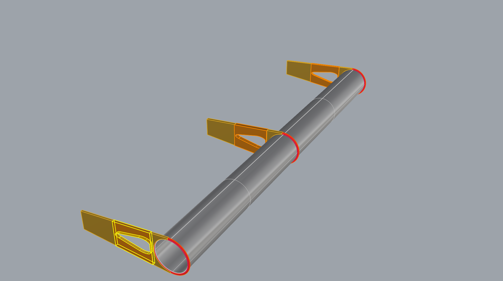

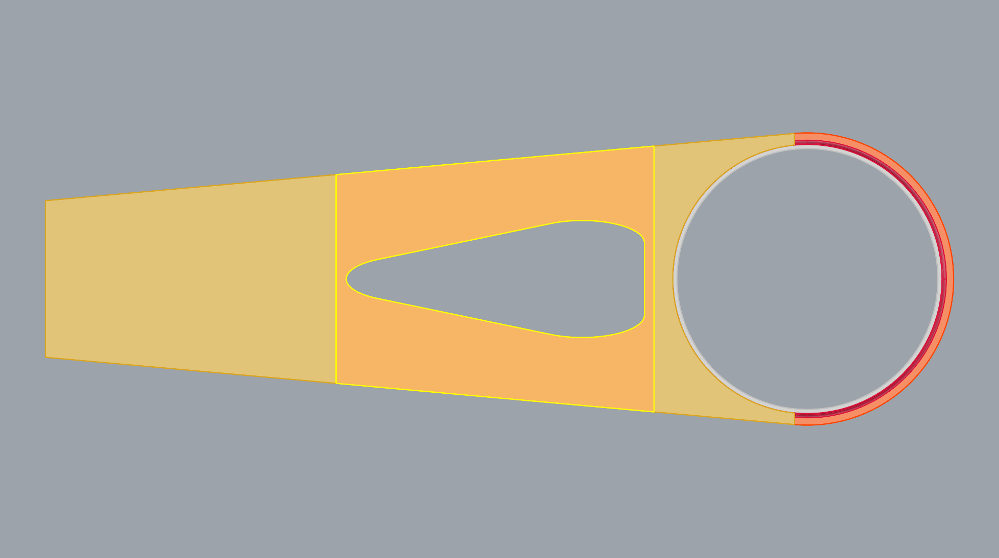

**挖孔前 vs 挖孔后（同一锥形舌片，共用片）**：

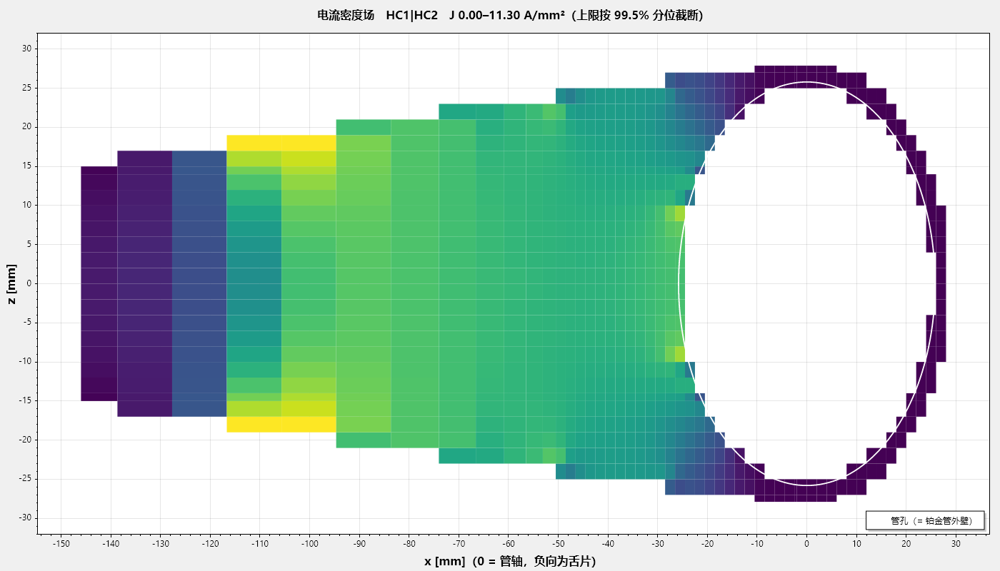

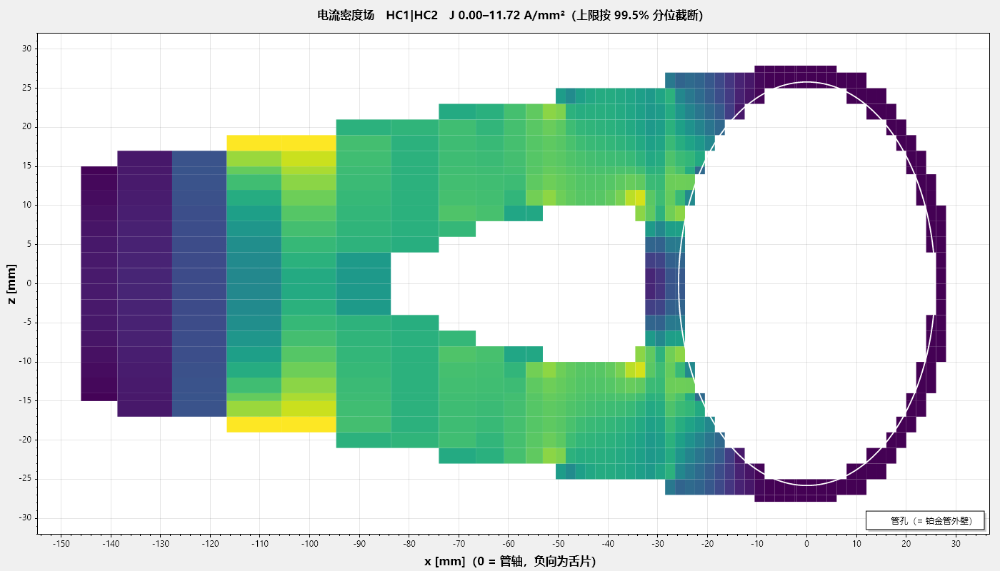

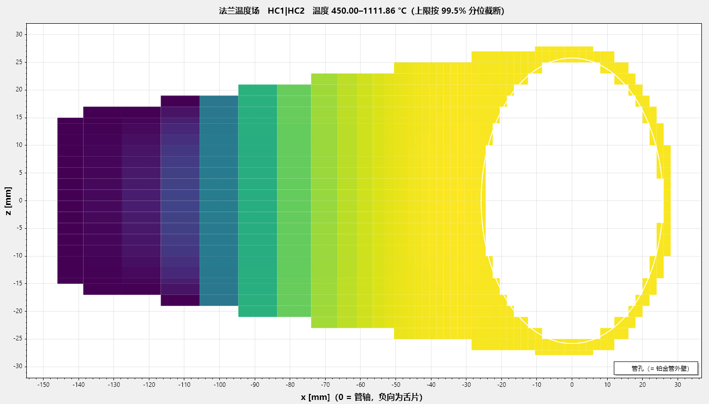

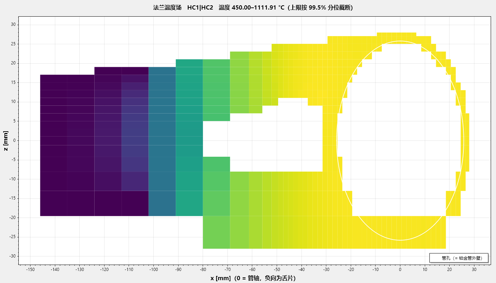

四张图合起来说的是：槽开在舌片中段，锥形舌在那里已经变宽、本来 J 就只有 7～9，所以不伤截面（臂按 J 加厚兜底）；同一锥形舌片开槽并按 J 加厚叉臂后，舌保温从 9.3／6.3／18.2 降到 5.7／3.6／11.7 mm 仍过，铂重省 13.2 g（2755.1 → 2741.9，槽挖掉的料减去叉臂补回的料）。少抽热来自槽去掉的一块保温面与叉臂略高的自热两处（模型里槽壁不散热，实物会打折）。把舌保温钉在挖孔前的 9.3／6.3／18.2 再解一次，开槽后三片抽热各少 16／18／9 W，多到热反向灌进管子（管孔净流入 −14.3 W 不过）——所以挖孔后的舌保温必须更薄（理论模型 v6.1 第 10.6 节「同保温对照」）。两案例的法兰增量温降 9.97 与 9.71 都是求解器停在 10 K 之下的落点，不能相减当效果。孔不能替代保温：挖孔后舌保温仍要 3.6～11.7 mm。

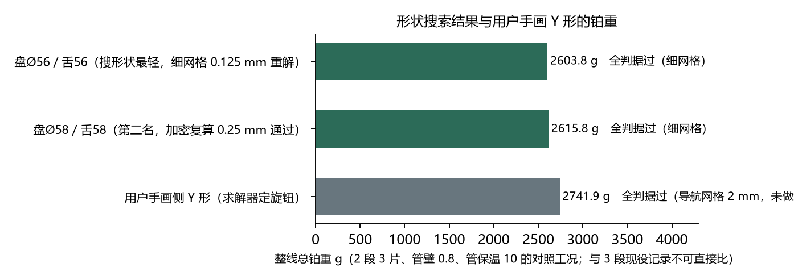

## 4.4 管保温 5 mm 别乱动

它对法兰增量温降的杠杆极大，看着诱人；但圆盘区最高温会反向同步炸掉、管孔净流入变负（热大量倒灌进管子）。机理：管保温薄 → 管散热猛增 → 电流大；而法兰包着没同比例增加 → 法兰反过来比管热。现用的 5 mm 恰好在拐点上。

## 4.5 初始值 → 结果值：三个案例并列

求解器不吃初值：它从约束盒的下角出发（板厚 = 焊接下界与按 J 定截面的下界取大、舌保温最薄、无环无槽无孔），旋钮只增不减。你画在图上的厚度只用来「解一次」看判据。

| 项 | 盘 Ø56／舌宽 56（搜形状最轻） | 侧 Y 形，挖孔后（你手画的） | 同一锥形舌片，不开槽 |
|:------|:--------|:----------|:--------|
| 形状（固定） | Ø56，舌 140 × 56 等宽 | Ø56，舌 146 × 30 锥形，从舌根伸到舌片中段的圆角三角槽 | Ø56，舌 146 × 30 锥形，无槽 |
| 板厚 入口／共用／出口 mm | 下角 0.60／1.02／0.60 → **0.60／1.02／0.60** | 图上 0.89／2.45／0.73 → **0.60／1.02／0.60** | 下角 → **0.60／1.02／0.60** |
| 舌片厚 mm（闭式，不是旋钮） | 1.75／3.03／1.75 | 2.64／4.57／2.64 | 2.64／4.57／2.64 |
| 叉臂 mm | — | 图上 3.69／6.39／3.69 → **3.80／6.58／3.80** | — |
| 舌保温 mm（旋钮） | 0.30 → **5.2／2.9／8.8** | 图上 3.0（只解一次）；求解从 0.30 起 → **5.7／3.6／11.7** | 0.30 → **9.3／6.3／18.2** |
| 合计 g | → **2603.8** | 图上解一次 2753.7 不可行 → **2741.9** | → **2755.1** |
| 法兰增量温降 K（限 10） | → 9.06 | 图上 90.8 → 9.71 | → 9.97 |
| 管孔净流入 W（> 0） | → 2.35 | → 3.38 | → 3.22 |
| 法兰截面 J（限 11） | → 9.996 | → 9.998 | → 9.981 |
| 圆盘盖得住管孔＋焊脚 mm（≥ 0） | → 1.18 | 图上 −0.25 不可行 → 1.18 | → 1.18 |
| 场解次数／耗时 | 重解 125 次／61 分；从头累计约 202 次／105 分（导航 32 + 加密 12 + 重解 61） | 64 次／26 分 | 89 次／36 分 |
| 判据在哪张网格上成立 | 细网格 0.125 mm | 导航网格 2 mm | 导航网格 2 mm |

读法：板厚三个案例都停在下角——按 J 定截面之后，热学缺口全由不花铂的舌保温补；你图上的 3 mm 舌保温解一次就把法兰增量温降推到 90.8 K；求解器不用这个 3 mm，从下角 0.30 起二分，落在 5.7～11.7 mm；Y 形比 Ø56 等宽舌重 138 g，几乎全来自舌片厚：锥形舌最窄处按 I/(J·w_min) 定了整根杆厚 2.64／4.57，比等宽舌的 1.75／3.03 厚 51 %；锥形少掉的面积省回一部分；槽与叉臂净省 13 g。第二、三列只在导航网格上过判据，未做细网格重解。中间的每一步（设计电流 → 舌片厚 → 下角 → 逐轮抬旋钮 → 加密复算 → 细网格重解）在理论模型 v6.1 第 10.5 节逐步列出。

## 4.6 算完之后：结果在什么环境下成立

改下面任何一项，判据表都要重算。

| 量 | 取值 | 说明 |
|:----|:-----------|:---------|
| 铜排压接段 | 舌端往回 40 mm，夹持 450 °C | 压接段不发热（铜排短接），舌端是定温边界 |
| 铜排 | 许用 J 2 A/mm²、到冷端 300 mm、冷端 25 °C；表面按氧化铜发射率 0.7 | 表面状态待现场确认（第 8 节） |
| 管保温 | 5 mm（现役记录）／10 mm（2 段对照工况） | 杠杆极大，别单独动（4.4 节） |
| 圆盘保温 | 20 mm | 现场实况「圆盘包、舌片按需」 |
| 舌保温 | 逐片结果值 | 求解器的旋钮，不花铂 |
| 环境与表面 | 25 °C；铂表面发射率 0.18、保温外表面 0.45；法兰无吹风 | 参数表 |
| 工况 | 控温点 1150／1080／1050 °C（2 段对照：1150／1080）、段长 300 mm、产量 1.5 t/day、液相线 1050 °C | 参数表与段表 |
| 供电 | 交流，相邻段相位差 120°（共用片 √3 倍电流） | 总纲 |
| 电流密度 | 设计 J 10、极限 11；管 J 许用 12 A/mm² | 工程师设定 |
| 焊接 | 手工 TIG 烧穿下界 0.6 mm；安全系数 2.0 | 焊法待现场确认 |

# 5 五个会骗人的坑

共同点：不报错、输出格式正常、数值看着合理——但结论是错的。

| 坑 | 怎么识破 |
|---|---|
| 贴着限值的「过」 | 看裕度列，不看 ✓ |
| 粗网格上的「过」 | 看「加密复算后的值」那一列；核算整线会自己走到那一步 |
| 未收敛的数 | 判据表上方写「未收敛」时，下面每个数都不能用 |
| 看不见却在起作用的量（渐变环、逐片舌保温、压接段、焊缝） | 输出框每次算完都逐条印实际用值，看一眼 |
| 两个按钮给的数不一样 | 一个算的是存好的设计记录，一个算的是你改过的页面；页面上的数和记录一样时两边给的就是同一个数 |

# 6 出图与交付

「③ 结果与出图」页点导出本页 3DM：三段管 + 四片法兰（板身 / 环 / 角焊缝 / 舌片，有叉臂时叉臂单独一层）+ 压接段参考线，图层按片分。写完立刻自校三条，任一条不过就不得作为交付件：读回来的方位、角焊缝体积（差 ≤ 0.5 %）、逐件重量对账（差 ≤ 2 %）。重量是唯一把所有几何细节都卷进去的一个数。

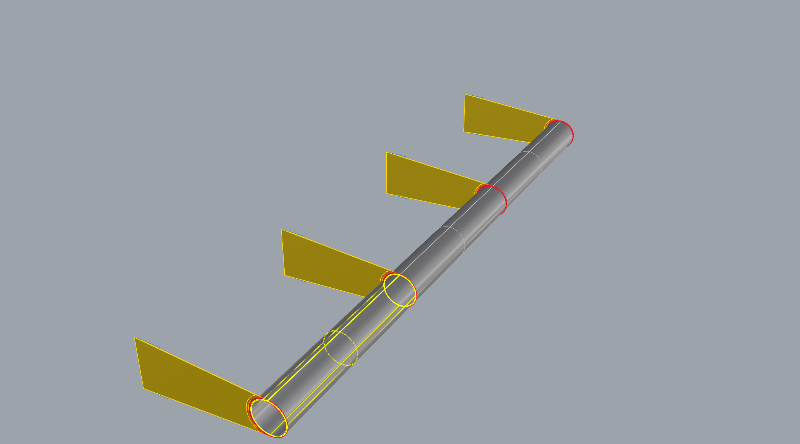

# 7 APP 怎么用

## 7.1 三分钟上手

| 步 | 做什么 | 看哪里 |
|---|---|---|
| 1 | 参考工具页：设计记录 ▾ → **载入设计记录** | 页面就是记录 |
| 2 | ② 法兰优化页：**核算整线** | 五步状态条告诉你它走到哪；结束时说「可以出图」或停在哪一步、为什么 |
| 3 | ① 输入页改盘径／舌宽／管壁／锥形／解法 | 改完停手一秒多会自己重算；要判据表说「先解决哪一条」就再点核算整线 |
| 4 | （可选）② 页 **◇ 搜形状** | 每算完一个形状出一行；最轻的写回页面，全部在「搜形状结果 ▾」里 |
| 5 | ③ 结果与出图：**导出本页 3DM** | 输出框里的重量对账 |

## 7.2 五个页签各管什么

| 页签 | 做什么 |
|---|---|
| ① 输入 | 参数、几何来源（参数或 .3dm 图纸）、法兰形状（盘径、舌宽、锥形舌、解法）、逐片旋钮与只读值（舌片厚、叉臂）、段表 |
| ② 法兰优化 | 核算整线（主键）；手动分步：自动定厚、搜形状、加密复算、细网格重解、导出可回读 3DM、厚度灵敏度扫描 |
| ③ 结果与出图 | 判据表、三张场图、导出本页 3DM、另存为设计记录、保存／读取 |
| 参考工具 | 设计记录、升温可达性趋势、分段核算、单段报告、轴向剖面、焊接下界小算盘 |
| 使用说明 | 本页即完整说明书（F1 直达） |

右上状态面板最下面有一行「下一步 → 点『…』」，该点的按钮同时加粗加淡蓝底；点那一行会带你切到对应页签并让按钮闪两下，它不会替你点。

## 7.3 核算整线 vs 搜形状

| | 核算整线 | ◇ 搜形状 |
|---|---|---|
| 回答的问题 | 这个设计能不能用、能不能造 | 能用的前提下哪个盘径／舌宽／舌形最省铂 |
| 什么时候点 | 每次改完输入或读完图纸都先点它 | 它说「该改形状」时；当前形状全过但想更轻时；想拿一张形状表自己挑时 |
| 它会动什么 | 只调旋钮，形状不动 | 盘径、舌宽、平行或锥形；两个都算时不挖孔、挖孔各搜一遍、各选各的最轻 |
| 花多久 | 十几分钟到两小时，可取消 | 几小时，适合下班前点 |
| 之后 | 到 ③ 出图 | 再点核算整线精算到细网格，过了才出图 |

## 7.4 用自己的 Rhino 图纸

① 输入页「法兰几何来源」选 Rhino .3dm 文件，选一张图（各片同一张图、厚度各自解），填图层名，段数在「铂金管加热段数」框里定。先「分析几何变数」再「核算整线」——不先分析，几何两条判据是「无法判定」，出图那页永远开不了。要搜形状，先点「◈ 图纸几何 → 参数」把图纸变成参数。

## 7.5 常见问题

| 现象 | 其实是 |
|---|---|
| 「◇ 搜形状」是灰的 | 图纸模式，先点「◈ 图纸几何 → 参数」 |
| 选了「（已作废）」的档，导出 3DM 没反应 | 故意拦住的，已作废的档不许出图 |
| 核算整线停在「该改形状」 | 厚度已到头；它会自己去搜形状，或你到 ① 页改盘径、舌宽、勾锥形 |
| 加密复算后从过变不过 | 粗网格把孔边和焊脚那一圈的梯度抹平了；点「细网格重解」 |
| 搜形状结果比设计记录重 | 它保证「过」，不保证比记录省；到 ① 页换一个盘径／舌宽再搜，或在「搜形状结果 ▾」里挑 |

# 8 现场还需确认的数

| 量 | 现在按什么算 | 一旦不同，影响多大 |
|---|---|---|
| 法兰截面的设计电流密度 J | 预设 10，极限 J + 1 | J 每改 1，法兰截面和铂重都跟着变；最值得现场给一个数 |
| 「法兰增量温降」的物理依据 | 10 K 来自热电偶误差 | 决定能否把设计点往外放 |
| 铜排表面状态 | 氧化铜发射率 0.7 | 抛光铜 0.05，差 14 倍 |
| 焊接方法 | 手工 TIG，烧穿下界 0.6 mm | 自动 TIG 0.3、激光 0.1，差一个量级 |
