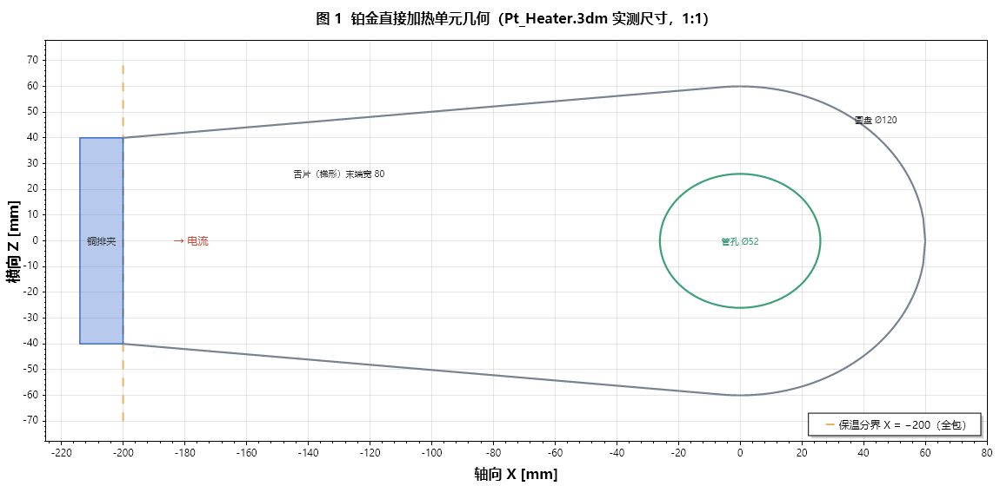
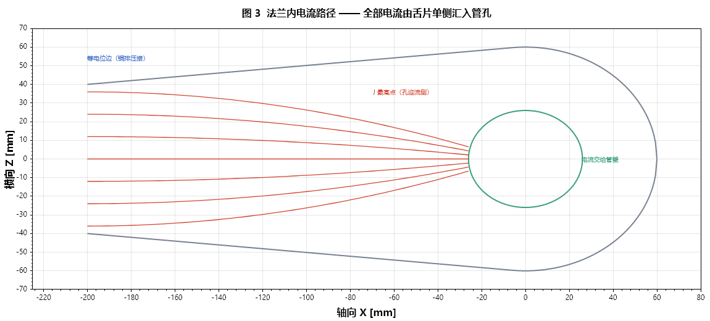
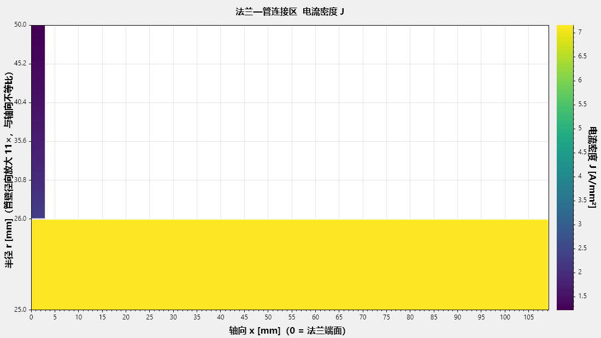
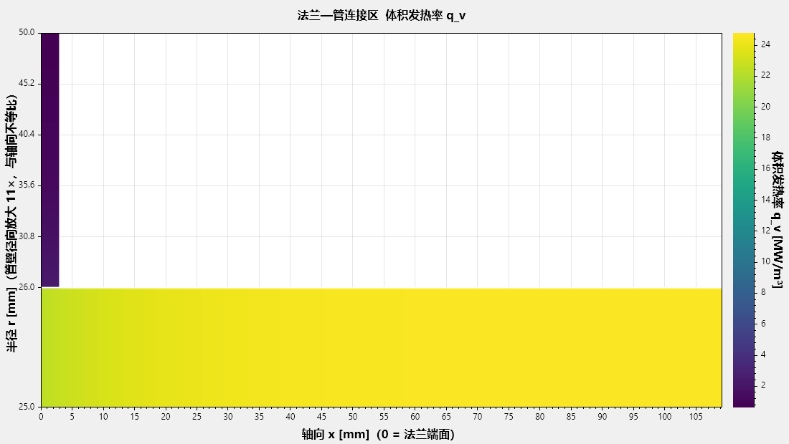
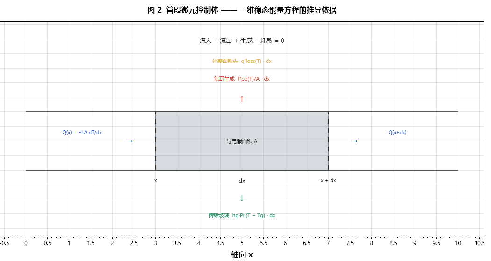
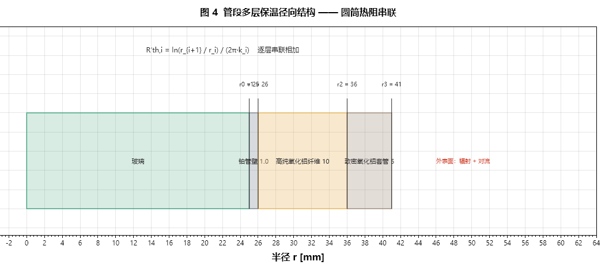
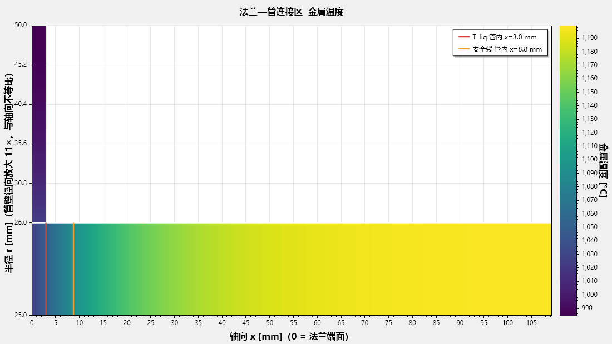
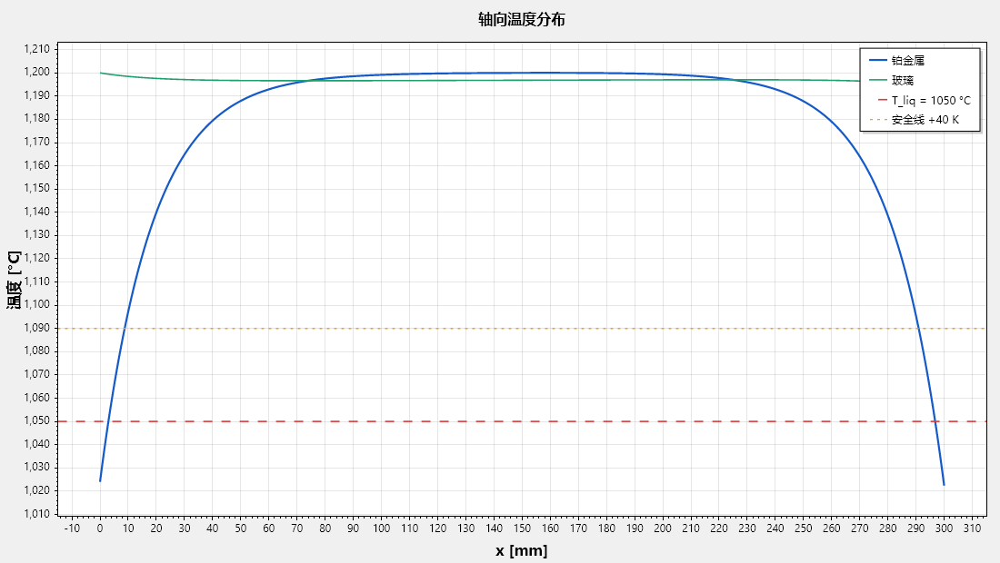
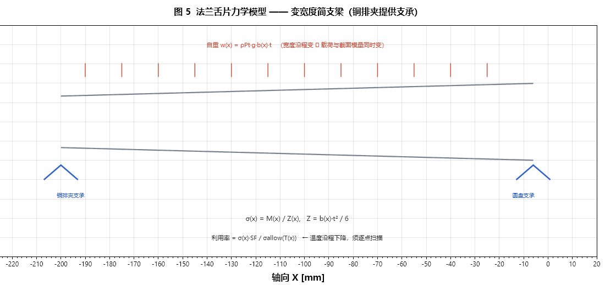

# 摘要

铂金直接通电加热是光学玻璃熔体输送的核心工艺。铂金既是**结构件**（承受玻璃内压与自重）、
又是**发热元件**（承载全部工作电流）、还是**与熔体直接接触的界面**（决定析晶与污染），
三重角色互相牵制，使「减少铂金用量」无法通过单一维度的优化达成。

本文建立铂管与法兰的**电—热—力耦合模型**，全部几何取自 `Pt_Heater.3dm` 实测，
材料数据取自供应商实测工作簿（Tanaka、Umicore），并以数值验证套件（18 项）保证求解正确性。

**核心结论**：在本工况下，铂金用量的约束次序为

$$\text{强度} \;>\; \text{电流密度} \;>\; \text{析晶}$$

纯铂在 1200 °C 以上的持久强度仅 0.5–1.1 MPa，**成为唯一的控制约束**；
现状全线纯铂 1.0 mm 的方案中，高温段（1250 °C、水头 1.0 m）利用率已达 1.11，**本身即已超限**。
改用弥散强化铂（ZGS/FKS16）可使强度约束彻底解除（利用率降至 0.19–0.48），
且因其基体仍为纯铂、**金属价格与纯铂相同**，是本问题性价比最高的单一措施。

\newpage

# 1  绪论

## 1.1 问题的物理本质

铂金直接加热单元同时承担三项互相冲突的功能：

| 角色 | 关键量 | 希望铂金 |
|---|---|---|
| 发热元件 | 电流密度 $J$、电阻率 $\rho_e$ | 截面小（$J$ 高则发热强） |
| 结构件 | 应力 $\sigma$、持久强度 | 截面大（应力低） |
| 熔体界面 | 壁温 $T$、液相线 $T_{liq}$ | 温度高且均匀（防析晶） |

减薄壁厚可省铂，却同时**抬高电流密度**与**抬高应力**，并因轴向导热截面减小而**加深法兰处冷点**。
三条约束沿同一个设计变量（壁厚）反向拉扯，这是本问题的全部难度所在。

## 1.2 优化目标与约束

$$\min\; m_{Pt} \;=\; m_{tube} + 2\,m_{flange} \qquad\text{(1.1)}$$

约束：

$$
\begin{aligned}
&\text{(C1) 电流密度：} && J_{tube} \le J_{allow},\quad J_{flange} \le J_{allow} \\
&\text{(C2) 析晶：}     && T(x) \ge T_{liq} + \Delta T_{margin} \quad \forall x \\
&\text{(C3) 强度：}     && \sigma_{eq}(x)\cdot SF \le \sigma_{allow}(T,\,t_{life}) \\
&\text{(C4) 制造：}     && t \ge t_{min}
\end{aligned}
 \qquad\text{(1.2)}
$$

## 1.3 设计逻辑顺序

本文的分析按以下顺序推进，每一步的输出是下一步的输入：

```
① 几何与工况（3dm + 工作簿）
        ↓
② 电学模型 → 电流分布 J、体积发热 q_v
        ↓
③ 热学模型 → 温度场 T（需 ② 的 q_v）
        ↓
④ 材料模型 → ρe(T)（反馈回 ②）、σ_allow(T) （供 ⑤）
        ↓
⑤ 三条约束校核 → 各自允许的最小壁厚
        ↓
⑥ 取最严者 → 最小可行壁厚 → 铂金质量
        ↓
⑦ 换材料重复 ④–⑥ → 选材决策
```

②↔③↔④ 之间存在双向耦合（发热改变温度，温度改变电阻率与电流分布），故须迭代求解（第 6 章）。

\newpage

# 2  几何与工况

## 2.1 几何（来源：`Pt_Heater.3dm`）



**如何看图 1**：横轴为轴向 $X$，纵轴为横向 $Z$，**比例 1:1**。
绿色圆为管孔（Ø52，即铂管外径），灰色轮廓为法兰平面外形：
右侧是 Ø120 圆盘，向左延伸出梯形舌片至 $X=-200$（末端宽 80），
左端蓝色块为铜排压接夹。橙色虚线为保温分界位置（本文取全包，即 $X=-200$）。

| 部位 | 尺寸 | 数值 |
|---|---|---|
| 铂管 | 外径 / 内径 / 壁厚 | Ø52 / Ø50 / 1.0 mm |
| | 段长 | 300 mm |
| | 导电截面积 $A$ | 160.2 mm² |
| 法兰 | 圆盘直径 | Ø120 |
| | 管孔直径 | Ø52 |
| | 舌片伸出 / 末端宽 / 厚 | 200 / 80 / 2.0 mm |
| | 平面净面积 | 23 591.6 mm² |

**几何自洽性验证**：舌片直边与 Ø120 圆的切点，由几何条件 $\vec{PT}\cdot\vec{OT}=0$ 解得
$(x,z)=(-6.06,\;59.69)$，与 `.3dm` 中记录的挤出路径起点 $(-6.061,\;59.693)$ 吻合至小数点后三位。
由此计算的平面净面积 23 591.6 mm² 与 `.3dm` 提取值完全一致（差 0.00 %）。
**该一致性说明宽度分布模型正确，是后续全部面积、质量、电流密度计算的基础。**

一个值得注意的设计事实：**舌片末端过流截面 $80\times2 = 160.0$ mm²，与铂管导电截面 160.2 mm² 相等**。
两者电流密度因而相同，这显然是刻意配平的结果。

## 2.2 工况（来源：`鉑金電氣計算.xlsx`、`鉑金材料蠕變應力壽命估算.xlsx`）

铂管为**分段控制**，各段温度与压力水头均不同。本文以三段为例：

| 段号 | 设定温度 °C | 玻璃水头 m | 段长 mm |
|---|---|---|---|
| HC1 | 1150 | 0.3 | 300 |
| HC2 | 1200 | 0.6 | 300 |
| HC3 | 1250 | 1.0 | 300 |

其余基准：产量 2 t/day、玻璃液相线 $T_{liq}=1050$ °C、析晶裕度要求 +40 K、
许用电流密度 $J_{allow}=10$ A/mm²、设计寿命 8760 h（1 年）、力学安全系数 2.0。

\newpage

# 3  电学模型

## 3.1 体积生热率 —— 从微分形式欧姆定律推导

**起点**：微分形式欧姆定律与电导率定义

$$\vec J = \sigma_e \vec E,\qquad \sigma_e = \frac{1}{\rho_e} \qquad\text{(3.1)}$$

**单位验证**：$[\vec J] = \mathrm{A/m^2}$，$[\sigma_e]=\mathrm{S/m}=\mathrm{A/(V\cdot m)}$，
$[\vec E]=\mathrm{V/m}$。右端 $\mathrm{\frac{A}{V\cdot m}\cdot\frac{V}{m}=\frac{A}{m^2}}$ ✓

单位体积的电磁功率密度（Poynting 定理中的耗散项）为

$$q_v = \vec J\cdot\vec E \qquad\text{(3.2)}$$

**单位验证**：$\mathrm{\frac{A}{m^2}\cdot\frac{V}{m}=\frac{A\cdot V}{m^3}=\frac{W}{m^3}}$ ✓

将式 (3.1) 代入消去 $\vec E$：

$$q_v = \vec J\cdot\frac{\vec J}{\sigma_e} = \frac{|J|^2}{\sigma_e}$$

$$\boxed{\;q_v = \rho_e(T)\,J^2\quad[\mathrm{W/m^3}]\;} \qquad\text{(3.3)}$$

**物理意义**：单位体积的发热功率与电流密度的**平方**成正比。
这条平方律是全文最重要的一条 —— 它意味着**截面稍微变大，发热能力就急剧下降**，
也是「法兰虽然导电却几乎不发热」的根本原因（第 3.4 节）。

## 3.2 段电阻、线生热率与总功率

等截面直管中电流沿轴向均匀分布，$J=I/A$：

$$R = \frac{\rho_e L}{A} \qquad\text{(3.4)}$$

$$q_L \equiv q_v A = \rho_e\left(\frac{I}{A}\right)^2 A = \frac{I^2\rho_e}{A}\quad[\mathrm{W/m}] \qquad\text{(3.5)}$$

$$P = q_L L = \frac{I^2\rho_e L}{A} = I^2 R \qquad\text{(3.6)}$$

式 (3.6) 即宏观焦耳定律 —— 它是由式 (3.3) **导出**的，而非另行假设，模型自洽。

## 3.3 质量方程 —— 目标函数的解析形式

设一段铂件须供给功率 $P$。由式 (3.3)，在电流密度均匀的前提下

$$P = \int_V q_v\,\mathrm{d}V = \rho_e J^2 V \qquad\text{(3.7)}$$

铂质量 $m = d_{Pt}V$，故 $V = m/d_{Pt}$，代入：

$$\boxed{\;m = \frac{d_{Pt}\,P}{\rho_e(T)\,J^2}\;} \qquad\text{(3.8)}$$

**单位验证**：$\mathrm{\frac{(kg/m^3)\cdot W}{(\Omega\cdot m)\cdot(A/m^2)^2}
=\frac{kg\cdot W}{m^3}\cdot\frac{m^4}{\Omega\cdot m\cdot A^2}
=\frac{kg\cdot W}{\Omega\cdot A^2}=kg}$（因 $\Omega A^2 = \mathrm{W}$）✓

**物理意义与工程用途**：在电流密度被安全上限钳死、材料与温度确定的前提下，
**铂金质量与所需功率成严格正比**。由于供料管的功率几乎全部用于补偿散热
（玻璃焓增仅占 8 %，见第 4.2 节），可得本问题的第一条工程判据：

> **省铂金 ≡ 省热损失。** 二者是同一个量，比例系数为 $d_{Pt}/(\rho_e J_{allow}^2)$。
> 任何被吹走、辐射掉、传导流失的瓦特，都必须由铂金发出来，因而都折算成克数。

## 3.4 法兰二维电流场

法兰的实际几何是「圆盘 + 平面梯形舌片」，电流由舌片**单侧**汇入管孔，是本质二维问题。



**如何看图 3**：红色曲线是电流流线示意。全部电流从左端等电位边（铜排压接处）进入，
沿舌片向右流动，在接近管孔时被迫**汇聚绕行**，最终在孔的迎流侧（左半周）进入管壁。
流线在孔左侧明显密集 —— 流线越密，电流密度越高。

薄板深度平均后的控制方程为

$$\nabla\cdot\left(\sigma_e\,t\,\nabla V\right)=0 \qquad\text{(3.9)}$$

守恒量是**面电流密度** $\vec K=-\sigma_e t\nabla V$（单位 A/mm），而电流密度

$$\vec J = \vec K/t = -\sigma_e\nabla V \qquad\text{(3.10)}$$

> **一个易犯的错误**：$J$ 与板厚**无关**。加厚只增大 $K$ 的通过能力，
> 不改变同一电位梯度下的 $J$。若在 $J$ 上再乘一次厚度因子，会得到「加厚区 $J$ 虚低」的假象，
> 使 $J_{\max}$ 的位置错误外移。本模型在实现时曾犯此错，由电流守恒检验（式 6.4）暴露。

**边界条件**

| 边界 | 类型 | 依据 |
|---|---|---|
| 舌片末端整条边 | Dirichlet $V=V_0$ | 整条边压接铜排，铜电导率为铂的 6 倍，视为等电位 |
| 管孔一圈 | Dirichlet $V=0$ | 电流全部交给管壁 |
| 其余自由边 | 自然 Neumann | 掩膜网格上「邻居在域外 ⇒ 该面通量为零」自动满足 |

**计算结果**（$I=1216$ A，网格 $h=0.5$ mm）：

| 位置 | $J$ [A/mm²] |
|---|---|
| 铂管壁 | 7.59 |
| 法兰平均 | 6.38 |
| **管孔迎流侧** | **10.63** |

**电流密度的最高点在法兰孔周，不在管子** —— 比管壁高 40 %。
孔周局部加厚可将其降至 9.59 A/mm²，但**再加厚无收益**：瓶颈随即转移到舌片末端角点，
该处由末端截面（$80\times2$ mm²）决定，与孔周厚度无关。
故加厚区取 $r\le40$ mm、厚 3.0 mm 即到顶，增铂 125 g/对。





**如何看图 c1 / c2**：横轴为轴向 $x$（0 = 法兰端面），纵轴为半径。
**注意纵轴为分段拉伸**：管壁仅 1.0 mm 而法兰跨越 30 mm，等比绘制则管壁不可辨，
故将管壁映射到图面下部约 1/3 高度（放大约 24 倍），纵轴刻度标注的是**真实半径**。
颜色为感知均匀色阶（Viridis），越亮值越大。

图 c2 是本文最直观的一张图：**管壁（底部窄带）呈亮黄，法兰（左侧大块）整体深紫**。
在同一色标下，法兰几乎不发热，却占据了绝大部分面积与全部散热 ——
这正是式 (3.3) 的平方律与面积膨胀同时作用于一处的图像证据。

\newpage

# 4  热学模型

## 4.1 管段一维稳态方程 —— 微元法推导



**如何看图 2**：取轴向位置 $x$ 处、长度 $\mathrm{d}x$ 的管段作为控制体（虚线框）。
蓝色箭头为轴向导热的流入与流出，红色为焦耳生成，橙色为外表面散失，绿色为传给玻璃。
稳态下四者之和为零。

逐项写出：

| 项 | 表达式 | 单位 |
|---|---|---|
| (a) 左端导入 | $Q(x)=-kA\,\mathrm{d}T/\mathrm{d}x$ | W |
| (b) 右端导出 | $Q(x+\mathrm{d}x)=Q(x)+\dfrac{\mathrm{d}Q}{\mathrm{d}x}\mathrm{d}x$ | W |
| (c) 焦耳生成 | $q_L\,\mathrm{d}x = \dfrac{I^2\rho_e(T)}{A}\mathrm{d}x$ | W |
| (d) 外表面散失 | $q'_{loss}(T)\,\mathrm{d}x$ | W |
| (e) 传给玻璃 | $h_g P_i\,(T-T_g)\,\mathrm{d}x$ | W |

代入守恒式，(a) 与 (b) 相减得 $-\dfrac{\mathrm{d}Q}{\mathrm{d}x}\mathrm{d}x$：

$$-\frac{\mathrm{d}Q}{\mathrm{d}x}\mathrm{d}x + q_L\mathrm{d}x - q'_{loss}\mathrm{d}x
- h_g P_i(T-T_g)\mathrm{d}x = 0$$

两边除以 $\mathrm{d}x$ 并回代 $Q=-kA\,\mathrm{d}T/\mathrm{d}x$：

$$\boxed{\;\frac{\mathrm{d}}{\mathrm{d}x}\!\left(kA\frac{\mathrm{d}T}{\mathrm{d}x}\right)
+ \frac{I^2\rho_e(T)}{A} - q'_{loss}(T) - h_g P_i (T-T_g) = 0\;} \qquad\text{(4.1)}$$

**单位验证**：各项均为 W/m。第一项 $\mathrm{\frac{1}{m}\left(\frac{W}{m\cdot K}\cdot m^2\cdot\frac{K}{m}\right)=\frac{W}{m}}$ ✓

**物理意义**：这是「**通电肋片方程**」。与经典肋片方程的唯一区别，是多了一个
**随温度变化的内部热源** $I^2\rho_e(T)/A$。正是这一项的温度依赖性带来了热稳定性问题（第 4.5 节）。

## 4.2 玻璃侧能量方程

$$\dot m\,c_{p,g}\frac{\mathrm{d}T_g}{\mathrm{d}x} = h_g P_i (T-T_g) \qquad\text{(4.2)}$$

忽略玻璃轴向导热的依据（Peclet 数）：

$$Pe=\frac{\rho_g v D c_{p,g}}{k_g}
=\frac{2500\times8.6\times10^{-3}\times0.0384\times1300}{2}\approx537 \gg 1 \;✓$$

**功率构成的量级比较**（2 t/day，$\Delta T_g=10$ K）：

$$P_{glass}=\dot m c_{p,g}\Delta T_g = 300\ \mathrm{W},\qquad
P_{loss}=q'L = 3710\ \mathrm{W},\qquad \frac{300}{3710}=8\,\%$$

**约 92 % 的电功率用于补偿散热**，印证第 3.3 节的判据。

## 4.3 多层保温 —— 圆筒热阻串联



**如何看图 4**：横轴为真实半径。自内向外依次为玻璃、铂管壁（1.0）、
高纯氧化铝纤维（10）、致密氧化铝套管（5）。每层的热阻按式 (4.5) 计算后**串联相加**。

保温层内无内热源，稳态柱坐标导热方程

$$\frac{1}{r}\frac{\mathrm{d}}{\mathrm{d}r}\!\left(k\,r\,\frac{\mathrm{d}T}{\mathrm{d}r}\right)=0
 \qquad\text{(4.3)}$$

首次积分得 $k\,r\,\mathrm{d}T/\mathrm{d}r = C$。单位长度径向热流

$$q' = -k(2\pi r)\frac{\mathrm{d}T}{\mathrm{d}r} = -2\pi C \qquad\text{(4.4)}$$

故 $C$ 与 $r$ 无关（能量守恒的必然结果）。分离变量并从 $r_1$ 积到 $r_2$：

$$T_1-T_2 = q'\,\frac{\ln(r_2/r_1)}{2\pi k}\;\equiv\;q'R'_{th} \qquad\text{(4.5)}$$

**单位验证**：$[R'_{th}]=\mathrm{\frac{1}{W/(m\cdot K)}=\frac{m\cdot K}{W}}$，
乘以 $q'$ [W/m] 得 K ✓

$n$ 层串联：

$$q'=\frac{T_{inner}-T_{outer}}{\displaystyle\sum_{i}\ln(r_{i+1}/r_i)/(2\pi k_i)} \qquad\text{(4.6)}$$

### 4.3.1 变导热系数的严格处理

纤维材料的 $k$ 在 200–1200 °C 间变化 4 倍以上，不可取常数。由式 (4.5) 的积分形式，
正确做法是定义**积分平均导热系数**

$$\bar k \equiv \frac{1}{T_2-T_1}\int_{T_1}^{T_2}k(T)\,\mathrm{d}T \qquad\text{(4.7)}$$

对线性模型 $k(T)=k_0+k_1T$：

$$\bar k=\frac{1}{T_2-T_1}\left[k_0T+\frac{k_1}{2}T^2\right]_{T_1}^{T_2}
= k_0+k_1\frac{T_1+T_2}{2}=k(\bar T) \qquad\text{(4.8)}$$

> **结论**：对线性 $k(T)$，「取平均温度处的 $k$ 值」与「积分平均」**完全等价，不是近似**。
> 这为程序中「用界面温度均值算 $k$」提供了严格依据。若 $k(T)$ 非线性（如含辐射项 $k\propto T^3$），
> 该等价不成立，须回到式 (4.7) 数值积分。

## 4.4 表面散热与辐射线性化

$$q''_{rad}=\varepsilon\sigma\left(T_s^4-T_a^4\right) \qquad\text{(4.9)}$$

定义辐射等效换热系数并**精确**因式分解（无近似）：

$$h_r \equiv \frac{q''_{rad}}{T_s-T_a}
=\varepsilon\sigma\,(T_s+T_a)(T_s^2+T_a^2) \qquad\text{(4.10)}$$

### 4.4.1 割线斜率与切线斜率 —— 一个必须区分的细节

式 (4.10) 给出的是**割线**斜率 $q''/\Delta T$。但在任何线性化或摄动分析中，
须用**切线**斜率 $\mathrm{d}q''/\mathrm{d}T_s = 4\varepsilon\sigma T_s^3$。二者之比

$$\frac{\mathrm{d}q''/\mathrm{d}T_s}{q''/\Delta T}
=\frac{4T_s^3(T_s-T_a)}{T_s^4-T_a^4}
\;\xrightarrow[T_a\ll T_s]{}\;4$$

以 $T_s=1573$ K、$T_a=298$ K 计，该比值为 **3.25**。

> **工程含义**：若在稳定性判据或热衰减长度中误用割线斜率，
> 将把散热的「抗扰动能力」**低估 3.25 倍**。本模型一律使用数值切线。

## 4.5 特征量

**热衰减长度**：令 $\theta=T-T_p$ 为对平台温度的偏离，线性化式 (4.1) 得

$$kA\frac{\mathrm{d}^2\theta}{\mathrm{d}x^2}-\beta\theta=0
\;\Longrightarrow\;\theta=\theta_0 e^{-x/\ell},\qquad
\boxed{\;\ell=\sqrt{\frac{kA}{\beta}}\;} \qquad\text{(4.11)}$$

其中 $\beta = \mathrm{d}q'_{loss}/\mathrm{d}T + h_g P_i$（切线斜率 + 玻璃耦合）。

**物理意义**：端部扰动（法兰冷点、局部保温缺失）沿轴向的影响范围。
本工况 $\ell=18.2$ mm，即法兰冷效应集中在约 $3\ell\approx55$ mm 内 ——
**范围小，但正因为范围小，梯度极陡**，这是析晶发生在紧邻法兰处的原因。

**热稳定判据**：恒流下某处温度升高 ⇒ 电阻率升高（$\mathrm{d}\rho_e/\mathrm{d}T>0$）
⇒ 该处发热更多，构成正反馈。摄动分析给出

$$kA\frac{\mathrm{d}^2\theta}{\mathrm{d}x^2}
+\left[\frac{I^2}{A}\frac{\mathrm{d}\rho_e}{\mathrm{d}T}-\beta\right]\theta=0$$

稳定要求方括号为负，即

$$\boxed{\;S \equiv \frac{\beta A}{I^2\,(\mathrm{d}\rho_e/\mathrm{d}T)} > 1\;} \qquad\text{(4.12)}$$

本工况 $S=19.7$，裕度充分，主要由玻璃侧耦合提供。
**结论**：纯铂的电阻温度系数足够低（1300 °C 时 0.047 %/K），恒流直接加热**本质稳定**。

## 4.6 法兰二维温度场

$$\nabla\cdot\left(k\,t\,\nabla T\right)+q_v t-2\,q''(T,\text{分段})=0 \qquad\text{(4.13)}$$

$q_v$ 由第 3.4 节的电流场给出；$q''$ 按 $X$ 分段取保温值或裸铂值。

### 4.6.1 从管子抽走的热量：用能量恒等式而非逐面累加

对所有有方程的格点求和，传导项伸缩相消，只剩与 Dirichlet 格点相邻的面：

$$\sum_i R_i=\left(Q_{gen}-Q_{loss}\right)+Q_{fromTube}=0
\;\Longrightarrow\;\boxed{\;Q_{fromTube}=Q_{loss}-Q_{gen}\;} \qquad\text{(4.14)}$$

> **实现教训**：最初按「遍历孔边界格点、累加四个邻面通量」统计，
> 在阶梯状圆孔边界上会漏面，实测偏小 14 %（212 vs 243 W）。
> 式 (4.14) 由守恒律直接给出，无需枚举边界面，故不会漏。

\newpage

# 5  材料模型

## 5.1 电阻率

$$\rho_e(T)=\rho_0\left[1+\alpha(T-T_0)+\beta(T-T_0)^2\right]\quad[\mu\Omega\!\cdot\!\mathrm{cm}]
 \qquad\text{(5.1)}$$

系数取自 `鉑金電氣計算.xlsx`（全精度）：

| 牌号 | $\alpha$ | $\beta$ | $\rho_0$ | $T_0$ |
|---|---|---|---|---|
| Pt | 3.9678411655333e-3 | −5.849309909955442e-7 | 9.83 | 0 |
| FKS16/Pt | 3.5292752903631e-3 | −4.428617180603556e-7 | 10.0 | 0 |
| Pt-Rh/90-10 | 1.3483449502269e-3 | −1.2572651570642e-8 | 19.1 | 0 |
| Pt-Rh/80-20 | 1.2512196262706e-3 | −1.286233111334e-7 | 20.8 | 20 |
| FKS16/PtRh-9010 | 1.5918684719034e-3 | −1.978599242696e-7 | 19.9 | 0 |

**验证**：Pt 在 1150 °C 时模型给出 47.0803 μΩ·cm，与工作簿单元格 I5 完全一致（差 < 1e-6）；
对全表 17 个实测点的 SSE = 0.0114877，与工作簿标注值吻合。

## 5.2 持久强度（蠕变断裂）

$$T\cdot\log_{10}\sigma = a(T)\cdot\log_{10}t + b(T) \qquad\text{(5.2)}$$

其中 $a(T)$、$b(T)$ 为绝对温度的**五次多项式**。该形式比单一 Larson–Miller 直线更灵活 ——
**斜率也随温度变**，因而能同时贴合弥散强化材料（曲线平缓）与纯铂（曲线陡）。

由式 (5.2) 可正反两用：

$$\sigma = 10^{\left[a\log_{10}t+b\right]/T},\qquad
t = 10^{\left[T\log_{10}\sigma-b\right]/a} \qquad\text{(5.3)}$$

**验证**：对工作簿中 **110 个供应商实测点**（Tanaka + Umicore，1000–1500 °C，1–10⁴ h）
逐点比对，**平均相对偏差 0.93 %，最大 4.6 %**；应力与寿命互算的往返误差 < 1e-9。

### 5.2.1 外推保护 —— 一个必须设置的护栏

多项式在拟合区间外会剧烈发散。实测：将纯铂外推到 900 °C，
式 (5.3) 给出 **8648 MPa** 的荒谬值（真实量级为个位数 MPa）。
故程序为每个牌号记录**有效温度区间**，区间外一律返回「超范围」而非数值。

| 牌号 | 有效区间 | 来源 |
|---|---|---|
| Pt、Pt-Rh/90-10、Pt-Rh/80-20 | 1100–1400 °C | Tanaka 原始数据点范围 |
| Tanaka-ZGS-Pt、ZGS-PtRh10 | 1000–1500 °C | Tanaka 原始数据点范围 |
| FKS16 系列 | 1000–1500 °C（**推定**） | Umicore 工作簿仅给系数，须向供应商确认 |

\newpage

# 6  数值方法与验证

## 6.1 求解器结构

| 模块 | 方程 | 方法 |
|---|---|---|
| `Bvp1D` | $\frac{\mathrm{d}}{\mathrm{d}s}(K\frac{\mathrm{d}T}{\mathrm{d}s})+S(s,T)=0$ | 有限体积 + Picard + 三对角追赶 |
| `SegmentSolver` | 管段金属 + 玻璃耦合 | 内层 Bvp1D，中层二分求电流，外层不动点求壁厚 |
| `PlateCurrent2D` | $\nabla\cdot(\sigma_e t\nabla V)=0$ | 掩膜网格五点格式 + SOR |
| `PlateThermal2D` | 式 (4.13) | 同上，Picard 处理 $T^4$ 非线性 |
| `CoupledSolver` | 管段 ↔ 法兰 ↔ $\sigma_e(T)$ ↔ 法兰厚度 | 外层不动点 |

管段与法兰径向共用同一个一维内核（管取 $s=x$、$K=kA$；法兰取 $s=r$、$K=k\,t_f(r)\,r$），
故只需验证一次。

## 6.2 验证结果（18 项，全部通过）

| 验证项 | 方法 | 结果 |
|---|---|---|
| 一维内核精度 | 制造解法 MMS，$n$ = 41→641 | 观测阶 1.991 → 1.999（理论 2 阶） |
| 解析肋片解 | $\cosh/\sinh$ 精确解对照 | 最大相对误差 < 1e-3 |
| 一维能量闭合 | $\int q_{gen}=\int q_{loss}$ | 残差 < 1e-9 |
| 圆筒导热 | 对照式 (4.5) 解析解 | 相对差 3.6e-9 |
| 线性 $k$ 的积分平均 | 对照式 (4.8) | 差 < 1e-9 |
| 辐射切线/割线比 | 对照手算 | 3.2461（手算 3.25） |
| 电阻率拟合 | 17 个实测点 SSE | 1.148763e-2（工作簿 1.1487668e-2） |
| **蠕变模型** | **110 个供应商实测点** | **平均偏差 0.93 %，最大 4.6 %** |
| 二维电流守恒 | 流入 vs 流出 | 相对误差 1.3e-3 |
| 二维温度场能量闭合 | 逐格残差 $\sum R_i$ | 1.9e-7 |
| 网格收敛 | Richardson 外推 | 观测阶 2.13，$n=401$ 误差 0.47 K |

**关于 MMS**：先设定精确解 $T_e(x)$，反代入方程得到源项，再让求解器去解并比对。
该方法能证明**代码解的确实是所写的方程**，可排除离散化 bug，是本套验证中最关键的一项。

\newpage

# 7  计算结果

## 7.1 连接区温度场



**如何看**：与图 c1 同样的坐标系统。红色虚线为液相线 $T_{liq}$ 穿越位置，
橙色点线为安全线（$T_{liq}$+40 K）。管壁自法兰端面向右迅速升温，
穿越两条线的位置即析晶风险区的边界。



**如何看**：蓝线为铂金属温度，绿线为玻璃主流温度，红/橙水平线为析晶判据。
**曲线低于红线的区段即为析晶风险区。**

## 7.2 力学校核（表 1）

来源：`--cli --mech`。材料 Pt，寿命 8760 h，管温 1200 °C，水头 0.5 m，安全系数 2.0。

| 管壁 mm | 管合成应力 MPa | 需许用 MPa | 纯铂许用 MPa | 利用率 | 判定 |
|---|---|---|---|---|---|
| 1.000 | 0.403 | 0.807 | 1.079 | 0.75 | ✓ |
| 0.900 | 0.435 | 0.869 | 1.079 | 0.81 | ✓ |
| 0.800 | 0.474 | 0.948 | 1.079 | 0.88 | ✓ |
| 0.700 | 0.525 | 1.050 | 1.079 | 0.97 | ✓ |
| **0.600** | 0.594 | 1.188 | 1.079 | **1.10** | **✗** |
| 0.562 | 0.627 | 1.253 | 1.079 | 1.16 | ✗ |
| 0.500 | 0.691 | 1.382 | 1.079 | 1.28 | ✗ |

**表格结构说明**：「合成应力」为环向（内压）与轴向（自重弯曲）的 von Mises 组合；
「需许用」= 合成应力 × 安全系数；「利用率」= 需许用 / 材料许用，**> 1 即超限**。

**读法**：纯铂在 1200 °C 下，壁厚不能低于约 0.68 mm。

### 表 2  压力水头敏感性（管壁 0.562 mm）

| 水头 m | 内压 kPa | 管环向 MPa | 管合成 MPa | 需许用 MPa |
|---|---|---|---|---|
| 0.2 | 4.9 | 0.245 | 0.585 | 1.169 |
| 0.5 | 12.3 | 0.576 | 0.627 | 1.253 |
| **1.0** | 24.5 | 1.128 | 0.982 | **1.964** |
| 1.5 | 36.8 | 1.679 | 1.464 | 2.929 |
| 2.0 | 49.1 | 2.231 | 1.983 | 3.967 |
| 3.0 | 73.6 | 3.334 | 3.056 | 6.111 |

**读法**：水头 1.0 m 是一个门槛 —— 超过它，环向应力开始压过弯曲应力，
需许用值突破 2 MPa（纯铂能力上限）。**分段控制下各段水头不同，
高水头段的壁厚不能沿用低水头段的最优值。**

## 7.3 材料对比（表 3）

来源：`--cli --matcmp`。工作温度 1200 °C，寿命 8760 h，安全系数 2.0。

| 牌号 | $\rho_e$ μΩ·cm | $\sigma_{断裂}$ MPa | $\sigma_{许用}$ MPa | 强度倍数 | $\rho_e$ 倍数 |
|---|---|---|---|---|---|
| Pt | 48.35 | 1.08 | 0.54 | 1.00 | 1.00 |
| **FKS16/Pt** | 45.97 | **8.24** | 4.12 | **7.64** | **0.95** |
| Tanaka-ZGS-Pt | 48.35 | 8.31 | 4.15 | 7.70 | 1.00 |
| Pt-Rh/90-10 | 49.66 | 2.54 | 1.27 | 2.35 | 1.03 |
| Umicore-PtRh10 | 49.66 | 2.75 | 1.37 | 2.55 | 1.03 |
| FKS16/PtRh-9010 | 52.24 | 19.05 | 9.53 | 17.66 | 1.08 |
| Tanaka-ZGS-PtRh10 | 49.66 | 14.26 | 7.13 | 13.22 | 1.03 |
| Pt-Rh/80-20 | 47.78 | 3.17 | 1.58 | 2.94 | 0.99 |

### 表 4  强度的温度敏感性 [MPa @ 8760 h]

| 牌号 | 1000 °C | 1100 | 1200 | 1300 | 1400 |
|---|---|---|---|---|---|
| Pt | 超范围 | 2.11 | 1.08 | 1.00 | 0.68 |
| FKS16/Pt | 26.32 | 15.39 | 8.24 | 4.66 | 2.64 |
| Tanaka-ZGS-Pt | 16.68 | 13.22 | 8.31 | 7.00 | 4.22 |
| Pt-Rh/90-10 | 超范围 | 3.53 | 2.54 | 1.82 | 1.29 |
| FKS16/PtRh-9010 | 75.74 | 35.61 | 19.05 | 11.79 | 8.02 |
| Tanaka-ZGS-PtRh10 | 29.05 | 21.51 | 14.26 | 10.25 | 6.40 |

**「超范围」的含义**：该温度落在供应商数据的拟合区间之外，
外推会得到发散的错误值，故程序拒绝输出（见 5.2.1 节）。

**读法**：
1. **弥散强化是主力，合金化不是。** FKS16/Pt 强度 7.6 倍且电阻率反而低 5 %；
   Pt-Rh 90-10 只有 2.35 倍，电阻率还高 3 %。
2. **纯铂在 1100 °C 后急剧劣化**（2.11 → 1.08 → 1.00 MPa），
   而弥散强化材料曲线平缓得多。工作温度越高，强化材料的相对优势越大。

## 7.4 最小可行壁厚矩阵（表 5）

来源：`--cli --matrix`。$J_{allow}=10$ A/mm²，寿命 8760 h，SF = 2.0，水头 0.5 m。

| 牌号 | 1100 °C | 1150 | 1200 | 1250 | 1300 |
|---|---|---|---|---|---|
| **Pt** | 0.310 | 0.533 | 0.677 | 0.720 | **0.744** |
| Pt-Rh/90-10 | 0.178 | 0.212 | 0.253 | 0.303 | 0.364 |
| Tanaka-ZGS-Pt | 0.150 | 0.150 | 0.150 | 0.150 | 0.150 |
| FKS16/Pt | 0.150 | 0.150 | 0.150 | 0.150 | 0.150 |
| Tanaka-ZGS-PtRh10 | 0.150 | 0.150 | 0.150 | 0.150 | 0.150 |
| FKS16/PtRh-9010 | 0.150 | 0.150 | 0.150 | 0.150 | 0.150 |

**表格结构说明**：数值为**强度允许的最小壁厚**（解析二分求解 $\sigma_{eq}\cdot SF=\sigma_{allow}$）。
**0.150 是搜索下界**，出现该值意味着「强度在该温度下根本不构成约束」。

**读法**：四种弥散强化牌号在 1100–1300 °C 全区间都碰不到强度限；
纯铂则在 1200 °C 以上不得低于约 0.70 mm，且曲线在高温端趋于平坦
（因减薄同时降低自重弯矩，与许用应力下降部分抵消）。

## 7.5 分段核算（表 6）

来源：`--cli --line`。三段工况见 2.2 节。

**方案 ① 现状：全线纯铂 1.0 mm**

| 段 | 温度 °C | 水头 m | 壁厚 mm | 强度最小 mm | 利用率 | 铂重 g | 判定 |
|---|---|---|---|---|---|---|---|
| HC1 | 1150 | 0.3 | 1.000 | 0.477 | 0.60 | 1031 | ✓ |
| HC2 | 1200 | 0.6 | 1.000 | 0.735 | 0.78 | 1031 | ✓ |
| **HC3** | **1250** | **1.0** | 1.000 | **1.120** | **1.11** | 1031 | **✗ 强度** |
| | | | | | **合计** | **3093** | **1 段超限** |

**方案 ② 纯铂 + 按强度取最小壁厚**

| 段 | 壁厚 mm | 利用率 | 铂重 g |
|---|---|---|---|
| HC1 | 0.477 | 1.00 | 487 |
| HC2 | 0.735 | 1.00 | 754 |
| HC3 | 1.120 | 1.00 | 1157 |
| | | **合计** | **2398** |

**方案 ③ 按段选最省牌号 + 最小壁厚**

| 段 | 牌号 | 壁厚 mm | 利用率 | 铂重 g |
|---|---|---|---|---|
| HC1 | Tanaka-ZGS-Pt | 0.300 | 0.19 | 305 |
| HC2 | Tanaka-ZGS-Pt | 0.300 | 0.29 | 305 |
| HC3 | Tanaka-ZGS-Pt | 0.300 | 0.48 | 305 |
| | | | **合计** | **915** |

**三个方案的读法**：

- **① 暴露了现状的隐患**：HC3 段（1250 °C + 1.0 m 水头）利用率 1.11，**已经超限**。
  这不是优化问题，是现状的安全问题。
- **② 说明纯铂无优化空间**：三段利用率全为 1.00，即全部踩在强度极限上，
  安全系数虽已计入但无任何工程余量；且 HC3 反而需**加厚**至 1.120 mm。
- **③ 弥散强化解除约束**：利用率最高仅 0.48，壁厚降至搜索下界 0.300 mm。
  **且 ZGS 基体仍为纯铂，金属价格与纯铂相同**，故相对成本同样是 915。

> **重要保留**：方案 ③ 的 0.300 mm 是程序的搜索下界，**不是工艺下界**。
> 若实际可制造/可装配的最小壁厚为 0.5 mm，结果将是 1525 g（仍省 51 %）。
> 此外方案 ③ 只施加了强度约束，电流密度与析晶两条约束尚未并入分段核算，
> 大概率会把壁厚顶回去。**该数值应视为上界潜力，而非可交付设计值。**

## 7.6 力学模型的一个细节：应力峰与利用率峰不在同一处



**如何看图 5**：舌片为**变宽度简支梁**（两端由圆盘与铜排夹支承，用户确认）。
红色箭头为均布自重。因宽度沿程变化，**载荷 $w(x)$ 与截面模量 $Z(x)$ 同时变**，
且温度沿程下降使许用应力沿程变化 —— 三者的极值不在同一位置。

计算证实（`--cli --tabscan`）：**应力峰值在 $x=-109$ mm（跨中附近，温度较低），
而利用率峰值在 $x=-27$ mm（靠近圆盘的根部，温度最高）**。
若按单点粗算（取根部宽度配跨中弯矩），会得出「舌片超限」的错误结论。
必须沿程逐点扫描。

\newpage

# 8  设计建议

按**实施难度与确定性**排序：

## 8.1 立即可做（不动铂件尺寸）

| 措施 | 依据 | 效果 |
|---|---|---|
| 停止压缩空气吹风 | 式 (3.8)：吹掉的每瓦都折算成铂重 | 消除 48 % 的法兰功率浪费 |
| 法兰保温包至舌片末端 | 保温分界扫描 | 析晶裕度 −122 → +49 K |
| 铜排夹改风冷（≤300 °C） | 夹持温度扫描：400 → 80 °C 边际收益极小 | 裕度再 +10 K，**无需水冷** |
| 保持铂表面光洁 | 辐射占散热 82 %，且 $\propto\varepsilon$ | 最多省 40 % 散热 |

## 8.2 需变更设计

| 措施 | 依据 | 效果 |
|---|---|---|
| 孔周局部加厚（$r\le40$ mm 至 3.0 mm） | 表 3.4：$J_{max}$ 10.63 → 9.59 | 消除 $J$ 越界，增铂 125 g/对 |
| **HC3 段壁厚加至 1.12 mm 或换材料** | 表 6 方案 ① | **消除现状超限（安全问题）** |

## 8.3 换材料（省铂的唯一通路）

**推荐 FKS16/Pt 或 Tanaka-ZGS-Pt**：

- 强度提升 7.6–7.7 倍，**强度约束彻底解除**
- **金属价格与纯铂相同**（ZrO₂ 弥散相 < 1 %，可忽略）
- 电阻率相当或略低（FKS16/Pt 低 5 %）
- 唯一增量成本是**加工溢价**，须向供应商询价

不推荐单纯加铑：Pt-Rh 90-10 强度仅 2.35 倍，电阻率高 3 %，
且按 2026-08-06 现货价（Pt \$1731/oz、Rh \$8500/oz，Rh/Pt = 4.91），
金属价格为纯铂的 **1.39 倍**。

\newpage

# 9  结论

1. **约束次序已确定**：本工况下 **强度 > 电流密度 > 析晶**。
   纯铂在 1200 °C 以上的许用应力仅 0.50–0.54 MPa，是唯一的控制约束。

2. **现状存在安全隐患，而非仅有优化空间**：HC3 段（1250 °C、水头 1.0 m）
   在 1.0 mm 壁厚下利用率 1.11，**已经超限**，应优先处理。

3. **纯铂条件下无省铂空间**：按强度取最小壁厚后三段利用率全为 1.00，
   无任何工程余量，且高温段反需加厚。

4. **弥散强化铂是唯一的解**：强度提升 7.6 倍使约束解除，
   而**金属价格与纯铂相同** —— 这是本问题中罕见的「不付金属代价即可解除约束」的措施。

5. **电流密度的最高点在法兰孔周而非管子**（10.63 vs 7.59 A/mm²）。
   该结论与常规直觉相反，且孔周加厚的收益在 $J_{max}=9.59$ 处饱和。

6. **吹风是在用铂金买安全**：由质量方程 $m=d_{Pt}P/(\rho_e J^2)$，
   被强制对流带走的每一瓦都必须由铂金发出，直接折算成克数。
   停吹风 + 全包保温可将析晶裕度从 −122 K 提升至 +49 K，且不动任何铂件。

\newpage

# 10  模型局限与待补数据

## 10.1 已知局限

| 项目 | 局限 | 影响 |
|---|---|---|
| 铂表面发射率 $\varepsilon$ | 取决于表面状态，0.10–0.30 | 总散热 ±40 %（**最大不确定源**） |
| 自然对流关联式 | Churchill–Chu，±15 % | 总散热 < 3 %（辐射主导） |
| 强制对流 | 平板关联式，射流冲击实际更高 | 吹风工况偏保守 |
| 二维孔周 $J$ | 阶梯边界，$h$ 减半时 $J_{max}$ 涨 3.5 % | **现值是下界** |
| FKS16 蠕变区间 | 工作簿仅给系数，区间为推定 | 须向供应商确认 |
| 分段核算 | 仅含强度约束 | $J$ 与析晶未并入，方案 ③ 为上界 |
| 水冷/风冷夹 | 末端整条边定温，未计接触热阻 | 接触热阻大则效果打折 |

## 10.2 待补数据（按影响排序）

1. **工艺可制造最小壁厚** —— 直接决定方案 ③ 的 915 g 是否可达
2. **各段实际温度与水头** —— 高水头段可能需要更厚壁
3. **FKS16 / ZGS 的加工溢价** —— 完成成本对比的最后一块
4. **铂表面发射率或表面状态记录** —— 收紧最大不确定源
5. **玻璃液相线 $T_{liq}$ 实测值** —— 析晶判据的基准

## 10.3 建议的现场验证顺序

1. 段电流与段电压 → 校验电阻，反推平均金属温度
2. 保温外表面温度 → 校验多层保温模型
3. 法兰本体温度（红外） → 校验自给率与浮动温度
4. 法兰前后 0–150 mm 轴向温度分布 → 校验热衰减长度与冷点深度
5. 二次电流的直流分量（钳表直流档） → 判定是否存在电解风险
6. 拆检时记录舌片有无永久弯曲 → 验证力学模型

---

**附：数据来源**

- 几何：`Pt_Heater.3dm`（图层 `铂金管`、`法兰`）
- 电阻率：`鉑金電氣計算.xlsx`
- 持久强度：`鉑金材料蠕變應力壽命估算.xlsx`（Tanaka、Umicore）
- 金属价格：Umicore PMM，2026-08-06（Pt \$1731/oz、Rh \$8500/oz）
- 全部图表与表格：由 `Pt_Optimize` 计算生成，命令见各表标注

*— 报告结束 —*
