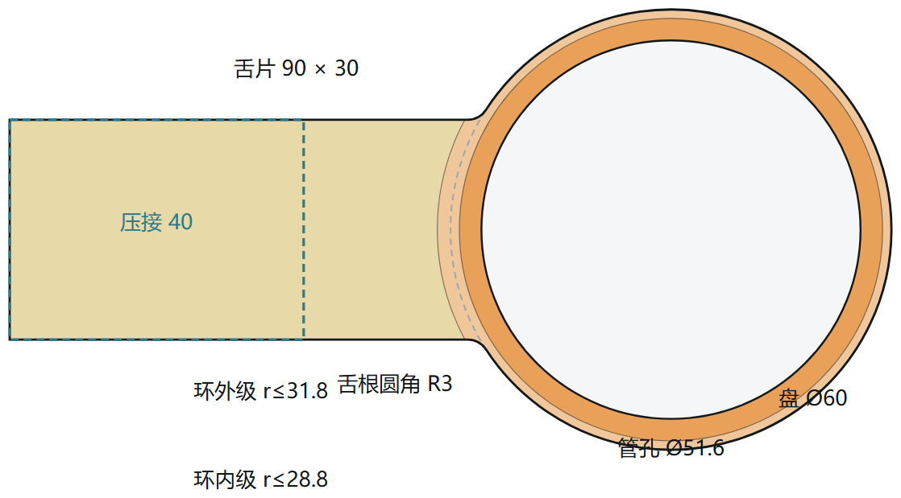
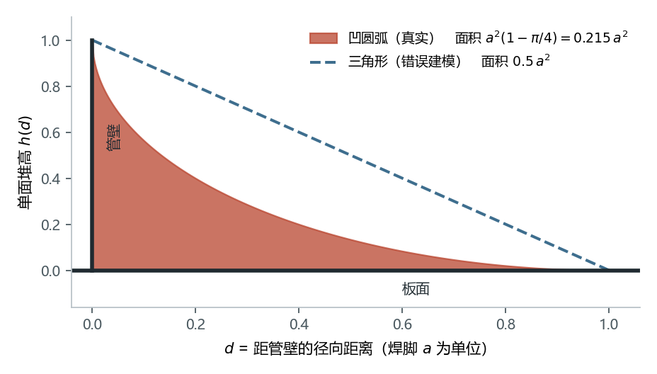
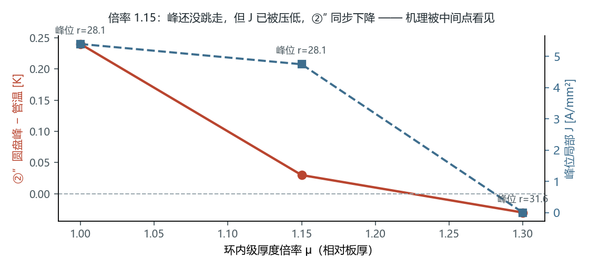
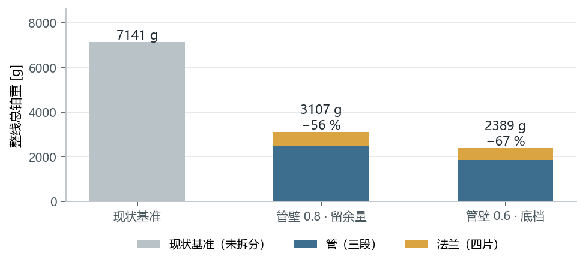

# 摘要

铂金直接通电加热是光学玻璃熔体输送的核心工艺。铂件同时是**结构件**、**发热元件**与
**熔体接触界面**，三重角色互相牵制，使「减少铂金用量」无法沿单一维度达成。

本文放弃 v4.0 的单段口径，改按业主总纲把问题定义为**整线**优化：目标是三段铂管
加四片法兰的**总铂重**，约束是「能升温且升温途中不烧断」与「稳态法兰不把热灌回管子」。
在此框架下，本文的主要工作不是又一次参数扫描，而是三件事：

1. **把判据本身立住。** 五条判据逐条审计限值出处，并确立一条纪律：
   判定的分辨率必须粗于数值噪声与现场可分辨尺度两者。据此把 ②″ 的限值由
   $0$ 改为 $5\ \mathrm{K}$ —— 原限值判的是 $14\ \mathrm{mW}$ 的局部倒流
   （占段功率 5 ppm），却决定了约 700 g 铂金。
2. **把传导链逐环量出来，而不是推出来。** 七个环节各有实测数据与事前写下的可证伪预言。
   过程中三次纠正了「代理量当原量」造成的错误结论，其中一次把整条可行管壁从
   2.0 mm 推到 1.4 mm。
3. **按实测雅可比搭控制律。** 三个旋钮的分工由 $\partial③/\partial t_{板}=+149\ \mathrm{K/mm}$、
   $\partial②″/\partial t_{板}=-1.6\ \mathrm{K/mm}$、$\partial②″/\partial\delta_{保温}\approx 0$
   定下，并证明保温对 ②″ 的作用是**穿过 ③ 的串级**而非直接效应
   —— 此前五版按直接效应搭的控制律全部失效。

**结果**：给出两档全判据通过的定案构型，整线总铂重 **3117 g**（管壁 0.8 mm，
每条判据都有裕度）与 **2398 g**（管壁 0.6 mm，被焊接烧穿下界与管电流密度同点咬住），
相对现状基准 7141 g 分别省 **56 %** 与 **66 %**。两档均给出可加工的 3DM 几何，
并以逐件质量对账验证几何与计算模型一致（差 $+0.1\ \%$）。

**同时给出一个未解的物理结论**：段与法兰的热耦合环路增益 $g\approx 0.96$，
离热失控（$g=1$）只差 4 %。它既是收敛缓慢的原因，也是本系统的一项设计裕度。

\newpage

# 1  绪论

## 1.1 三重角色与它们的冲突

| 角色 | 关键量 | 希望铂金 |
|---|---|---|
| 发热元件 | 电流密度 $J$、电阻率 $\rho_e$ | 截面小（$J$ 高则发热强） |
| 结构件 | 应力 $\sigma$ | 截面大（应力低） |
| 熔体界面 | 壁温 $T$ | 温度高且均匀 |

减薄壁厚可省铂，却同时抬高电流密度、抬高应力，并因轴向导热截面减小而加深法兰处冷点。

## 1.2 优化目标与约束（业主总纲）

$$\min\; m_{\mathrm{Pt}}^{\text{整线}}
= \sum_{i=1}^{n} m_{\text{管},i} + \sum_{j=0}^{n} m_{\text{法兰},j}
\qquad\text{(1.1)}$$

**是整线总铂重，不是省铂率，也不是单段口径。** 本文之前版本的「单段 HC3」结论
其口径已作废。

两条硬约束：

$$
\begin{aligned}
&\textbf{(C1) 能达成升温功能：} && \text{空管升到 } 1150\ ^\circ\mathrm{C}\text{，且升温途中不损坏}\\
&\textbf{(C2) 稳态热流方向：}   && 0 < \Delta T_{\text{管根}} < 10\ \mathrm{K}
\end{aligned}
\qquad\text{(1.2)}
$$

C1 的失效模式已由现场印证：**共用法兰在升温阶段烧断**。因此 C1 不是「几小时升到」，
而是「升得上去且不烧」。C2 为负即法兰比管热，与 C1 是同一条失效线的两端。

可调自由度：法兰厚度（可阶梯分布）、法兰形状、管壁厚、保温方案（管与法兰分别）、
舌片长宽、升温速率。**四片法兰允许各自独立** —— 这一条后来被证明是必需的，
不是可选的（第 9.2 节：四片舌保温相差 12 倍）。

## 1.3 被划掉的三条约束

业主 2026-08-14 明确：

> 「铂金直接加热系统都留有膨胀考量，蠕变、铂金加热蒸发也都不必考虑」

据此**热膨胀/热应力、蠕变/持久强度、高温挥发**三条全部关闭。其后果必须写清楚，
因为它推翻了 v4.0 的主结论：

- v4.0 的「约束次序：强度 > 电流密度 > 析晶」**不再成立**；
- v4.0 的「纯铂无省铂空间，弥散强化铂是唯一出路」**前提消失** ——
  那条结论建立在持久强度上；
- 壁厚的工艺下界不再由强度定，改由**焊接**定（第 4.6 节）。

**仍是约束**（不要一并划掉）：铂熔点 $1768\ ^\circ\mathrm{C}$、**局部热失稳**。
两者都不是强度问题。

## 1.4 求解逻辑顺序

```
① 判据体系与限值出处      ← 先立判据，否则后面每个数都无从判过与不过
        ↓
② 电学模型 → 电流分布 J、面电流 K、体积发热 q_v
        ↓
③ 热学模型 → 管段一维 BVP + 法兰二维壳（需 ② 的 q_v）
        ↓
④ 段↔法兰耦合迭代 → 收敛解（需判定收敛，见第 8 章）
        ↓
⑤ 传导链实测 → 找出真正卡住判据的病灶与机理
        ↓
⑥ 按实测雅可比搭控制律 → 逐档定尺寸
        ↓
⑦ 可行性阶梯 → 最薄的全过档 → 定案
```

②↔③↔④ 双向耦合（发热改温度，温度改电阻率与电流分布），须迭代求解。
**第 ① 步排在最前不是形式**：本项目最严重的几次错误都发生在「求解器没错、判据错了」
的情形下（第 5 章）。

\newpage

# 2  几何与工况

## 2.1 定案构型


**如何看图 1**：横轴为管轴。三段 $\varnothing 50$ 内径的铂管串联，四片法兰兼作电极。
中间两片是**共用片** —— 两侧段电流相位差 $120^\circ$，它承担 $\sqrt 3$ 倍电流，
发热 $\propto I^2$，故现场失效都卡在这两片。



| 部位 | 量 | 数值 |
|---|---|---|
| 铂管 | 内径 / 段长 / 段数 | $\varnothing 50$ / 300 mm / 3 |
| | 管外保温 | 5 mm |
| 法兰 | 圆盘直径 | $\varnothing 60$ |
| | 管孔半径 | $r_{h} = 25 + t_{管壁}$（跟随管外径） |
| | 舌片 长 × 宽 | $90 \times 30$ mm，等宽 |
| | 舌根过渡圆角 | $R3$ |
| | 管孔渐变环 | 两级，宽各 3 mm，**厚度按板厚的倍率给** |
| | 压接段 | 自舌端往回 40 mm，夹持 $450\ ^\circ\mathrm{C}$ |

**几何全部是相对量。** 管孔半径跟随管外径、环半径相对管孔、环厚度相对板厚。
这不是风格问题：把它们写成绝对值曾两次造成静默失效（第 5.4 节与第 6.4 节）。

## 2.2 工况

| 段号 | 控温点 $^\circ\mathrm{C}$ | 段长 mm |
|---|---|---|
| HC1 | 1150 | 300 |
| HC2 | 1080 | 300 |
| HC3 | 1050 | 300 |

产量 1.5 t/day，玻璃液相线 $1050\ ^\circ\mathrm{C}$，环境 $25\ ^\circ\mathrm{C}$，
交流供电（无净法拉第迁移）。

## 2.3 角焊缝的几何

管穿过圆盘内孔，**两面各一道角焊缝**。自熔小角焊缝被表面张力拉成**凹面**，
不是三角形：

$$h(d) = a-\sqrt{a^{2}-(d-a)^{2}},\qquad d = r-r_{h}\in[0,a]
\qquad\text{(2.1)}$$

$$t_{\mathrm{eff}}(r) = t_{\text{分区}}(r) + 2h(d)
\qquad\text{(2.2)}$$

其中焊脚 $a=\max(t_{板},\,t_{管壁})$。把式 (2.1) 写成隐式即可看清它是什么：

$$(d-a)^{2}+(h-a)^{2}=a^{2}
\qquad\text{(2.3)}$$

即**半径 $a$ 的圆弧**，圆心 $(r_h+a,\;a)$；在 $d=0$ 处切线竖直（贴管壁），
在 $d=a$ 处切线水平（贴板面）—— 标准凹角焊缝。



单道截面积

$$A_{\text{凹}}=\int_{0}^{a}h(d)\,\mathrm{d}d=a^{2}\!\left(1-\frac{\pi}{4}\right)=0.2146\,a^{2}
\qquad\text{(2.4)}$$

而三角形为 $0.5a^{2}$。**按三角形建模会把焊缝的好处高估 2.3 倍。**

**为什么必须建模**：孔周正是全片电流密度峰值所在，而面电流守恒（式 3.5）给出
$J=K/t$ —— 增厚按比例压低该处的 $J$ 与单位面积发热。焊缝在电学上是帮忙的。

\newpage

# 3  电学模型

## 3.1 体积生热率

由微分形式欧姆定律 $\vec J=\sigma_e\vec E$、$\sigma_e=1/\rho_e$，
单位体积电磁功率密度 $q_v=\vec J\cdot\vec E$，消去 $\vec E$：

$$\boxed{\;q_v=\rho_e(T)\,J^{2}\quad[\mathrm{W/m^{3}}]\;}
\qquad\text{(3.1)}$$

**单位验证**：$\mathrm{(\Omega\!\cdot\!m)\cdot(A/m^{2})^{2}
=\Omega A^{2}/m^{3}=W/m^{3}}$ ✓

这条**平方律**是全文最重要的一条：截面稍微变大，发热能力就急剧下降。
它也是「法兰虽然导电却几乎不发热」的根本原因。

## 3.2 质量方程

设一段铂件须供给功率 $P$，电流密度均匀时 $P=\rho_e J^{2}V$，
铂质量 $m=d_{\mathrm{Pt}}V$：

$$\boxed{\;m=\frac{d_{\mathrm{Pt}}\,P}{\rho_e(T)\,J^{2}}\;}
\qquad\text{(3.2)}$$

**单位验证**：$\mathrm{\dfrac{(kg/m^{3})\cdot W}{(\Omega\!\cdot\!m)(A/m^{2})^{2}}
=\dfrac{kg\cdot W}{\Omega A^{2}}=kg}$ ✓

**工程含义**：在电流密度被上限钳死时，铂金质量与所需功率成严格正比。
供料管的功率几乎全部用于补偿散热，故

> **省铂金 $\equiv$ 省热损失。** 任何被吹走、辐射掉、传导流失的瓦特，
> 都必须由铂金发出来，因而都折算成克数。

## 3.3 薄板：面电流守恒

法兰是「圆盘 + 平面舌片」，电流由舌片**单侧**汇入管孔，是本质二维问题。
深度平均后的控制方程

$$\nabla\cdot\left(\sigma_e\,t\,\nabla V\right)=0
\qquad\text{(3.3)}$$

守恒量是**面电流密度**

$$\vec K=-\sigma_e\,t\,\nabla V\quad[\mathrm{A/mm}]
\qquad\text{(3.4)}$$

$$\vec J=\vec K/t
\qquad\text{(3.5)}$$

由式 (3.1) 与 (3.5)，**单位面积**的发热（壳模型里真正进入热方程的量）为

$$q_A = q_v\,t = \rho_e J^{2}t = \rho_e\,\frac{K^{2}}{t}
\qquad\text{(3.6)}$$

$$\boxed{\;q_A\propto \frac{K^{2}}{t}\;}
\qquad\text{(3.7)}$$

式 (3.7) 是后面所有「加厚」类对策的理论依据，也解释了它们的**双向性**：
加厚同时降低单位面积发热（$\propto 1/t$）与提高横向导热能力（$\propto t$）。
控制器必须同时看到这两侧（第 7 章）。

> **一个易犯的错误**：$J$ 与板厚**无关**（同一电位梯度下）。加厚只增大 $K$ 的
> 通过能力。若在 $J$ 上再乘一次厚度因子，会得到「加厚区 $J$ 虚低」的假象，
> 使 $J_{\max}$ 的位置错误外移。本模型实现时曾犯此错，由电流守恒检验暴露。

## 3.4 共用法兰的电流

两侧段电流相位差 $120^\circ$，共用片承担

$$I_{\text{共用}}=\left|\,\vec I_{左}-\vec I_{右}\,\right|
=\sqrt{I_{左}^{2}+I_{右}^{2}+I_{左}I_{右}}\;\xrightarrow[\;I_左=I_右=I\;]{}\;\sqrt3\,I
\qquad\text{(3.8)}$$

发热 $\propto I^{2}$ 故为端片的 **3 倍**。这不是经验系数，是相量求和的结果
（早期用的 1.5 已被它取代）。

\newpage

# 4  热学模型

## 4.1 管段：通电肋片方程

对轴向微元作能量平衡（导入、导出、焦耳生成、外表面散失、传给玻璃）：

$$\boxed{\;\frac{\mathrm{d}}{\mathrm{d}x}\!\left(kA\frac{\mathrm{d}T}{\mathrm{d}x}\right)
+\frac{I^{2}\rho_e(T)}{A}-q'_{loss}(T)-h_gP_i\,(T-T_g)=0\;}
\qquad\text{(4.1)}$$

**单位验证**：各项均为 W/m。第一项
$\mathrm{\frac1m\!\left(\frac{W}{m\cdot K}m^{2}\frac{K}{m}\right)=\frac{W}{m}}$ ✓

这是「**通电肋片方程**」：与经典肋片方程的唯一区别是多了一个随温度变化的内部热源，
正是这一项的温度依赖性带来热稳定性问题（第 4.5 节）。

## 4.2 特征长度与法兰增量温降的闭式

令 $\theta=T-T_p$ 为对平台温度的偏离，线性化式 (4.1)：

$$kA\frac{\mathrm{d}^{2}\theta}{\mathrm{d}x^{2}}-\beta\theta=0
\;\Longrightarrow\;\theta=\theta_0e^{-x/\ell},\qquad
\boxed{\;\ell=\sqrt{\frac{kA}{\beta}}\;}
\qquad\text{(4.2)}$$

其中 $\beta=\mathrm{d}q'_{loss}/\mathrm{d}T+h_gP_i$（**切线**斜率 + 玻璃耦合）。

现在把法兰接上去。设法兰自管孔抽走热流 $D$（W），则在 $x=0$ 处

$$D=-kA\left.\frac{\mathrm{d}\theta}{\mathrm{d}x}\right|_{0}=\frac{kA}{\ell}\theta_0$$

代入式 (4.2) 消去 $\ell$：

$$\boxed{\;③\;\equiv\;|\theta_0|\;=\;\frac{D}{\sqrt{kA\beta}}\;}
\qquad\text{(4.3)}$$

**单位验证**：$[kA\beta]=\mathrm{\frac{W\cdot m}{K}\cdot\frac{W}{m\cdot K}=\frac{W^{2}}{K^{2}}}$，
开方得 W/K，$D$ 除之得 K ✓

式 (4.3) 是本文的核心闭式：**法兰造成的管根增量温降，等于抽热量除以
「管子沿轴向的散热—导热几何平均刚度」**。它把一个二维耦合问题压成一个标量关系，
且已被逐环实测证实（第 6 章）。三条推论立刻可读：

1. $③\propto D$ —— 想压 ③ 就得压抽热，别无他途；
2. $\beta$ 在**分母**里 —— 管保温越厚（$\beta$ 越小）③ 越大，这与直觉相反；
3. $A\propto t_{管壁}$ —— 减薄管壁会**加深**法兰冷点。

## 4.3 法兰：二维壳

$$\nabla\cdot\left(k\,t\,\nabla T\right)+q_A-2\,q''(T,\text{分区})=0
\qquad\text{(4.4)}$$

$q_A$ 由式 (3.6) 给出；$q''$ 按分区取保温值或裸铂值（圆盘与舌片可各自设定）。

### 4.3.1 从管子抽走的热量：用能量恒等式而非逐面累加

对所有有方程的格点求和，传导项伸缩相消，只剩与 Dirichlet 格点相邻的面：

$$\sum_i R_i=\left(Q_{gen}-Q_{loss}\right)+Q_{fromTube}=0
\;\Longrightarrow\;\boxed{\;Q_{fromTube}=Q_{loss}-Q_{gen}\;}
\qquad\text{(4.5)}$$

> **实现教训**：最初按「遍历孔边界格点、累加四个邻面通量」统计，
> 在阶梯状圆孔边界上会漏面，实测偏小 14 %（212 vs 243 W）。
> 式 (4.5) 由守恒律直接给出，无需枚举边界面，故不会漏。

### 4.3.2 变厚度的处理

板厚在网格上按半径分区取值，并**叠加**焊缝：

$$t(x,z)=
\begin{cases}
t_{舌}, & \text{舌片区}\\[2pt]
t_{板}\cdot\mu_{内}+2h(d), & r\le r_h+w\\[2pt]
t_{板}\cdot\mu_{外}+2h(d), & r\le r_h+2w\\[2pt]
t_{板}+2h(d), & \text{其余圆盘区}
\end{cases}
\qquad\text{(4.6)}$$

外圈倍率取内圈的 40 % 过渡：$\mu_{外}=1+0.4(\mu_{内}-1)$ —— **渐变而非台阶**。
面导度按面处厚度取两侧算术平均（变厚度时不能再用等权平均）。


## 4.4 辐射线性化：割线与切线

$$h_r\equiv\frac{q''_{rad}}{T_s-T_a}=\varepsilon\sigma(T_s+T_a)(T_s^{2}+T_a^{2})
\qquad\text{(4.7)}$$

式 (4.7) 是**割线**斜率。但在任何线性化或摄动分析中（包括式 4.2 的 $\beta$），
须用**切线**斜率 $\mathrm{d}q''/\mathrm{d}T_s=4\varepsilon\sigma T_s^{3}$。二者之比

$$\frac{\mathrm{d}q''/\mathrm{d}T_s}{q''/\Delta T}
=\frac{4T_s^{3}(T_s-T_a)}{T_s^{4}-T_a^{4}}\;\xrightarrow[T_a\ll T_s]{}\;4$$

以 $T_s=1573\ \mathrm{K}$、$T_a=298\ \mathrm{K}$ 计为 **3.25**。
误用割线会把散热的抗扰动能力**低估 3.25 倍**。本模型一律使用数值切线。

## 4.5 局部热失稳：一条不含几何、不含电流的闭式

恒流下某处温度升高 $\Rightarrow$ 电阻率升高 $\Rightarrow$ 该处发热更多，构成正反馈。
把包保温的舌片视为「两端定温、通电、绝热」的杆，两条约束都能写成闭式：

- **局部稳定（上界）**：$J\le J_{stab}=\dfrac{1}{L}\sqrt{\dfrac{k}{\rho_e\,\mathrm{TCR}}}$，
  代入 $P=I J\rho_e\ell$ 得 $P_{\max}=2I\sqrt{\rho_e k/\mathrm{TCR}}$ —— 长度与截面全部约掉；
- **导热漏（下界）**：$P\!\cdot\!Q=I^{2}\rho_e k\Delta T$（与几何无关）
  $\Rightarrow P_{\min}=I\sqrt{\rho_e k\Delta T}$。

相除：

$$\boxed{\;\text{裕度}=\frac{P_{\max}}{P_{\min}}=\frac{2}{\sqrt{\mathrm{TCR}\cdot\Delta T}}
\;\Longrightarrow\;\text{可行}\iff \mathrm{TCR}\cdot\Delta T\le 2\;}
\qquad\text{(4.8)}$$

$\rho_e k$ 即维德曼–弗兰兹的 $L_0\bar T$，故下界也等于 $I\sqrt{L_0\bar T\Delta T}$。

**纯铂在 $900\text{–}1400\ ^\circ\mathrm{C}$、夹持 $25\text{–}600\ ^\circ\mathrm{C}$
的整个范围内 $\mathrm{TCR}\cdot\Delta T\approx 0.21\text{–}0.62$，裕度 1.8–3.1，全区可行。**
这条闭式推翻了早期「端片是结构性瓶颈、两条约束没有交集」的结论 ——
那个结论来自「舌片只能裸露或全包」的二值假设与一个漏掉压接锚点的 $J_{stab}$。

> **一条必须记住的机理：压接段不发热。** 铜排把那一段短接（铜比铂导电 25 倍、厚 10 倍），
> 故**舌片有效发热长度 = 舌长 − 压接长**。90 mm 舌片扣掉 40 mm 只剩 50 mm。
> 早期「把舌片缩到 50 mm」的方向因此完全反了。

## 4.6 工艺下界：由焊接定，不由强度定

强度约束关闭后，壁厚下界改由焊接给出。可算的那一半是**屈曲变形** ——
焊缝纵向收缩留下远场压应力，板越薄越容易鼓曲：

$$t_{\min}=\frac{12(1-\nu^{2})\,C\,\beta_w\,\alpha\,(\bar c\,\Delta T_m+L_f)}
{k_b\,\pi^{2}\,\bar c\,\eta_{melt}}\;b
\qquad\text{(4.9)}$$

**$E$ 与 $\rho$ 在推导中约掉**，只剩热学物性与三个工艺系数，且**正比于无支撑宽度 $b$**。
可信度锚点：同一公式代入低碳钢给 $t_{\min}/b=0.0073$，即 300 mm 宽板 2.2 mm，
与「薄钢板 2–3 mm 以下焊后必鼓曲」的车间常识吻合。

| 圆盘 | 环宽 mm | 屈曲下界（含 SF 2.0） | 控制机理 |
|---|---|---|---|
| $\varnothing120$ | 34 | 4.71 | 屈曲 |
| $\varnothing72$ | 10 | 1.39 | 屈曲 |
| **$\varnothing60$** | **4** | **0.55** | 屈曲 |
| 管（圆筒） | — | 任何壁厚都不屈曲 | 烧穿 |

管侧走轴压屈曲判据，推导中 $t$ 与 $R$ **同时约掉**，只剩比值 $0.0073\ll1$
$\Rightarrow$ **管壁下界不可能由变形定，只可能由烧穿定。**

三条可执行结论：

1. **缩小圆盘直径同时放松焊接下界** —— 与省铂、与端片热平衡三者同向，本问题中少有；
2. **圆盘的焊接下界（$\varnothing60\to0.55$）已被电热约束顶出来的实际板厚
   （1.5–3.4 mm）盖住**，与焊法无关；
3. **舌片与圆盘同板切出、无焊缝** $\Rightarrow$ 舌厚不受任何焊接下界约束。

管壁的烧穿下界按现场实况取**手工 TIG 的 0.6 mm**（自动 TIG $\approx0.3$、
激光或电阻缝焊 $\approx0.1$，**差一个量级**）。

\newpage

# 5  判据体系

## 5.1 三条铁律

本项目在一天之内因判据本身出错而连续得出五个「不报错、格式正常、结论错」的结果。
据此立三条铁律，并按它们重构了代码：

1. **判据只有一个来源。** 全部判定出自 `LineRunner.Judge`；界面、命令行、报告一律只读结果，
   不得自行重算。判据定义散在三处正是连错的根源。
2. **几何只有一个来源。** 定案值出自 `FinalDesign`。曾有辅助命令各自钉着几代之前的几何，
   跑得出漂亮的数 —— 但那是**另一个设计**的数。
3. **判据不允许消失。** 只能「过 / 不过 / 无法判定」三态，**无法判定一律不算通过**。
   曾有判据写成「有数据才加入检查表」，数据缺失时整条判据消失，
   实测增量降 $+32\ \mathrm{K}$（上限 10）却报「全过」。

## 5.2 五条判据与限值出处

**每条限值都必须有来源。** 下表是审计过的常驻表：

| 判据 | 定义 | 限值 | 出处 |
|---|---|---|---|
| ① 升温 | 空管自室温到 $1150\ ^\circ\mathrm{C}$ 的时间 | 72 h | 业主「$\le$ 3 天」 |
| ②′ 管孔净流入 | $Q_{fromTube}$（式 4.5） | $>0$ | 总纲 C2 下半条「为负即法兰比管热」——**方向性判据** |
| ②″ 圆盘区最高温 | $T_{disc,\max}-T_{root}$ | 5 K | 现场控温精度 $\pm5\ \mathrm{K}$ |
| ③ 法兰增量温降 | 无法兰基线 − 实际（同位置） | 10 K | 总纲 C2；**业主明确：贴着热偶误差定的** |
| 管 J | $I/A_{管}$ | 12 A/mm² | 现场：一般上限 15，管壁 0.6 时 12 是极限 |
| 管壁下界 | — | 0.6 mm | 手工 TIG 烧穿下界（§4.6） |

降为**参考量**（只报数不判）的：法兰 $J_{\max}$（限值 10，物理依据待定）、
整片最高温 ②（与 C2 数学上互斥，见下）、管强度利用率（蠕变已关闭）、
玻璃温降（**现场实测 20 K，全模型唯一校准点**，模型给 21.9 K）。

### 5.2.1 为什么 ② 必须降为参考量

② 取整片最高温。舌片包保温后峰值落在舌片上，离管子几十毫米、中间隔着圆盘，
拿它跟管根比是在比两个不相干的位置。更硬的理由是它与 C2 **数学上互斥**：
管孔一圈净流量 $\approx0$ $\Rightarrow$ $\oint q\,\mathrm{d}\theta=0$ $\Rightarrow$
$q$ 必然有正有负 $\Rightarrow$ 必然存在比管热的点。要整圈都比管冷需冷点深 32 K，
而 C2 只许 10 K。

**降级不等于放松**：舌片仍由熔点与式 (4.8) 的局部失稳管着。

### 5.2.2 ③ 的口径必须是「增量」

原来判「偏离本段控温点」。但接上段间导热后，共用法兰处的管温由**两侧控温点**决定 ——
实测 HC1|HC2 接头停在 $1116\ ^\circ\mathrm{C}$（1150 与 1080 之间），偏离本段控温点 34 K，
**与法兰设计无关**。让法兰去背控温点梯度的锅，等于给优化器一个够不着的靶子。

现在判的是「有法兰 vs 无法兰」的同位置之差 —— 那才是法兰的责任。
代价是必须先算一次无法兰基线；基线算不出来时，本条判**无法判定**，不判通过。

## 5.3 ②″ 的限值由 0 改为 5 K

这是本轮唯一一条限值变更，理由须完整记录。

**原限值 $0$ 是我从「任何一点都不许比管热」字面推的，没有出处。** 业主的质问把问题问对了：

> 「0.02–0.08 K 在计算上有差别，实际生产现场是一样的甚至属于温度量测的噪音」

**量化那 0.05 K 值多少热**：峰值那一格约 $2\times2$ mm、厚约 4 mm，到管孔的导热通道

$$G=\frac{kA}{L}\approx\frac{72\times8\times10^{-6}}{2\times10^{-3}}\approx0.29\ \mathrm{W/K}
\quad\Rightarrow\quad Q=G\,\Delta T\approx\mathbf{0.014\ W}
\qquad\text{(5.1)}$$

对照该片法兰净抽热 $+4\ \mathrm{W}$、该段加热功率约 3 kW：
**原判据在 0.05 K 上判的是 14 mW 的局部倒流 —— 占净抽热 0.35 %、占段功率 5 ppm。
而它判掉了约 700 g 铂金。**

**结构上它也不可能有裕度**：限值 0，而物理地板是 $-0.04\ \mathrm{K}$
（盘缘 $J=0$ 的峰，八档保温 × 五档倍率实测恒定）$\Rightarrow$ 任何可行解的
$②″\in[-0.04,\,0]$，可行带宽 0.04 K —— 比数值噪声还窄。

**真正该判的物理**是共用法兰升温烧断，其机理是局部热失稳，而式 (4.8) 允许的
局部温升是**几十上百 K**。逐点 $\le0$ 是比物理**严三个数量级**的代理。

**新限值的来源**（业主给的两个现场数，是两回事，不要混）：

| | 含义 | 数值 |
|---|---|---|
| 控温精度 | 闭环把温度**稳住**的能力 | $\pm5\ \mathrm{K}$ |
| 铂热偶 $>1000\ ^\circ\mathrm{C}$ 误差 | **知道**它是多少度的能力 | $\pm10\ \mathrm{K}$ |

限制「这个差别是否可分辨」的是较大者，**本项取较保守的 5 K**。

## 5.4 判据分辨率原则

> **每条判据的限值必须有来源；判定的分辨率必须粗于「数值噪声」与
> 「现场可分辨尺度」两者。**

对 ③ 的 10 K，还有两条独立于物理依据的推论：

1. **不该把设计点摆在 10 上** —— 摆在测量地板上的判定分不出真假；
2. **不该拿它当控制靶** —— $\partial③/\partial t_{板}=+149\ \mathrm{K/mm}$ 是**正号**，
   靶设在 $③=8$ 会让优化器**加厚板**把 ③ 推向限值，**花铂金把判据推坏**。

同类隐患：②′ 的限值同样是 0，同样没有裕度。目前实测 $+1.7\sim+1.9\ \mathrm{W}$ 离 0 够远
才没出事；若哪一档落到 $+0.2\ \mathrm{W}$，就是 ②″ 的翻版。

\newpage

# 6  传导链的逐环实测

方法由业主定：**「跟随传导链，拿证据 → 分析 → 对策 → 用一个可证伪的预言验对策，
再反复验证传导链」**。以下每一环都有实测数字，预言写在跑之前。

## 6.1 环 1：管壁 → 管根，验证式 (4.3)

同一片（入口），管壁 $2.0\to1.8$ mm：

| 入口片 | 壁 2.0 | 壁 1.8 | $\Delta$ |
|---|---|---|---|
| 管根 $^\circ\mathrm{C}$ | 1148.64 | 1147.89 | $-0.75$ |
| 盘峰 $^\circ\mathrm{C}$ | 1148.57 | 1148.14 | $-0.43$ |
| ②″ | $-0.06$ | $+0.25$ | $+0.31$ |

符合式 (4.3)：$A\propto t_{管壁}$ 减小 $\Rightarrow$ $\sqrt{kA\beta}$ 减小 $\Rightarrow$ ③ 增大。

> **一次纠错**：我曾拿「偏离本段控温点 34.38 / 34.36」当管根的代理，据此宣布这一环被证伪。
> **那是段内最大偏差，不是该片贴着的管根。** 逐片绝对温度一打出来就纠正了。
> $\Rightarrow$ **代理量不是原量。** 判据要拆开时，必须导出**判据自己用的那两个数**。

## 6.2 环 2：圆盘区有两个竞争峰

| | 位置 | 局部 $J$ | 行为 |
|---|---|---|---|
| **峰 A 盘缘** | $r\approx29.7\text{–}31.6$ | **0.00**（电学死区） | 只跟随管根 57 %；值恒为 $-0.04$，八档保温 + 五档倍率全同 $\Rightarrow$ **地板** |
| **峰 B 舌根凹角** | $x=-24.3,\;z=\pm13$ | $4.4\text{–}10.5$ | 真尖峰；随舌保温单调涨 |

$②″=\max(A,B)-T_{root}$。管壁 2.0 时 B 低于地板 $\Rightarrow$ **隐形**；1.8 时 B 冒头 $\Rightarrow$ 不过。

$\Rightarrow$ **「管壁必须 2.0 mm」是假象。挡路的是峰 B，不是管壁。**

**峰 B 的定位过程本身是一条教训。** 最初只报半径 $r\approx27.4$，读成「管孔外那一圈」。
导出坐标后才看清：舌片半宽 15，切点 $x=-\sqrt{30^{2}-15^{2}}=-25.98$，
峰落在**舌片直边与圆盘圆弧的交接凹角**上，往里 1.7 mm。

> **只报「$r=27.4$」不足以定位病灶，要报 $(x,z)$。** 半径把「孔边一圈」和
> 「舌根两个角」压成了同一个数 —— 又一次「代理量不是原量」。

对症旋钮是舌根圆角 $R$（凹角电流拥塞的教科书解法），代价极小：$R=10$ 每片约 $+2.4$ g，
对比盘径 $\varnothing60\to\varnothing84$ 要 $+494$ g，**差两个数量级**。

## 6.3 环 3：舌保温**不是** ②″ 的旋钮

管壁 2.0，舌保温倍率 $0.05\to4.0$（**80 倍**），②″ 恒为 $-0.04$，峰位不变。
它是 ②′ 与 ③ 的旋钮：②′ 从 $+23.95$ 到 $-20.18\ \mathrm{W}$，③ 从 41.9 到 0.0 K。

## 6.4 环 4：渐变环改成相对量，并被逐点看见



| 倍率 $\mu$ | ②″ | 峰位 $r$ | **峰位 $J$** | 法兰 g |
|---|---|---|---|---|
| 1.00（关） | $+0.24$ | 28.1 | **5.40** | 924 |
| 1.15 | $+0.03$ | 28.1 | **4.75** | 954 |
| **1.30** | $-0.03$ | **31.6** | **0.00** | 983 |

**倍率 1.15 那一行是关键证据**：峰还没跳走，但 $J$ 已被压低，②″ 同步下降 ——
机理链条被中间点看见，不是只看到首尾两端。翻转点在 1.30，代价 $+59$ g／四片。

> **一次静默失效**：渐变环最初写成**绝对半径**，而管孔半径 $=25+t_{管壁}$。
> 于是每换一档管壁，环就被悄悄重画一遍。更糟的是台阶厚度写成
> $\max(\text{台阶厚},\,\text{板厚})$ —— 板厚一旦超过 2.4 mm，环**完全消失**。
> **整条可行性阶梯从来没有环。** 修好之后可行管壁从 2.0 掉到 1.4，
> $7265\to5252$ g（$-28\ \%$）。


## 6.5 环 5：副作用也在同一条关系式上

环加厚 $\Rightarrow$ 法兰对管的导热截面 $\uparrow$ $\Rightarrow$ 抽热 $D$ 从 1.16 到
**8.68 W** $\Rightarrow$ 由式 (4.3)，③ 冲到 **14.5 K**（上限 10）。
$\Rightarrow$ 必须由控制器用板厚顶回：发热 $\propto K^{2}/t$ 增、导热 $\propto t$ 减，**双向**。

## 6.6 环 6：靶设错了

环倍率受控之后出现怪象：倍率一路推到 1.63，②″ 却停在 $+0.1$ 不动。
不是环失效，是两个旋钮**经由 ②′ 耦合**：环加厚 $\Rightarrow$ ②′ $\uparrow$ $\Rightarrow$
板厚旋钮为把 ②′ 压回靶值 2 W 而削薄 $\Rightarrow$ 环处发热 $\propto K^2/t$ 回升 $\Rightarrow$ 抵消。

而同一轮的原始量说：**②′ $=+4/+17/+15/+4$ W 时 ③ 只有 6.5 K**（上限 10）
$\Rightarrow$ **控制器在白削薄**。

$\Rightarrow$ 那个 2 W 是当初用式 (4.3) 反解出来的**代理靶**，而 ③ 现在被直接判。
**保护哪条判据就直接盯哪条。②′ 是符号判据（$>0$），不是有靶值的量。**

## 6.7 环 7：实测雅可比

| | $\partial/\partial t_{板}$ | $\partial/\partial \delta_{舌保温}$ | $\partial/\partial \delta_{管保温}$ |
|---|---|---|---|
| **③** | $\mathbf{+149\ \mathrm{K/mm}}$ | $-1$ K/mm（$>20$ mm 后迅速饱和） | $+11\ldots20$ K/mm |
| **②″** | $-1.6$ K/mm | $\boldsymbol{\approx 0}$（80 倍扫描不动） | $-3.1$ K/mm（且与 ②′ 同轴） |
| 环倍率一步 | — | 只值 0.14 K | — |

**管保温被证伪为独立旋钮**：③ 能从 $-59.5$ 扫到 $+121.3$（杠杆极大），但 ②″ 反向同步炸掉，
②′ 冲到 $-266$ W。机理：管保温薄 $\Rightarrow$ 管散热猛增 $\Rightarrow$ 电流大；
而法兰包着 20 mm 没同比例增加 $\Rightarrow$ **法兰反过来比管热**。
现用的 5 mm 恰在拐点上 —— **那个冻结值本身是对的，但这只有量过才知道。**

\newpage

# 7  控制律

## 7.1 为什么必须是串级

「保温 $\to$ ②″」的控制律曾五版全崩。真正原因到环 7 才清楚：
**保温对 ②″ 没有直接作用**，它的通路是**穿过 ③ 的串级**。在 ③ 保持不变的约束下，

$$\left.\frac{\mathrm{d}②″}{\mathrm{d}\delta}\right|_{③}
=\frac{\partial ②″}{\partial t_{板}}\cdot
\left(-\frac{\partial ③/\partial \delta}{\partial ③/\partial t_{板}}\right)
=\frac{-1.6}{149}\approx-0.011\ \mathrm{K/mm}
\qquad\text{(7.1)}$$

我五次都按**直接**效应估符号与增益 —— 方向和量级自然都不对。

> **一个旋钮「有效」不代表它是直接的。控制律必须按真实通路搭，不是按相关性搭。**

## 7.2 三个旋钮的分工

| 旋钮 | 直接控制 | 增益 | 速度 |
|---|---|---|---|
| **板厚 $t_{板}$** | ③ | $+149$ K/mm | 快（内环） |
| **环倍率 $\mu$** | ②″ | 一步 0.14 K | 中 |
| **舌保温 $\delta$** | ③ 的余量 $\to$ ②″ | $-0.011$ K/mm（式 7.1） | 慢（外环） |

内环用板厚把 ③ 压住；外环用舌保温给 ③ 腾余量，内环于是能选**更厚**的板 ——
**厚板才是 ②″ 的解药**。挪 ②″ 0.1 K 约需 9 mm 保温，而共用片当前 1.4 mm、
上限 80 mm，量级对得上。

## 7.3 反饱和接力

环倍率有物理饱和：它压的是**整圈**，而病灶只在**两个角**上（环 2），
故在 $\mu\approx2.5$ 处饱和。控制律因此写成**接力**而非替换：
$\mu$ 达到 2.5 时把舌保温接进来，$\mu$ 退回时保温也退。

早期曾直接用保温**替换**环旋钮，结果管壁 1.6 档失效 —— 保温撞上 80 mm 上限。
**接力，不是替换。**

## 7.4 三条实现纪律

1. **靶不设在限值上。** ②″ 的靶设 $+3.0\ \mathrm{K}$（限值 5，留 2 K），
   ③ 不设靶而由判据直接管。
2. **每个旋钮有自己的分支。** 曾把新旋钮写在旧旋钮的 `continue` 之后，
   优化器报「两个旋钮都到位」停机，实际 ②″ 还差 $+0.01$。
3. **收敛容差必须细于判据分辨率**，否则判据是在读求解器的残差（第 8.4 节）。

\newpage

# 8  数值方法与收敛

## 8.1 求解器结构

| 模块 | 方程 | 方法 |
|---|---|---|
| `Bvp1D` | $\frac{\mathrm{d}}{\mathrm{d}s}(K\frac{\mathrm{d}T}{\mathrm{d}s})+S(s,T)=0$ | 有限体积 + Picard + 三对角追赶 |
| `SegmentSolver` | 管段金属 + 玻璃耦合（式 4.1–4.2） | 内层 `Bvp1D`，中层二分求电流 |
| `ShellCurrent` | 式 (3.3) | 掩膜网格五点格式 + SOR，面导度 $\propto t\sigma$ |
| `ShellThermal` | 式 (4.4) | 同上，Picard 处理 $T^{4}$ |
| `LineRunner` | 段 $\leftrightarrow$ 法兰 $\leftrightarrow$ $\sigma_e(T)$ | 外层不动点 + 欠松弛 |

验证套件 18 项全部通过，其中最关键的是**制造解法（MMS）**：
先设定精确解，反代入方程得源项，再让求解器去解并比对 ——
它证明**代码解的确实是所写的方程**。一维内核观测阶 $1.991\to1.999$（理论 2 阶）。

## 8.2 环路增益 $g\approx0.96$

段与法兰互为边界条件：法兰抽热改变管根温度，管根温度改变法兰的抽热。
外层不动点迭代的残差轨迹给出几何收缩比 $r\approx0.984$（欠松弛 $\omega=0.35$），
反推裸 Picard 增益

$$g=1-\frac{1-r}{\omega}\approx0.954\text{–}0.961
\qquad\text{(8.1)}$$

> **这是物理结论，不只是数值问题：段↔法兰热耦合的环路增益 $\approx0.96$，
> 离热失控（$g=1$）只差 4 %。** 它应作为设计量汇报 —— 是本系统的热失控裕度。

$\omega=0.35$ 的欠松弛在这里**帮倒忙**：把 0.954 拖成了 0.984。
但它是为很久以前一个会发散的构型加的，故改为自适应（慢模式放大、反弹减半，
最坏退化回 0.35）。

Aitken $\Delta^{2}$ 外推（对抽热向量）**无效** —— 触发 10 次，残差被推下去又被拉回。
原因到 2026-08-16 才查清：**慢模式不在抽热向量上，而在「抽热 $\leftrightarrow$ 段间端温」
耦合起来的方向上**，而 Aitken 只作用在前者、且只能处理一个模式。

### 8.2.1 Anderson 加速：把两者放进同一个状态向量

取状态 $x=(\,$各段两端抽热 $D_{i,L},D_{i,R}$；各段两侧邻段端温 $T_{i,L},T_{i,R}\,)$，
维数 $\le 10$。记 $F(x)=G(x)-x$，用最近 $m=4$ 步的残差差分张成子空间做最小二乘外推：

$$\gamma=rg\min_{\gamma}igl\|F_k-\Delta F\,\gammaigr\|_W,\qquad
x_{k+1}=x_k+\omega F_k-\sum_{j}\gamma_jigl(\Delta x_j+\omega\,\Delta F_jigr)
\qquad	ext{(8.3)}$$

三个实现细节缺一不可，每一条都由「加上去却不起作用」实测出来：

| 细节 | 不做会怎样（实测） |
|---|---|
| 加权范数 $\|\cdot\|_W$（各分量除以自身标度） | 状态里混着抽热 [W] 与端温 [K]，不标度时最小二乘被一方主导，另一方等于没进子空间 —— **与 Aitken 当年失效同一个病** |
| Tikhonov 取 $10^{-4}\,\mathrm{tr}/m$ | 取 $10^{-8}$ 时 $\Delta F$ 高度共线使 $\gamma$ 发散，步长被安全阀打掉 **96/104 步** |
| 安全阀参照 $\|F\|$ 而非欠松弛步 $\omega\|F\|$ | $\omega$ 自适应压到 0.15 时阀门跟着紧 6.7 倍，Anderson 等于没开 |

**安全性质**：式 (8.3) 只改变到达不动点的路径，收敛时仍满足 $x=G(x)$ ——
**同一组方程、同一个解**。最坏情形（安全阀连连丢弃）退化回欠松弛 Picard。

实测（两档定案，与纯 Picard 解逐项比对）：

| | ③ | ②″ | 合计 g | 轮数 | 用时 |
|---|---|---|---|---|---|
| 管壁 0.8　纯 Picard | 6.184 | 0.981 | 3117.60 | 60+ | 3 min |
| 管壁 0.8　Anderson | 6.198 | 0.981 | 3117.56 | **9** | **0.3 min** |
| 管壁 0.6　纯 Picard | 5.297 | 1.121 | 2397.90 | 60+ | 3 min |
| 管壁 0.6　Anderson | 5.308 | 1.121 | 2397.87 | **8** | **0.3 min** |

偏离定案点的算例收益更大：「管保温 1 mm」档纯 Picard 需 **734 轮／17.4 min**，
Anderson **109 轮／2.7 min**，且落回默认 200 轮预算之内。

## 8.3 收敛度量：又一次「代理量不是原量」

残差轨迹里曾出现两次确定性跳变（第 6 轮 $+21.4$ K、第 15 轮 $+51.8$ K）。
平滑收缩里不会有这个，故一度判定「模型里有东西在离散地切换状态」。

跳变捕捉给出的答案是：跳的只有 `TRootC` 这**一个标量** ——
它在管段两端之间**切换报哪一端**。同一时刻两端各自只动 0.9 / 0.1 K，
电流没变、抽热没变，**物理场一直光滑**。

$\Rightarrow$ **收敛判据建立在一个会切换分支的代理量上。** 改成对两端各自判之后，
跳变消失；慢模式仍在，那才是真的。

## 8.4 剩余误差，而不是相邻两轮变化

由 $g\approx0.96$，相邻两轮变化 $\delta$ 对应的**距不动点距离**为

$$\Delta_\infty\approx\frac{\delta}{1-g}\approx25\,\delta
\qquad\text{(8.2)}$$

用 $\delta$ 当收敛判据曾在 $\delta=1.36$ 时报「5 轮收敛」，而真实剩余误差约 34 K ——
它只是撞上了「快模式衰完、慢模式还没露头」的窗口。

现在按几何外推估 $r$ 并报 $\Delta_\infty=\delta\,r/(1-r)$；$r$ 测不出来时
**保守取 25 倍放大**，绝不用 $\delta$ 本身。两档定案的剩余误差估计为
**0.65 K / 0.75 K**，故 ③ 携带的数值不确定度约 $\pm0.7\ \mathrm{K}$，
对 10 K 的限值可用；②″ 对管根的灵敏度约 0.014，不确定度 $\pm0.01\ \mathrm{K}$，
远细于 5 K 的限值。

> 这一条修好之前，③ 曾拿 $\pm5\ \mathrm{K}$ 的不确定度去比 10 K 的限值。
> **收敛不是数值洁癖 —— 它直接决定判据有没有意义。**

\newpage

# 9  计算结果

## 9.1 两档定案

两档**都全判据通过**，差别只在裕度与铂重。取舍属于业主，因为它取决于
「手工 TIG 焊 0.6 mm 壁」与「0.6 mm 壁跑 11 A/mm²」两件现场判断，不在计算里。


| 判据 | 限值 | 管壁 0.8 | 管壁 0.6 |
|---|---|---|---|
| ① 升温 空管到目标 | 72 h | 0.057 h | 0.079 h |
| ②″ 圆盘区最高温 − 管温 | 5 K | 0.981 K（裕度 80 %） | 1.121 K（78 %） |
| ②′ 管孔净流入 | $>0$ W | $+1.67$ W | $+1.91$ W |
| ③ 法兰增量温降 | 10 K | 6.18 K（38 %） | 5.30 K（47 %） |
| 管 J | 12 A/mm² | 9.51（21 %） | 10.96（9 %） |
| 管壁 vs 焊接下界 | 0.6 mm | 0.8（33 %） | 0.6（**0**） |

**管壁 0.8 · 留余量**：没有任何判据贴限值。
**管壁 0.6 · 底档**：焊接烧穿下界（余量 0）与管 J（余量 9 %）**在同一点咬住** ——
这是可行域的底。

## 9.2 尺寸与铂重

| | 管壁 0.8 | 管壁 0.6 |
|---|---|---|
| 板厚（入口/共用1/共用2/出口）mm | 2.11 / 3.40 / 3.18 / 1.76 | 1.82 / 2.91 / 2.71 / 1.49 |
| 环内级倍率 $\mu$ | 1.24（四片同） | 1.22（四片同） |
| 舌保温（四片）mm | 18.7 / 1.6 / 1.4 / 3.9 | 同左 |
| 管（三段）g | 2466 | 1842 |
| 法兰（四片）g | 652 | 557 |
| **合计 g** | **3117** | **2398** |
| 相对现状基准 7141 g | $-56\ \%$ | $-66\ \%$ |
| 外层耦合剩余误差估计 | 0.65 K | 0.75 K |



**两条值得单独指出的结构性结果**：

1. **共用片比端片厚 60–90 %**（3.40 vs 1.76 mm）。这是式 (3.8) 的 $\sqrt3$ 倍电流
   经平方律放大的直接后果。**四片等厚是现状，不是最优。**
2. **舌保温四片相差 12 倍**（18.7 vs 1.4 mm）。端片要靠保温保住发热，
   共用片本身发热过剩、几乎要裸露散热。**不能同规格。**
   而这个自由度**不花铂**（只是纤维），故铂重只由板厚与舌片尺寸决定，
   两组自由度就此解耦。

## 9.3 几何交付与质量对账

两档均输出可加工的 `.3dm`：三段铂管 + 四片法兰（板身 / 环外级 / 环内级 / 角焊缝）
+ 压接段参考线，图层按片分。

写完立刻自校三项，任一项不过即判定「不得作为交付件」：

| 校验 | 判据 | 它防的是什么 |
|---|---|---|
| 方位 round-trip | 从磁盘读回，沿 $Y$ 的包围盒跨度 = 板厚 | 板被画到 XY 面沿 Z 拉伸（曾出过：自己写的 `.3dm` 再读回来量到 **0 材料**） |
| 角焊缝体积 | 回转体实测 vs 式 (2.4) 的解析积分，差 $\le0.5\ \%$ | 焊缝形状画错（曾用 12 段同心带拟合圆弧，成了一圈阶梯） |
| **逐件质量对账** | 3DM 体积 $\times\rho$ vs FE 网格体积 $\times\rho$，差 $\le2\ \%$ | **一切几何细节** |

实测（管壁 0.8，$\rho=21.45\ \mathrm{g/cm^{3}}$）：

| 件 | 3DM | 计算模型 | 差 |
|---|---|---|---|
| 铂管 | 2464.8 g | 2464.8 g | $+0.00\ \%$ |
| 入口片 | 130.2 | 129.8 | $+0.30\ \%$ |
| 共用片 1 | 216.6 | 215.3 | $+0.60\ \%$ |
| 共用片 2 | 201.5 | 200.4 | $+0.56\ \%$ |
| 出口片 | 107.6 | 107.4 | $+0.24\ \%$ |
| **合计** | **3120.6** | **3117.6** | $\mathbf{+0.10\ \%}$ |

残差方向固定为正，有出处：3DM 侧是精确几何，FE 侧是 2 mm 格子在孔边采样陡变的焊肉，
必然少算一点。管壁 0.6 档合计 $+0.09\ \%$。

> **校验量选错，比不校验更危险。** 原来只验「包围盒沿 $Y$ = 板厚」，
> 一路报「19 项全吻合」，而实际法兰只有计算值的 **43 %**。
> 那个量分辨不出孔有没有挖、焊角在不在、环有没有多长出去 —— 它发的是**虚假的通过证**。
> **质量是唯一把所有几何细节都卷进去的标量。**

\newpage

# 10  结论

1. **判据体系是本轮的主要交付物，不是附属品。** 五条判据逐条审计出处，
   并确立「判定分辨率必须粗于数值噪声与现场可分辨尺度」的原则。
   据此把 ②″ 的限值由 0 改为 5 K —— 原限值判的是 14 mW（占段功率 5 ppm），
   却决定了约 700 g 铂金。

2. **法兰增量温降有闭式**：$③=D/\sqrt{kA\beta}$。它把二维耦合压成一个标量关系，
   已被逐环实测证实，并直接给出三条推论（$③\propto D$；管保温在分母上；
   减薄管壁会加深法兰冷点）。

3. **卡住 ②″ 的病灶是舌根凹角的电流拥塞，不是管壁，也不是孔边一圈。**
   只报半径会把「孔边一圈」与「舌根两个角」压成同一个数。
   对症旋钮是舌根圆角，代价比缩放盘径小两个数量级。

4. **控制律必须按真实通路搭。** 舌保温对 ②″ 没有直接作用，其通路是穿过 ③ 的串级，
   等效增益 $-0.011\ \mathrm{K/mm}$。按直接效应搭的五版控制律全部失效。

5. **段↔法兰热耦合的环路增益 $g\approx0.96$**，离热失控只差 4 %。
   这既是收敛缓慢的原因，也是应当汇报的设计裕度。收敛判据必须报
   **距不动点的估计** $\delta/(1-g)$，而非相邻两轮变化。

6. **给出两档全判据通过的定案**：3117 g（管壁 0.8，处处有裕度）与
   2398 g（管壁 0.6，被焊接下界与管 J 同点咬住），相对现状基准省 56 % 与 66 %。
   两档几何均以逐件质量对账验证，与计算模型差 $+0.1\ \%$。

7. **v4.0 的主结论已随三条约束的关闭而作废**：「约束次序 强度 > 电流密度 > 析晶」
   与「弥散强化铂是唯一出路」的前提（持久强度）不再存在。
   现在的下界由**焊接**给出，而**焊接方法只经管壁一条路影响铂重**。

\newpage

# 11  局限与待补数据

## 11.1 已知局限

| 项目 | 局限 | 影响 |
|---|---|---|
| 外层耦合 | 环路增益 0.96；Anderson 已把定案点压到 9 轮，但**极端偏离档仍可能超出默认 200 轮** | 剩余误差 0.3–0.6 K；③ 携带 $\pm0.6$ K |
| 铂表面发射率 $\varepsilon$ | 取决于表面状态，0.10–0.30 | 总散热 $\pm40\ \%$（**最大不确定源**） |
| 散热模型 | 未经现场标定，系统性偏高 2–4 倍 | 电流与铂重偏保守 |
| 网格 2 mm | 焊脚 0.6–3.4 mm、舌根圆角 R3 均在网格尺度上 | 局部峰值被抹平，**现值是下界** |
| 法兰 $J$ 许用值 | **无依据**（现取 10，已降为参考量） | 实测 34；一旦成为硬判据，结论大幅改变 |
| 共用片叠加 | 按 $\sqrt3$ 相量和 | 若一次侧接线不同则须重算 |

## 11.2 待补数据（按影响排序）

| 量 | 现状 | 一旦不同，影响多大 |
|---|---|---|
| 焊接方法 | 按手工 TIG（下界 0.6 mm） | 自动 TIG 可到 0.3、激光 0.1，**差一个量级**；0.6 档正被它咬住 |
| 法兰 $J$ 的许用值 | 无依据 | 决定法兰能否再减薄 |
| ③ 的物理依据 | 只知刻度来自热偶误差 | 决定能否把设计点从 10 K 往外放 |
| 铜排表面状态 | 按氧化铜 $\varepsilon=0.7$ | 抛光铜只有 0.05，**差 14 倍**，散热段长度直接翻几倍 |
| 铂表面状态记录 | 取 0.18 | 收紧最大不确定源 |

## 11.3 建议的现场验证顺序

1. 段电流与段电压 $\to$ 校验电阻，反推平均金属温度
2. 保温外表面温度 $\to$ 校验多层保温模型与散热标定
3. 法兰本体温度（红外），**并记录峰值位置** $\to$ 校验 ②″ 与峰 B 的定位
4. 法兰前后 $0\text{–}150$ mm 轴向温度分布 $\to$ 校验式 (4.2) 的 $\ell$ 与式 (4.3) 的 ③
5. 升温过程中共用片的温升曲线 $\to$ 校验 C1 与环路增益 $g$

---

**附：数据来源**

- 几何：`Core/FinalDesign`（定案几何的唯一来源），交付 `.3dm` 由 `--cli --make3dm` 生成并自校
- 判据：`Core/LineRunner.Judge`（判定的唯一来源）
- 电阻率：`鉑金電氣計算.xlsx`；对 17 个实测点 SSE $=1.1488\times10^{-2}$，与工作簿一致
- 玻璃温降：**现场实测 20 K**，模型 21.9 K —— 全模型唯一校准点
- 现场条件（控温精度 $\pm5$ K、热偶误差 $\pm10$ K、管 J 上限、焊接方法）：业主 2026-08-14/15 给定
- 全部数值与图：由 `Pt_Optimize` 按 `FinalDesign` 实时生成

*— 报告结束 —*
