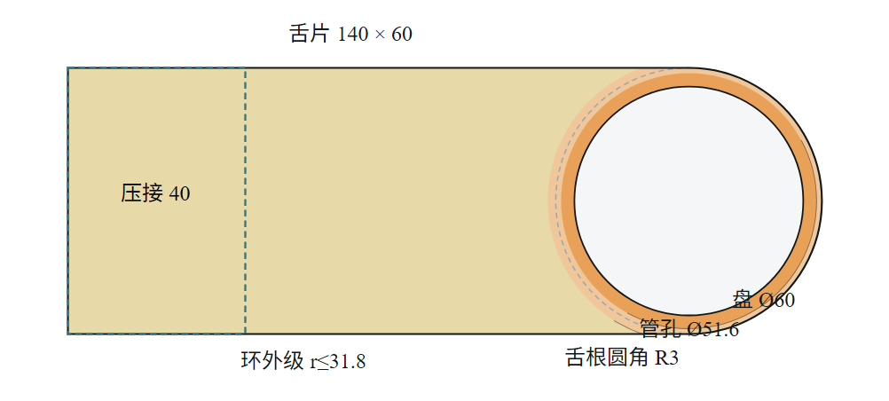
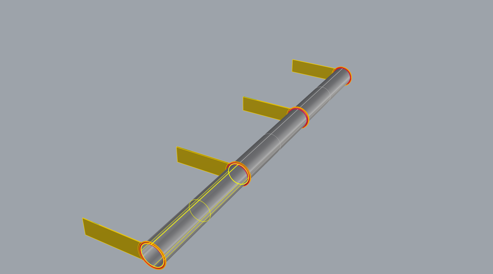

# 摘要

铂金直接通电加热是光学玻璃熔体输送的核心工艺。铂件同时是结构件、发热元件与熔体接触界面，三重角色互相牵制，「减少铂金用量」不能沿单一维度达成。本报告按业主总纲把问题定义为整线优化：目标是几段铂管加各片法兰的总铂重，约束是「能升温且升温途中不烧断」与「稳态法兰不把热灌回管子」。

v6.0 与 v5.0 相比，计算流程整个换成一条**由第一性原理定下的设计因果链**（业主 2026-09-08 定）：

1. 先算 20 °C/h 升温工况下管子必须通过的**设计电流**；
2. 按工程师设定的电流密度 J（预设 10 A/mm²）把法兰每一个必经截面**定出尺寸**——舌片厚由此闭式算出，不再是旋钮；
3. 用温度场与电流场决定**孔和槽开在哪里**；
4. 求解器只调剩下的旋钮（舌保温、渐变环、槽、孔），全体截面终验 J < J + 1；
5. 形状（盘径、舌宽、锥形舌、挖不挖孔）由**形状搜索**给出，不挖孔与挖孔两族各自选最轻的可行解，不互相比重量。

在此之上建立了三样东西：一套有出处的判据体系与「判据分辨率」纪律；一条经逐环实测的传导链（法兰增量温降的闭式、共用片的 √3 倍电流、抽热窗口的两侧）；一个从约束盒下角出发、旋钮只增不减、解与初值无关的求解器，以及能回答「哪种形状最省铂」的形状搜索。

结果：现役设计记录「管壁 0.8 · 留余量」总铂重 3547 g（管 2465 + 法兰 1082，3 段 4 片）；在 2 段 3 片的对照工况下，形状搜索给出的最轻可行形状为盘 Ø56／舌宽 56，细网格重解后 2603.8 g，与用户手画的侧 Y 形（2741.9 g）对比省 5 %。所有判据表、图纸与本报告的图，都由程序从同一份设计记录生成。

# 1 绪论

## 1.1 三重角色与它们的冲突

| 角色 | 关键量 | 希望铂金 |
|---|---|---|
| 发热元件 | 电流密度 J、电阻率 ρ | 截面小（J 高则发热强） |
| 结构件 | 应力 σ | 截面大（应力低） |
| 熔体界面 | 壁温 T | 温度高且均匀 |

减薄壁厚可省铂，却同时抬高电流密度、抬高应力，并因轴向导热截面减小而加深法兰处的冷点。

## 1.2 优化目标与约束（业主总纲）

目标是**整线总铂重**，不是省铂率，也不是单段口径。两条硬约束：

- C1 升温：空管能在期限内升到目标温度，且升温途中共用法兰不烧断——现场失效正是共用法兰在升温阶段烧断；
- C2 稳态：法兰不把热灌回管子（管孔净流入为正）；为负即法兰比管热，与 C1 是同一条失效线的两端。

可调自由度：法兰厚度（逐片独立）、法兰形状（盘径、舌宽、舌边平行或锥形、舌孔、圆盘背侧槽、渐变环）、管壁厚、保温（管与法兰分别）、升温速率。

## 1.3 被划掉的三条约束

业主 2026-08-14 明确：铂金直接加热系统都留有膨胀考量，蠕变、铂金加热蒸发也都不必考虑。据此热膨胀／热应力、蠕变／持久强度、高温挥发三条关闭。后果：壁厚的工艺下界不再由强度定，改由焊接定（第 4.6 节）；v4.0 的「约束次序：强度 > 电流密度 > 析晶」不再成立。仍是约束的：铂熔点、局部热失稳。

## 1.4 求解逻辑顺序（v6.0 的设计因果链）

```
① 判据体系与限值出处          ← 先立判据，否则后面每个数都无从判过与不过
② 设计电流（20 °C/h 升温）     ← 尺寸的依据是空管升温，不是稳态
③ 按 J 定截面                  ← 舌片厚、舌盘交界、孔缘环、各级环：I/(J·宽)
④ 场定孔                       ← 槽心角、舌孔孔心按温度场／电流场写回
⑤ 旋钮求解                     ← 约束盒下角出发，只增不减，二分求根
⑥ 终验                         ← 全体截面 J < J+1；熔化只判断不加厚
⑦ 网格加密复算 → 细网格重解    ← 判据在哪张网格上成立，就在哪张网格上求根
⑧ 形状搜索                     ← 盘径／舌宽／锥形／孔族；两族各自最轻
```

②③④⑤ 之间是耦合的（发热改温度，温度改电阻率与电流分布），须迭代求解。第 ① 步排在最前不是形式：本项目最严重的几次错误都发生在「求解器没错、判据错了」的情形下。

# 2 几何与工况

## 2.1 整线布置


横轴为管轴。中间两片是共用片——两侧段电流相位差 120°，它承担 √3 倍电流，发热是端片的 3 倍，现场失效多半出在这两片。

## 2.2 法兰的形态族



APP 里一片法兰由下面这些量描述（`DesignSpec`，每片可独立）：

| 部位 | 量 | 谁定 |
|---|---|---|
| 圆盘 | 直径；管孔半径 = 管内径/2 + 壁厚 | 形状搜索／工程师；管孔随管 |
| 舌片 | 舌长、舌端半宽、舌边平行或**锥形**（两边与圆盘相切） | 舌长 = 圆盘切点 + 压接段 + 自由段下界，闭式；半宽与锥形由搜索或工程师 |
| 板厚（圆盘） | 逐片 | 求解器旋钮（只增不减） |
| 舌片厚 | 逐片 | 闭式：设计电流 ÷ (J × 舌片最窄有效宽)，不是旋钮 |
| 舌根加厚段（叉臂） | 起点、终点、厚度 | 舌根有切口时派生：切口带内按 I/(J·带内最窄宽) 加厚，带外还是杆厚 |
| 渐变环 | 内级／外级倍率与半径（相对板厚、相对管孔） | 旋钮（成对：半径 + 厚度） |
| 圆盘背侧槽 | 张角、槽心角 | 张角是旋钮，槽心角按场定 |
| 舌孔 | 孔径、顺流拉长比、孔心 x、形状族（圆／圆角三角／圆角方） | 孔径与拉长比是旋钮（只在挖孔族），孔心按场定，形状族比价 |
| 舌保温 | 逐片 | 旋钮，不花铂 |


几何全部是相对量：管孔半径跟随管外径、环半径相对管孔、环厚度相对板厚。把它们写成绝对值曾两次造成静默失效（板一变厚环就消失）。

## 2.3 工况

| 段号 | 控温点 °C | 段长 mm |
|---|---|---|
| HC1 | 1150 | 300 |
| HC2 | 1080 | 300 |
| HC3 | 1050 | 300 |

产量 1.5 t/day，玻璃液相线 1050 °C，环境 25 °C，交流供电。升温工况：空管、20 °C/h、全线到 1150 °C。

## 2.4 角焊缝的几何

管穿过圆盘内孔，两面各一道角焊缝。自熔小角焊缝被表面张力拉成凹面，不是三角形：以焊脚 a 为半径的圆弧，圆心在 (a, a)，在管壁处切线竖直、在板面处切线水平。单道截面积

$$A_w = a^2\left(1-\frac{\pi}{4}\right)\approx 0.215\,a^2,$$

只有三角形 $a^2/2$ 的 43 %。按三角形建模会把焊缝的好处高估 2.3 倍。焊缝在电学上是帮忙的：孔周正是电流密度峰值所在，加厚按比例压低该处的电流密度与单位面积发热。计算里一直算着它，交付的 3DM 里也画着它。

# 3 电学模型

## 3.1 体积生热率

由微分形式欧姆定律 $\mathbf{E}=\rho\,\mathbf{J}$，单位体积电功率

$$q_v=\rho\,J^2\quad[\mathrm{W/m^3}].$$

这条平方律是全文最重要的一条：截面稍微变大，发热能力就急剧下降。它也是「法兰虽然导电却几乎不发热」的根本原因。

## 3.2 质量方程

设一段铂件须供给功率 $P$，电流密度均匀时体积 $V=P/(\rho J^2)$，铂质量

$$m=\rho_m V=\frac{\rho_m\,P}{\rho\,J^2}.$$

在电流密度被上限钳死时，铂金质量与所需功率成严格正比。供料管的功率几乎全部用于补偿散热，故**省铂金 = 省热损失**：任何被吹走、辐射掉、传导流失的瓦特，都必须由铂金发出来，因而都折算成克数。

## 3.3 薄板：面电流守恒

法兰是「圆盘 + 平面舌片」，电流由舌片单侧汇入管孔，是本质二维问题。深度平均后的控制方程

$$\nabla\cdot\left(t\,\sigma\,\nabla\varphi\right)=0,\qquad \mathbf{K}=t\,\mathbf{J}=-t\,\sigma\nabla\varphi,$$

守恒量是面电流密度 $\mathbf{K}$。单位面积的发热（壳模型里真正进入热方程的量）

$$q_A=\rho\,J^2\,t=\frac{\rho\,K^2}{t}.$$

这是后面所有「加厚」类对策的理论依据，也解释了它们的双向性：加厚同时降低单位面积发热（∝ 1/t）与提高横向导热能力（∝ t）。

## 3.4 共用法兰的电流

两侧段电流相位差 120°，共用片承担

$$I_{\text{共用}}=\left|I\,e^{j0}+I\,e^{j120^\circ}\right|=\sqrt{3}\,I,$$

发热 ∝ I²，故为端片的 3 倍。这不是经验系数，是相量求和的结果。

## 3.5 设计电流：20 °C/h 升温全程的峰值（v6.0 新）

稳态有玻璃时后两段的玻璃在加热管子、电流很小；**空管升温才是尺寸的依据**。管子自己的准静态电流由

$$I^2 R_{\text{管}}(T)=Q_{\text{管散热}}(T)+C_{\text{管}}\,\frac{dT}{dt}$$

给出，沿升温全程 25 → 1150 °C 取最大（散热随温度涨，峰在目标温度处；20 K/h 下热容项约 1 W，散热千瓦级）。逐段各算，共用片按相量合成。

为什么不用「管 + 法兰」两节点模型的电流当尺寸依据：两节点里法兰自热会让法兰比管热、热倒灌回管子，管电流算少；而法兰电阻随板厚变，第一轮闭式估计与第二轮场解可以差 20 倍，设计电流会跳。尺寸依据不许被「法兰帮管子发热」省掉、也不许随法兰自己漂，所以取管子单独所需的电流（确定、闭式；它不是整线稳态段电流的上界——同一次整线判定里，空管到温的段电流比它大约 0.5 %；差的来源推断是法兰抽热与段间耦合不在它里面，未拆开验）；两节点的结果另算一份当对照，不进尺寸链。

现役工况实算：段 979 A，片 979／1696／979 A（共用片 √3 倍）。

## 3.6 按 J 定截面（v6.0 新）

工程师设定电流密度 J（预设 10 A/mm²，极限 J + 1）。法兰上电流必经的每一个截面都要满足 $I/A \le J$：

| 截面 | 在哪里 | 面积怎么算 |
|---|---|---|
| 舌片各处 | 沿舌长逐点 | 舌宽（扣掉舌孔弦长）× 舌片厚 |
| 舌盘交界弦 | 舌片与圆盘相切处 | 交界弦长（扣管孔弦、扣圆盘切口）× 厚 |
| 孔缘环 | 管孔外一圈 | 环带宽 × 环厚 |
| 各级渐变环 | 内级、外级 | 环带宽 × 该级厚 |

舌片厚由此闭式定下：

$$t_{\text{舌}}=\frac{I}{J\,w_{\min}},$$

其中 $w_{\min}$ 是舌片最窄有效宽（有舌孔时扣掉孔的弦长）；不低于板料下限（烧穿 0.6 mm），向上落到图纸格 0.01 mm。舌根有切口（舌孔或落到舌根的圆盘槽）时，切口那一段按带内最窄宽单独加厚成**叉臂**，带外还是杆厚——这就是 Y 形舌板的来历（第 8.4 节）。

终验：全体截面 J < J + 1，作为判据「法兰截面 J」印在判据表里。

# 4 热学模型

## 4.1 管段：通电肋片方程

对轴向微元作能量平衡（导入、导出、焦耳生成、外表面散失、传给玻璃）：

$$\frac{d}{dx}\left(kA\frac{dT}{dx}\right)+\frac{\rho(T)\,I^2}{A}-h_{\text{eff}}P\,(T-T_\infty)-q_{\text{玻璃}}(T)=0.$$

与经典肋片方程的唯一区别是多了一个随温度变化的内部热源，正是这一项的温度依赖性带来热稳定性问题（第 4.5 节）。

## 4.2 特征长度与法兰增量温降的闭式

令 $\theta$ 为对平台温度的偏离，线性化后管段的轴向刚度为散热与导热的几何平均。设法兰自管孔抽走热流 $Q$，则管根的增量温降

$$\Delta T_{\text{根}}=\frac{Q}{\sqrt{\left(h'P+\text{玻璃耦合}\right)\,kA}}.$$

这是本文的核心闭式：法兰造成的管根增量温降，等于抽热量除以「管子沿轴向的散热—导热几何平均刚度」。三条推论都已逐环实测：想压增量温降就得压抽热，别无他途；管保温越厚（h' 越小）增量温降越大，与直觉相反；减薄管壁（A 小）会加深法兰冷点。

## 4.3 法兰：二维壳

单位面积发热由 3.3 节给出；散热按分区取保温值或裸铂值（圆盘与舌片可各自设定）。从管子抽走的热量用能量恒等式算（对所有有方程的格点求和，传导项伸缩相消，只剩与管孔格点相邻的面），不逐面累加——后者在阶梯状圆孔边界上会漏面，实测偏小 14 %。

板厚在网格上按分区取值（板身、各级环、叉臂带、舌片）并叠加焊缝；面导度按面处厚度取两侧算术平均。

## 4.4 辐射线性化：割线与切线

在任何线性化或摄动分析中须用切线斜率 $4\varepsilon\sigma T^3$ 而不是割线斜率；二者之比以 1150 °C 与 25 °C 计为 3.25。误用割线会把散热的抗扰动能力低估 3.25 倍。本模型一律使用数值切线。

## 4.5 局部热失稳：一条不含几何、不含电流的闭式

恒流下某处温度升高 → 电阻率升高 → 该处发热更多，构成正反馈。把包保温的舌片视为「两端定温、通电、绝热」的杆，稳定条件与导热漏条件相除后长度与截面全部约掉，只剩材料物性；纯铂在夹持温度整个范围内裕度 1.8～3.1，全区可行。判据表里以「整片热稳定」「局部热稳定」两条参考量印出（散热随温度涨得比发热快多少倍）。

一条必须记住的机理：**压接段不发热**。铜排把那一段短接（铜比铂导电 25 倍、厚 10 倍），舌片有效发热长度 = 舌长 − 压接长。

## 4.6 工艺下界：由焊接定，不由强度定

强度约束关闭后，壁厚下界改由焊接给出。可算的那一半是屈曲变形：焊缝冷却时纵向收缩，在焊缝附近留下受拉区，靠板的其余部分受压来平衡；板越薄抗压屈曲能力越弱（$\sigma_{cr}\propto t^2$），到某个厚度以下就鼓曲。由收缩力（tendon force）、全熔透线能量与板屈曲临界应力联立，E 与 ρ 都约掉：

$$t_{\min}=\frac{12(1-\nu^2)\,C\,\beta\,\alpha\,\left(\bar c\,\Delta T_m+L_f\right)}{k_b\,\pi^2\,c\,\eta_{\text{melt}}}\;b,$$

结果只取决于材料的热学量与三个工艺系数，并**正比于板的无支撑宽度 b**——它给出的是 t/b 的下限，必须按每条焊缝各自的 b 来算。三个系数里板屈曲系数 k_b 是大头：四边简支 4.0，三边简支一边自由 0.43，差 9.3 倍；法兰盘是后一种。

| 圆盘 | 环宽 mm | 屈曲下界（含 SF 2.0） | 控制机理 |
|---|---|---|---|
| Ø120 | 34 | 4.71 | 屈曲 |
| Ø72 | 10 | 1.39 | 屈曲 |
| Ø60 | 4 | 0.55 | 屈曲（被烧穿 0.6 盖住） |
| 管（圆筒） | — | 任何壁厚都不屈曲 | 烧穿 |

三条可执行结论：缩小圆盘直径同时放松焊接下界，与省铂、与端片热平衡三者同向；圆盘的焊接下界已被电热约束顶出来的实际板厚盖住；舌片与圆盘同板切出、无焊缝，舌厚不受焊接下界约束。管壁的烧穿下界按现场实况取手工 TIG 的 0.6 mm（自动 TIG 约 0.3、激光约 0.1）。

APP 的「参考工具 ▸ 焊接下界小算盘」就是这条公式的独立算盘：改一格当场重算，并列出一串盘径看从哪一档起由屈曲控制；它不进计算链，不改页面上的数。

## 4.7 熔化：只判断，不当旋钮（v6.0）

按 J 定截面之后，各片在约束盒下角本不该熔。若场解出某片熔化（温度越过铂熔点），APP 判定「该解不存在」并停下——不是抬厚度去救：熔化说明要么闭式截面漏了一刀（先看判据表「法兰截面 J」那行的最紧截面），要么 J 设得太高。熔化区里的温度数一个都不引用。

# 5 判据体系

## 5.1 三条铁律

1. **判据只有一个来源**：整线计算判出来的表。界面、报告只读结果，不自己重算。
2. **几何只有一个来源**：设计记录。出的图、算的场、画的示意图都从它来。
3. **判据不允许消失**：只能「过／不过／无法判定」三态，无法判定一律不算通过。

## 5.2 硬判据与限值出处

| 判据（APP 里显示的名字） | 判什么 | 限值 | 出处 |
|---|---|---|---|
| 升温 | 按 20 °C/h 空管升温所需电流折成的管 J 峰值，没被管 J 许用截住 = 升得到目标 | 管 J 许用 | 闭式 |
| 管孔净流入 | 热是从管子流进法兰（安全），还是倒灌进管子（烧断方向） | > 0 W | 总纲 C2 |
| 圆盘区最高温 − 管温 | 贴着管孔那一圈盘面比管子热多少 | 5 K | 现场控温精度 ±5 K |
| 法兰增量温降 | 有法兰 vs 无法兰的同位置管根温差（只算法兰的责任） | 10 K | 业主定，按热电偶误差取 |
| 管 J | 管子自身的电流密度 | 12 A/mm²（参数表可改） | 现场：一般 15，壁 0.6 时 12 是极限 |
| 法兰截面 J | 设计电流 ÷ 每个必经截面面积 | 设定 J + 1 | 第 3.6 节 |
| 舌片自由段 | 舌片伸出来没被压接吃掉的那段够不够装铜排 | ≥ 100 mm | 现场铜排长 100、宽 60–80 |
| 圆盘盖得住管孔＋焊脚 | 盘半径 − 管孔半径 − 焊脚 | ≥ 0 | 可造性；不可造的几何料最少，优化器会主动往那里跑 |
| 管壁下界 | 焊接烧穿 | 0.6 mm | 手工 TIG |

参考量（印出来、不卡交付）：升温到位用时（集总）、整片热稳定、局部热稳定、法兰最高温、升温期法兰−管峰值、管↔法兰热收支、管强度利用率、玻璃温降。

## 5.3 判据分辨率原则

每条判据的限值必须有来源；判定的分辨率必须粗于「数值噪声」与「现场可分辨尺度」两者。曾有人用 0.02～0.08 K 的差别决定约 700 g 铂金——而那点温差只对应 14 mW，占段功率 5 ppm，现场任何仪器都测不出来。据此圆盘区最高温的限值由 0 改为 5 K（现场控温精度与热电偶误差里取保守的 5 K）。

对「法兰增量温降」的 10 K，两条独立于物理依据的推论：不该把设计点摆在 10 上（摆在测量地板上的判定分不出真假）；不该拿它当控制靶（∂增量温降/∂板厚是正号，靶设在 8 会让优化器加厚板把判据推向限值）。

## 5.4 复核值与记录值

判据表有两列口径：记录值是导航网格（2 mm）上算的；复核值是把网格一档档加密、直到数不再变之后的数。做决定看复核值。现役记录实测：法兰增量温降 4.72 K（粗网格）→ 10.33 K（0.25 mm），粗网格把孔边与焊脚那一圈的梯度抹平了，这个差足以把「过」变成「不过」，所以核算整线一定走到加密复算。

# 6 传导链的逐环实测（摘要）

方法由业主定：跟随传导链，拿证据 → 分析 → 对策 → 用一个可证伪的预言验对策。七环的结论（详见 v5.0 第 6 章）：

| 环 | 结论 | 关键数 |
|---|---|---|
| 1 管壁 → 管根 | 管壁减薄，法兰增量温降增大（式 4.2） | 壁 2.0 → 1.8：管根 1148.64 → 1147.89 °C |
| 2 圆盘区两个竞争峰 | 峰 A 在盘缘（电学死区，只跟随管根），峰 B 在舌根凹角（真尖峰）；「管壁必须 2.0」是假象，挡路的是峰 B | 对症旋钮是舌根圆角，每片约 1 g |
| 3 舌保温 | 不是圆盘区最高温的旋钮；它管管孔净流入与法兰增量温降 | 扫 80 倍，圆盘区最高温不动 |
| 4 渐变环 | 改成相对量后，机理被中间点看见；倍率 1.15 时峰未跳走但局部 J 已压低 | 翻转点 1.30 |
| 5 副作用 | 环加厚 → 抽热增 → 增量温降冲高，须由板厚顶回 | 抽热 1.16 → 8.68 W |
| 6 靶设错了 | 管孔净流入是方向判据，不该有靶值；保护哪条判据就直接盯哪条 | — |
| 7 实测雅可比 | 板厚对增量温降是正号（加厚同时降发热、增导热） | +149 K/mm |

# 7 求解器：约束盒下角与旋钮分配

## 7.1 起点是约束盒的下角，不是任何初值

求解器从约束盒的下角出发：板厚 = max(焊接屈曲下界, 烧穿下界, 按 J 定截面的下界)，舌保温 = 下界，环倍率 = 1，槽与孔 = 0。传进来的任何旋钮值一个都不用——这就是「解与初值无关」的实现方式。旋钮只增不减，每根旋钮用二分求根抬到刚好过为止；因为只往上走过，停下的那一点就是最小的可行点。

## 7.2 判据 → 旋钮的分配表

| 判据不过 | 候选旋钮（按实测每克铂买到的裕度排序） |
|---|---|
| 管孔净流入 | 外级环倍率、外级环半径、板厚 |
| 法兰增量温降（抽热太多） | 舌保温（不花铂）、圆盘背侧槽张角、舌孔孔径、舌孔顺流拉长比 |
| 圆盘区最高温 | 舌保温、环倍率、内级环半径 |

比价规则：先看补得上补不上，再看每克铂买到的裕度；候选各自独立求根，补不上的退回原值并淘汰（写明原因：解不出来、开不出槽、作用在空集上……），一根补不上时求解器自己攒出组合。旋钮全部到顶仍不过，就把话说清楚交出去：「厚度到头，该改形状」——那是形状搜索的事。

「解法」三选一（不挖舌孔／挖舌孔／两个都算）：不挖孔族把舌孔两根旋钮剔出候选，其余照旧；两族各自走到最小可行点，不互相比重量。

## 7.3 场定位置

圆盘背侧槽的槽心角与舌孔的孔心不是拍的：每轮按当地电流方向与温度场写回（槽开在电流基本不走、热照样被抽走的那一侧），开孔之后冻结。舌孔的形状族（圆／圆角三角／圆角方）各抬到各的上界量一次，按同一套比价规则选。

## 7.4 网格：导航网格 → 加密复算 → 细网格重解

导航网格（2 mm）用来定位；判据可不可信由加密复算说了算（一档档加密到判据不再变）；加密后不过的，直接在那张细网格上重新求根（旋钮只增不减），解完再验一次才可出图。

## 7.5 控制律的由来

v5.0 的串级结构（内环板厚压法兰增量温降、外环舌保温腾余量、环倍率反饱和接力）在 v6.0 里退居为分配表里的排序依据。原因是按 J 定截面之后，板厚不再是主要旋钮——大多数案例在下角就过了热学判据，剩下的缺口由不花铂的舌保温与挖料类旋钮补。

# 8 形状搜索原理与法兰形态选型

## 8.1 搜索空间

| 维 | 取值 | 谁管 |
|---|---|---|
| 盘径 | 连续（下界由「圆盘盖得住管孔＋焊脚」闭式给出） | 搜索 |
| 舌宽比例 | 半宽／盘半径，0.25～1.0 | 搜索 |
| 舌边 | 平行／锥形（离散） | 搜索（邻域探索里翻转） |
| 孔族 | 不挖舌孔／挖舌孔 | 两族各跑一遍，各选各的最轻，不互比 |
| 舌长 | 闭式（切点 + 压接段 + 自由段下界） | 不搜 |
| 舌片厚 | 闭式（I/(J·宽)） | 不搜 |

## 8.2 流程

1. 网格粗筛：几个盘径 × 几个舌宽比例，给出发点与方向；工程师当前形状也当基准点算一遍。
2. 盘径下界的不动点迭代：下界随板厚变，迭代到不动。
3. 二分定可行区间，黄金分割找最轻点（≤ 4 点）。
4. 剩余舌宽比例各试一次（批算）。
5. 邻域探索：从当前最好点出发试盘径 ±一步、舌宽比例 ±一步、翻转锥形共 5 个邻点；有更好就搬过去继续，没有更好就把步长减半再问一次，直到 0.625 mm——停机条件因此是一句能写进交付的话：「在 ±0.625 mm 分辨率上是局部最优」。每轮的邻点互相独立，4 路并发批算（串行与并行逐位相同，有门钉着）。
6. 胜出形状精算：细网格上重新求根，写回页面（含锥形勾选）；算过的全部形状进「搜形状结果」下拉供工程师自选。

## 8.3 不同形态法兰的选型步骤

| 步 | 做什么 | 看什么决定下一步 |
|---|---|---|
| 1 | 载入设计记录，点核算整线 | 判据表：全过就到步 5；不过看「先解决哪一条」 |
| 2 | 卡热和电（管孔净流入／圆盘区最高温／法兰增量温降／管 J）：核算整线自己调旋钮 | 旋钮到顶仍不过 → 「该改形状」 |
| 3 | 卡几何（舌片自由段／圆盘盖得住）：改盘径、舌宽 | 或直接搜形状 |
| 4 | 搜形状：先不挖孔族；「解法」选两个都算再看挖孔族；锥形有没有帮助由搜索翻转试出 | 搜形状结果下拉：每族最轻的可行形状；Y 形（舌孔＋叉臂）会不会出现，看挖孔族里孔是否被选中 |
| 5 | 核算整线精算到细网格 | 「可以出图」 |
| 6 | 导出 3DM，重量对账 | 差在 ±2 % 内才拿去加工 |

## 8.4 Y 形舌板：由来与机理

用户 2026-09-10 手画的侧 Y 形舌板（舌根开一条到根的槽，形成两条臂）是挖孔族的一个自然成员：舌孔一开，舌片最窄有效宽变小，按 J 定截面要求切口那一段加厚，于是「杆 + 叉臂」的 Y 形自动出现。三条实测结论：

- 按 J 定截面之后，**把整片舌片均匀加厚再开孔只会更差**（截面被 J 钉死，多出来的料抽热更多）；只把切口带加厚成叉臂，舌根的孔才有效（内径 50 对照：法兰增量温降 −58 K → 通过，孔径 20.9，+26 g）。
- 孔不能替代保温：两个对照案例在舌保温封 3 mm 时都不可行；孔与槽是「少抽热」的旋钮，主力仍是不花铂的舌保温。
- 成本随管径爆炸：内径 80、盘 Ø96 时叉臂要 18～32 mm 厚，每克铂只换到 0.1 K。

在 2 段对照工况下，用户手画的 Y 形交给求解器定旋钮后可行、2741.9 g；形状搜索给出的盘 Ø56／舌宽 56（不挖孔）细网格重解 2603.8 g，省 5 %。两者都在「搜形状结果」下拉里，由工程师自己选。

# 9 数值方法与收敛

| 模块 | 方程 | 方法 |
|---|---|---|
| SegmentSolver | 管段金属 + 玻璃耦合（4.1） | 有限体积 + Picard + 三对角追赶；中层二分求电流 |
| DesignCurrent | 升温准静态电流（3.5） | 闭式，沿升温全程取峰值 |
| SectionSizing | 按 J 定截面（3.6） | 闭式，逐截面 |
| ShellCurrent | 面电流守恒（3.3） | 掩膜网格五点格式 + 共轭梯度 |
| ShellThermal | 二维壳热方程 | 同上，Picard 处理温度相关物性 |
| FieldPlacement | 场定槽心角、舌孔孔心 | 按当地电流方向与温度场 |
| LineRunner | 段 ↔ 法兰耦合 | 外层不动点 + Anderson 加速 |
| Solver | 旋钮求根 | 约束盒下角出发，逐旋钮二分，只增不减 |
| MeshVerify | 网格无关复核 | 一档档加密到判据不再变 |
| ShapeSearchPlan / ShapeBatchEval | 形状搜索 | 网格粗筛 → 不动点 → 二分 → 黄金分割 → 邻域探索（步长减半）；批内 4 路并发 |

外层耦合的环路增益约 0.95，离热失控（1.0）只差 4 %——它既是收敛缓慢的原因，也是本系统的一项设计裕度，作为设计量汇报。Anderson 加速把状态（各段两端抽热、各段两侧邻段端温）放进同一个向量做加权最小二乘外推，最坏退化回欠松弛 Picard；收敛判据不用步长做代理，直接按真残差判（曾因此暴露过一个被喂了假值的 17.7 K）。剩余误差报「距不动点的估计」，不报「相邻两轮变化」。

# 10 计算结果

## 10.1 现役设计记录：管壁 0.8 · 留余量

| 项 | 值 |
|---|---|
| 管 | 内径 50／段长 300 × 3／壁 0.8，管保温 5 mm |
| 圆盘 | Ø60 |
| 舌片 | 140 × 60，等宽，舌根圆角 R3 |
| 板厚（入口／共用 1／共用 2／出口） | 0.89 / 2.45 / 2.35 / 0.73 mm |
| 舌保温（四片） | 0.4 / 0.4 / 0.5 / 0.3 mm |
| 渐变环 | 倍率 1.00（不需要环：舌片加宽后孔周不再拥挤） |
| 管／法兰／合计 | 2465 / 1082 / 3547 g |


## 10.2 形状搜索结果（2 段 3 片对照工况，管壁 0.8、管保温 10）

| 案例 | 结果 | 合计 g |
|---|---|---|
| 盘 Ø56／舌宽 56／舌长 140（搜形状最轻） | 导航网格可行 → 加密复算 0.125 mm 不过 → 细网格重解 105 分后可行 | 2603.8 |
| 盘 Ø58／舌宽 58 | 导航网格可行，加密复算 0.25 mm 通过 | 2615.8 |
| 用户手画侧 Y 形（Ø56、舌 146×30 锥形、舌根槽） | 形状固定、旋钮自由：可行 | 2741.9 |
| R29 对照：Ø56，舌保温封 3 mm | 不可行：法兰侧旋钮都到头 | 2655.6 |
| R29 大管径：内径 80、Ø96 | 不可行：叉臂 18～32 mm 仍不够 | 5763.0 |


## 10.3 法兰设计结果图（Rhino 8 截取）





## 10.4 几何交付与质量对账

出图后立刻自校三项，任一项不过即「不得作为交付件」：

| 校验 | 判据 | 它防的是什么 |
|---|---|---|
| 读回来的方位 | 从磁盘读回，沿 Y 的跨度 = 板厚 | 板画到了别的平面上 |
| 角焊缝体积 | 回转体实测 vs 解析积分，差 ≤ 0.5 % | 焊缝形状画错 |
| 逐件重量对账 | 3DM 体积 × 密度 vs 计算网格体积 × 密度，差 ≤ 2 % | 孔没挖、焊角没画、环多长出去——一切几何细节 |

只验「包围盒沿 Y = 板厚」曾一路报「全吻合」而实际法兰只有计算值的 43 %；重量是唯一把所有几何细节都卷进去的一个数。

# 11 APP 使用方法

## 11.1 三分钟上手

| 步 | 做什么 | 为什么 |
|---|---|---|
| 1 | 参考工具页：设计记录 ▾ → 载入设计记录 | 从一个已知可行的设计出发 |
| 2 | ② 法兰优化页：核算整线 | 它会自己走完：解一次 → 判据没过就调旋钮（需要时搜形状）→ 加密复算到数不再变 → 细网格上不过就重解 → 可以出图 |
| 3 | ① 输入页改盘径／舌宽／管壁／锥形／解法 | 舌长会自己顶到装配下界；改完停手一秒多会自动重算 |
| 4 | （可选）◇ 搜形状 | 连盘径都还没定、或想看有没有更省铂的形状 |
| 5 | ③ 结果与出图：导出本页 3DM | 拿到与刚才计算完全一致的几何，输出框里看重量对账 |

## 11.2 五个页签

① 输入（参数、几何来源、法兰形状、逐片旋钮与只读值、段表）；② 法兰优化（核算整线主键、手动分步、五步状态条、输出框）；③ 结果与出图（判据表、三张场图、出图与存档）；参考工具（解析粗看、分段核算、焊接下界小算盘、设计记录）；使用说明（本页即完整说明书，F1 直达）。右上状态面板底部有一行「下一步 → 点『…』」，该点的按钮同时加粗加淡蓝底。

## 11.3 核算整线 vs 搜形状

先点核算整线，它说要搜形状时再搜；想省铂再手动搜。核算整线只调旋钮不动形状；搜形状动盘径、舌宽、锥形，「解法」选两个都算时两族各搜一遍。搜形状写回的是粗网格上的解，搜完必点核算整线精算，过了才出图。

## 11.4 用自己的 Rhino 图纸

① 输入页「法兰几何来源」选 Rhino .3dm 文件，选一张图（各片同一张图、厚度各自解），填图层名；先「分析几何变数」再「核算整线」。分析会认出管孔、盘径、舌片尺寸、各级台阶、锥形舌与舌根加厚段；「◈ 图纸几何 → 参数」把图纸变成参数后才能搜形状。图纸模式下四个厚度框是厚度倍数，不是板厚。

## 11.5 常见问题

- 搜形状是灰的：现在是图纸模式，先点「◈ 图纸几何 → 参数」。
- 两个按钮给的数不一样：一个算的是存好的设计记录，一个算的是你改过的页面。
- 加密复算后从过变不过：粗网格把孔边和焊脚那一圈的梯度抹平了，细网格才是真的；点「细网格重解」。
- 判据全过但数看着不对：先看判据表上方那行收敛信息，写「未收敛」时下面每个数都不能用。

# 12 现场待确认的数与结论

| 量 | 现在按什么算 | 一旦不同，影响多大 |
|---|---|---|
| 法兰截面的设计电流密度 J | 预设 10（可改），极限 J + 1 | J 每改 1，法兰截面和铂重都跟着变；最值得现场给一个数 |
| 「法兰增量温降」的物理依据 | 10 K 来自热电偶误差 | 决定能否把设计点从 10 K 往外放 |
| 铜排表面状态 | 氧化铜发射率 0.7 | 抛光铜 0.05，差 14 倍 |
| 焊接方法 | 手工 TIG（烧穿下界 0.6 mm） | 自动 TIG 0.3、激光 0.1，差一个量级 |

结论：本报告把 v5.0 的判据体系与传导链保留为基础，把计算流程换成「升温电流 → 按 J 定截面 → 场定孔 → 终验」的因果链，并把形状（盘径、舌宽、锥形、孔族）交给形状搜索。所有数与图都由同一份设计记录生成，任何一处「过」都有机器门或抓图撑着；限制与待确认的数如实列在上面。
