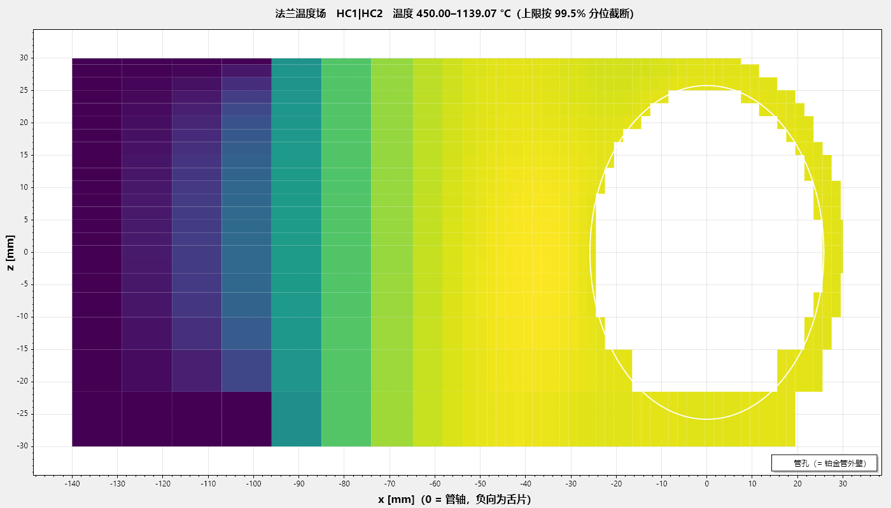
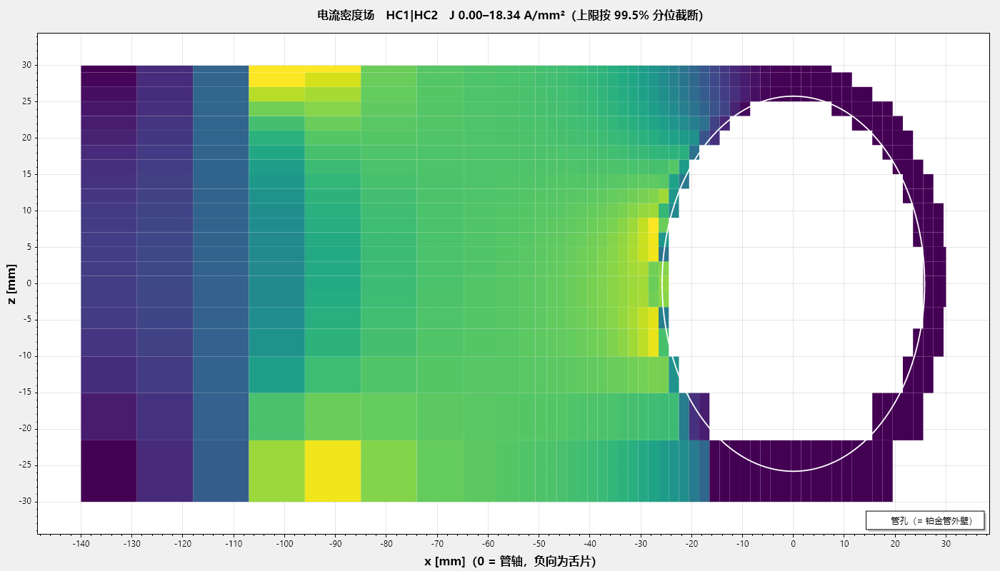
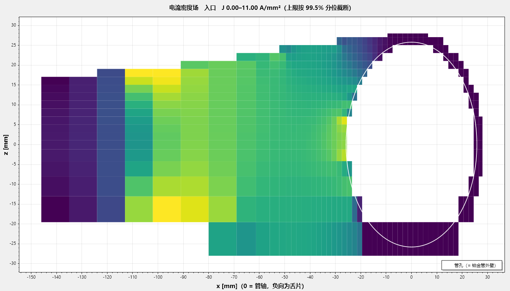
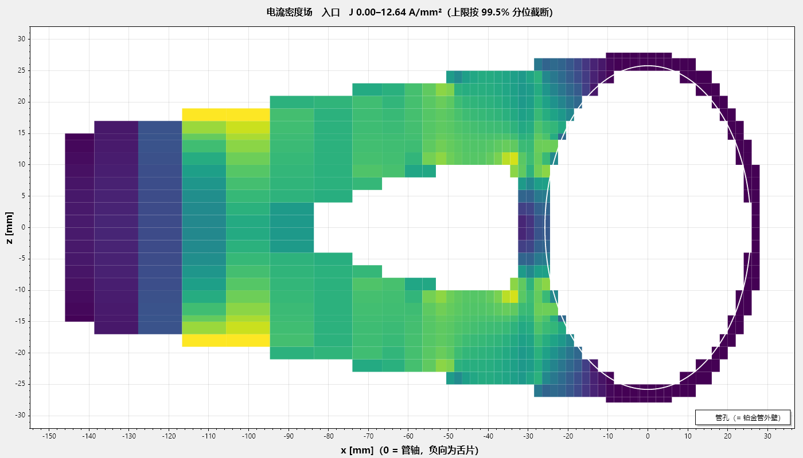

# 摘要

铂金直接通电加热是光学玻璃熔体输送的核心工艺。铂件同时是结构件、发热元件与熔体接触界面，三重角色互相牵制，「减少铂金用量」不能沿单一维度达成。本报告把问题定义为整线优化：目标是几段铂管加各片法兰的总铂重，约束是「能升温且升温途中不烧断」与「稳态法兰不把热灌回管子」。

计算流程是一条**由第一性原理定下的设计因果链**：

1. 先算 20 °C/h 升温工况下管子必须通过的**设计电流**；
2. 按工程师设定的电流密度 J（预设 10 A/mm²）把法兰每一个必经截面**定出尺寸**——舌片厚由此闭式算出，不再是可调参数；
3. 用温度场与电流场决定**孔和槽开在哪里**；
4. 求解器只调剩下的可调参数（舌保温、渐变环、槽、孔），全体截面终验 J < J + 1；
5. 形状（盘径、舌宽、锥形舌、挖不挖孔）由**形状搜索**给出，不挖孔与挖孔两族各自选最轻的可行解，不互相比重量。

在此之上建立了三样东西：一套有出处的判据体系与「判据分辨率」纪律；一条传导链（法兰增量温降的闭式、共用片的 √3 倍电流、抽热窗口的两侧）；一个从约束盒下角出发、可调参数只增不减、解与初值无关的求解器，以及能回答「哪种形状最省铂」的形状搜索。

结果：现役设计记录「管壁 0.8 · 留余量」总铂重 3547 g（管 2465 + 法兰 1082，3 段 4 片）；在 2 段 3 片的对照工况下，形状搜索给出的最轻可行形状为盘 Ø56／舌宽 56，细网格重解后 2603.8 g，侧 Y 形方案（挖孔族）2741.9 g，导航网格上可行；两族程序不互比重量，这里只是并列。所有判据表、图纸与本报告的图，都由程序从同一份设计记录生成。

# 1 绪论

## 1.1 三重角色与它们的冲突

| 角色 | 关键量 | 希望铂金 |
|---|---|---|
| 发热元件 | 电流密度 J、电阻率 ρ | 截面小（J 高则发热强） |
| 结构件 | 应力 σ | 截面大（应力低） |
| 熔体界面 | 壁温 T | 温度高且均匀 |

减薄壁厚可省铂，却同时抬高电流密度、抬高应力，并因轴向导热截面减小而加深法兰处的冷点。

## 1.2 优化目标与约束

目标是**整线总铂重**，不是省铂率，也不是单段口径。两条硬约束：

- C1 升温：空管能在期限内升到目标温度，且升温途中共用法兰不烧断——现场失效正是共用法兰在升温阶段烧断；
- C2 稳态：法兰不把热灌回管子（管孔净流入为正）；为负即法兰比管热，与 C1 是同一条失效线的两端。

可调自由度：法兰厚度（逐片独立）、法兰形状（盘径、舌宽、舌边平行或锥形、舌孔、圆盘背侧槽、渐变环）、管壁厚、保温（管与法兰分别）、升温速率。

## 1.3 被划掉的三条约束

按给定的设计条件，系统已留有热膨胀余量，蠕变与铂金高温挥发不作为约束。据此热膨胀／热应力、蠕变／持久强度、高温挥发三条关闭。后果：壁厚的工艺下界不再由强度定，改由焊接定（第 4.6 节）；v4.0 的「约束次序：强度 > 电流密度 > 析晶」不再成立。仍是约束的：铂熔点、局部热失稳。

## 1.4 求解逻辑顺序（设计因果链）

```
① 判据体系与限值出处          ← 先立判据，否则后面每个数都无从判过与不过
② 设计电流（20 °C/h 升温）     ← 尺寸的依据是空管升温，不是稳态
③ 按 J 定截面                  ← 舌片厚、舌盘交界、孔缘环、各级环：I/(J·宽)
④ 场定孔                       ← 槽心角、舌孔孔心按温度场／电流场写回
⑤ 可调参数求解                     ← 约束盒下角出发，只增不减，二分求根
⑥ 终验                         ← 全体截面 J < J+1；熔化只判断不加厚
⑦ 网格加密复算 → 细网格重解    ← 判据在哪张网格上成立，就在哪张网格上求根
⑧ 形状搜索                     ← 盘径／舌宽／锥形／孔族；两族各自最轻
```

②③④⑤ 之间是耦合的（发热改温度，温度改电阻率与电流分布），须迭代求解。第 ① 步排在最前不是形式：判据错了，求解器再对也没有用。

# 2 几何与工况

## 2.1 整线布置


横轴为管轴。中间两片是共用片——两侧段电流相位差 120°，它承担 √3 倍电流，发热是端片的 3 倍，现场失效多半出在这两片。

## 2.2 法兰的形态族


APP 里一片法兰由下面这些量描述（`DesignSpec`，每片可独立）：

| 部位 | 量 | 谁定 |
|---|---|---|
| 圆盘 | 直径；管孔半径 = 管内径/2 + 壁厚 | 形状搜索／工程师；管孔随管 |
| 舌片 | 舌长、舌端半宽、舌边平行或**锥形**（两边与圆盘相切） | 舌长 = 圆盘切点 + 压接段 + 自由段下界，闭式；半宽与锥形由搜索或工程师 |
| 板厚（圆盘） | 逐片 | 求解器可调参数（只增不减） |
| 舌片厚 | 逐片 | 闭式：设计电流 ÷ (J × 舌片最窄有效宽)，不是可调参数 |
| 舌根加厚段（叉臂） | 起点、终点、厚度 | 舌根有切口时派生：切口带内按 I/(J·带内最窄宽) 加厚，带外还是杆厚 |
| 渐变环 | 内级／外级倍率与半径（相对板厚、相对管孔） | 可调参数（成对：半径 + 厚度） |
| 圆盘背侧槽 | 张角、槽心角 | 张角是可调参数，槽心角按场定 |
| 舌孔 | 孔径、顺流拉长比、孔心 x、形状族（圆／圆角三角／圆角方） | 孔径与拉长比是可调参数（只在挖孔族），孔心按场定，形状族比价 |
| 舌保温 | 逐片 | 可调参数，不花铂 |


几何全部是相对量：管孔半径跟随管外径、环半径相对管孔、环厚度相对板厚。写成绝对值，板一变厚环就会消失，所以一律用相对量。

## 2.3 工况

| 段号 | 控温点 °C | 段长 mm |
|---|---|---|
| HC1 | 1150 | 300 |
| HC2 | 1080 | 300 |
| HC3 | 1050 | 300 |

产量 1.5 t/day，玻璃液相线 1050 °C，环境 25 °C，交流供电。升温工况：空管、20 °C/h、全线到 1150 °C。

设计输入与来源汇总如下；正文中的「给定」均指本表。

| 设计条件 | 取值 | 来源 |
|:------|:----------|:------|
| 控温点、段长、产量、液相线 | 1150／1080／1050 °C，300 mm，1.5 t/day，1050 °C | 工艺给定 |
| 升温工况 | 空管、20 °C/h、全线到 1150 °C | 工艺给定 |
| 环境温度 | 25 °C | 现场 |
| 允许法兰增量温降 | 10 K | 给定（按热电偶误差取） |
| 圆盘区最高温 − 管温 | ≤ 5 K | 现场控温精度 |
| 设计电流密度 J | 10 A/mm²（可改），极限 J + 1 | 给定 |
| 管 J 许用 | 12 A/mm² | 现场经验（一般 15，壁 0.6 时 12 是极限） |
| 铜排 | 长 100、宽 60～80 mm；夹持 450 °C、压接 40 mm | 现场 |
| 焊接 | 手工 TIG，烧穿下界 0.6 mm | 现场工艺 |
| 保温 | 管 5 mm（对照工况 10 mm）、圆盘 20 mm | 现场实况 |
| 热膨胀、蠕变、高温挥发 | 不作为约束 | 给定（系统已留膨胀余量） |
| 材料物性 | 铂电阻率、导热系数、比热、密度等 | 材料手册与程序拟合 |

## 2.4 角焊缝的几何

管穿过圆盘内孔，两面各一道角焊缝。自熔小角焊缝被表面张力拉成凹面，不是三角形：以焊脚 a 为半径的圆弧，圆心在 (a, a)，在管壁处切线竖直、在板面处切线水平。单道截面积

$$A_w = a^2\left(1-\frac{\pi}{4}\right)\approx 0.215\,a^2,$$

只有三角形 $a^2/2$ 的 43 %。按三角形建模会把焊缝的好处高估 2.3 倍。焊缝在电学上是帮忙的：孔周正是电流密度峰值所在，加厚按比例压低该处的电流密度与单位面积发热。计算里一直算着它，交付的 3DM 里也画着它。

| 符号 | 含义 | 单位 |
|:---|:------------------|:-------|
| $A_w$ | 单道角焊缝的截面积 | mm² |
| $a$ | 焊脚，= max(板厚, 管壁厚) | mm |

# 3 电学模型

## 3.1 体积生热率

由微分形式欧姆定律 $\mathbf{E}=\rho\,\mathbf{J}$，单位体积电功率

$$q_v=\rho\,J^2\quad[\mathrm{W/m^3}].$$

这条平方律是全文最重要的一条：截面稍微变大，发热能力就急剧下降。它也是「法兰虽然导电却几乎不发热」的根本原因。

| 符号 | 含义 | 单位 |
|:---|:------------------|:-------|
| $q_v$ | 单位体积电功率（体积生热率） | W/m³ |
| $\rho$ | 铂电阻率，随温度上升（程序按牌号实测拟合） | Ω·m |
| $\mathbf{J}$、$J$ | 电流密度矢量及其模；工程上以 A/mm² 报 | A/m²（1 A/mm² = 10⁶ A/m²） |
| $\mathbf{E}$ | 电场强度 | V/m |

## 3.2 质量方程

设一段铂件须供给功率 $P$，电流密度均匀时体积 $V=P/(\rho J^2)$，铂质量

$$m=\rho_m V=\frac{\rho_m\,P}{\rho\,J^2}.$$

在电流密度被上限钳死时，铂金质量与所需功率成严格正比。供料管的功率几乎全部用于补偿散热，故**省铂金 = 省热损失**：任何被吹走、辐射掉、传导流失的瓦特，都必须由铂金发出来，因而都折算成克数。

| 符号 | 含义 | 单位 |
|:---|:------------------|:-------|
| $m$ | 该段铂件的质量 | kg |
| $\rho_m$ | 铂密度，21 450 | kg/m³ |
| $V$ | 铂件体积 | m³ |
| $P$ | 该段须供给的电功率（稳态 ≈ 散热） | W |
| $\rho$、$J$ | 同 3.1 节：电阻率、电流密度 | Ω·m、A/m² |

## 3.3 薄板：面电流守恒

法兰是「圆盘 + 平面舌片」，电流由舌片单侧汇入管孔，是本质二维问题。深度平均后的控制方程

$$\nabla\cdot\left(t\,\sigma\,\nabla\varphi\right)=0,\qquad \mathbf{K}=t\,\mathbf{J}=-t\,\sigma\nabla\varphi,$$

守恒量是面电流密度 $\mathbf{K}$。单位面积的发热（壳模型里真正进入热方程的量）

$$q_A=\rho\,J^2\,t=\frac{\rho\,K^2}{t}.$$

这是后面所有「加厚」类对策的理论依据，也解释了它们的双向性：加厚同时降低单位面积发热（∝ 1/t）与提高横向导热能力（∝ t）。

| 符号 | 含义 | 单位 |
|:---|:------------------|:-------|
| $t$ | 板厚（板面上逐点取值：板身、各级环、叉臂、舌片） | m |
| $\sigma$ | 铂电导率，= 1/ρ | S/m |
| $\varphi$ | 电位 | V |
| $\nabla$ | 板面内的二维梯度算子 | 1/m |
| $\mathbf{K}$ | 面电流密度（沿厚度积分的电流密度），守恒量 | A/m |
| $q_A$ | 单位板面积的发热（进入壳热方程的源项） | W/m² |
| $\rho$、$J$ | 同 3.1 节：电阻率、电流密度 | Ω·m、A/m² |

## 3.4 共用法兰的电流

两侧段电流相位差 120°；共用片处管子连续，左段电流流入、右段电流流出，法兰承担的是两段电流之差

$$I_{\text{共用}}=\left|I\,e^{j0}-I\,e^{j120^\circ}\right|=\sqrt{I^2+I^2+I\cdot I}=\sqrt{3}\,I,$$

发热 ∝ I²，故为端片的 3 倍。这不是经验系数，是两段电流相量相减的结果。

| 符号 | 含义 | 单位 |
|:---|:------------------|:-------|
| $I$ | 单段电流（有效值） | A |
| $I_{\text{共用}}$ | 共用片承担的电流（两侧段电流的相量差） | A |
| $j$、$e^{j\theta}$ | 虚数单位与相位因子（θ 为相位角，°） | — |

## 3.5 设计电流：20 °C/h 升温全程的峰值

稳态有玻璃时后两段的玻璃在加热管子、电流很小；**空管升温才是尺寸的依据**。管子自己的准静态电流由

$$I^2 R_{\text{管}}(T)=Q_{\text{管散热}}(T)+C_{\text{管}}\,\frac{dT}{dt}$$

给出，沿升温全程 25 → 1150 °C 取最大（散热随温度涨，峰在目标温度处；20 K/h 下热容项约 1 W，散热千瓦级）。逐段各算，共用片按相量合成。

为什么不用「管 + 法兰」两节点模型的电流当尺寸依据：两节点里法兰自热会让法兰比管热、热倒灌回管子，管电流算少；而法兰电阻随板厚与温度变，闭式估计与场解可以差一个量级以上，设计电流会跳。尺寸依据不许被「法兰帮管子发热」省掉、也不许随法兰自己漂，所以取管子单独所需的电流（上界、确定、闭式）；两节点的结果另算一份当对照，不进尺寸链。

实算：现役记录（3 段、管保温 5 mm）段 1214 A，片 1214／2102／2102／1214 A；2 段对照工况（管保温 10 mm）段 979 A，片 979／1696／979 A——管保温厚一倍，升温时散热少，设计电流小两成。共用片都是 √3 倍。

| 符号 | 含义 | 单位 |
|:---|:------------------|:-------|
| $I$ | 管段的准静态升温电流；全程峰值即设计电流 | A |
| $R_{\text{管}}(T)$ | 管段电阻，随温度变 | Ω |
| $Q_{\text{管散热}}(T)$ | 管段外表面在温度 T 下的散热功率（保温、辐射、对流） | W |
| $C_{\text{管}}$ | 管段热容（质量 × 比热） | J/K |
| $dT/dt$ | 升温速率；20 °C/h = 5.56×10⁻³ K/s（这里的 t 是时间，与 3.3 节的板厚 t 不同） | K/s |
| $T$ | 管金属温度 | °C |

## 3.6 按 J 定截面

工程师设定电流密度 J（预设 10 A/mm²，极限 J + 1）。法兰上电流必经的每一个截面都要满足 $I/A \le J$：

| 截面 | 在哪里 | 面积怎么算 |
|---|---|---|
| 舌片各处 | 沿舌长逐点 | 舌宽（扣掉舌孔弦长）× 舌片厚 |
| 舌盘交界弦 | 舌片与圆盘相切处 | 交界弦长（扣管孔弦、扣圆盘切口）× 厚 |
| 孔缘环 | 管孔外一圈 | 环带宽 × 环厚 |
| 各级渐变环 | 内级、外级 | 环带宽 × 该级厚 |

舌片厚由此闭式定下：

$$t_{\text{舌}}=\frac{I}{J\,w_{\min}},$$

其中 $w_{\min}$ 是舌片最窄有效宽（有舌孔时扣掉孔的弦长）；不低于板料最薄 0.6 mm（与焊接烧穿下界同值），向上落到图纸格 0.01 mm。舌根有切口（舌孔或伸进舌根的圆盘背侧槽）时，切口那一段按带内最窄宽单独加厚成**叉臂**，带外还是杆厚——这就是 Y 形舌板的来历（第 8.4 节）。

终验：全体截面 J < J + 1，作为判据「法兰截面 J」印在判据表里。

| 符号 | 含义 | 单位 |
|:---|:------------------|:-------|
| $t_{\text{舌}}$ | 舌片厚（闭式，不是可调参数） | mm |
| $I$ | 该片的设计电流（现役记录端片 1214、共用片 2102；2 段对照工况 979／1696） | A |
| $J$ | 工程师设定的设计电流密度，预设 10；极限 J + 1 | A/mm² |
| $w_{\min}$ | 舌片最窄有效宽（压接段以外；有舌孔时扣掉孔的弦长） | mm |
| $A$ | 某一必经截面的面积 = 宽 × 厚 | mm² |

# 4 热学模型

## 4.1 管段：通电肋片方程

对轴向微元作能量平衡（导入、导出、焦耳生成、外表面散失、传给玻璃）：

$$\frac{d}{dx}\left(kA\frac{dT}{dx}\right)+\frac{\rho(T)\,I^2}{A}-h_{\text{eff}}P\,(T-T_\infty)-q_{\text{玻璃}}(T)=0.$$

与经典肋片方程的唯一区别是多了一个随温度变化的内部热源，正是这一项的温度依赖性带来热稳定性问题（第 4.5 节）。

| 符号 | 含义 | 单位 |
|:---|:------------------|:-------|
| $x$ | 沿管轴的坐标 | m |
| $T$ | 管金属温度 | K（差值即 °C） |
| $k$ | 铂导热系数，71.6（0 °C）→ 85.4（1300 °C） | W/(m·K) |
| $A$ | 管壁截面积 = π·(外径² − 内径²)/4 | m² |
| $\rho(T)$ | 铂电阻率 | Ω·m |
| $I$ | 管电流 | A |
| $h_{\text{eff}}$ | 外表面等效换热系数（保温层导热 + 外表面辐射与对流，线性化） | W/(m²·K) |
| $P$ | 管外周长 = π·外径 | m |
| $T_\infty$ | 环境温度，25 °C（298 K） | K |
| $q_{\text{玻璃}}(T)$ | 单位长度传给管内玻璃的热流 = 内壁换热系数 × 内周长 × (T − T_玻璃) | W/m |

## 4.2 特征长度与法兰增量温降的闭式

令 $\theta$ 为对平台温度的偏离，线性化后管段的轴向刚度为散热与导热的几何平均。设法兰自管孔抽走热流 $Q$，则管根的增量温降

$$\Delta T_{\text{根}}=\frac{Q}{\sqrt{\left(h'P+\text{玻璃耦合}\right)\,kA}}.$$

这是本文的核心闭式：法兰造成的管根增量温降，等于抽热量除以「管子沿轴向的散热—导热几何平均刚度」。三条推论：想压增量温降就得压抽热，别无他途；管保温越厚（h' 越小）增量温降越大，与直觉相反；减薄管壁（A 小）会加深法兰冷点。

| 符号 | 含义 | 单位 |
|:---|:------------------|:-------|
| $\Delta T_{\text{根}}$ | 法兰造成的管根增量温降（判据「法兰增量温降」，限 10 K） | K |
| $Q$ | 法兰自管孔抽走的热流（判据「管孔净流入」，须 > 0） | W |
| $h'$ | 管外表面散热对温度的切线斜率（线性化外散热系数） | W/(m²·K) |
| $P$ | 管外周长 | m |
| 玻璃耦合 | 单位长度的玻璃换热 = 内壁换热系数 × π × 内径 | W/(m·K) |
| $k$、$A$ | 同 4.1 节：铂导热系数、管壁截面积 | W/(m·K)、m² |
| $\theta$ | 对平台温度的偏离 | K |

## 4.3 法兰：二维壳

单位面积发热由 3.3 节给出；散热按分区取保温值或裸铂值（圆盘与舌片可各自设定）。从管子抽走的热量用能量恒等式算（对所有有方程的格点求和，传导项伸缩相消，只剩与管孔格点相邻的面），不逐面累加（后者在阶梯状圆孔边界上会漏面）。

板厚在网格上按分区取值（板身、各级环、叉臂带、舌片）并叠加焊缝；面导度按面处厚度取两侧算术平均。

## 4.4 辐射线性化：割线与切线

在任何线性化或摄动分析中须用切线斜率 $4\varepsilon\sigma T^3$ 而不是割线斜率；二者之比以 1150 °C 与 25 °C 计为 3.17（1300 °C 时 3.25）。误用割线会把散热的抗扰动能力低估 3.2 倍。本模型一律使用数值切线。

| 符号 | 含义 | 单位 |
|:---|:------------------|:-------|
| $\varepsilon$ | 表面发射率：铂 0.18、保温外表面 0.45、铜排（氧化铜）0.7 | — |
| $\sigma$ | 斯特藩–玻尔兹曼常数，5.67×10⁻⁸（本节专用；3.3 节的 σ 是电导率） | W/(m²·K⁴) |
| $T$ | 表面绝对温度 | K |
| $4\varepsilon\sigma T^3$ | 辐射散热对温度的切线系数 | W/(m²·K) |

## 4.5 局部热失稳：稳定条件只含材料物性

恒流下某处温度升高 → 电阻率升高 → 该处发热更多，构成正反馈。把包保温的舌片视为「两端定温、通电、绝热」的杆，稳定条件与导热漏条件相除后长度与截面全部约掉，只剩材料物性（式子见 v5.0 报告 docs/Pt_理论模型_v5.0.docx 第 4.5 节，此处只引结论）；纯铂在夹持温度整个范围内裕度 1.8～3.1，全区可行。判据表里以「整片热稳定」「局部热稳定」两条参考量印出（散热随温度涨得比发热快多少倍）。

一条必须记住的机理：**压接段不发热**。铜排把那一段短接（铜比铂导电 25 倍、厚 10 倍），舌片有效发热长度 = 舌长 − 压接长。

## 4.6 工艺下界：由焊接定，不由强度定

强度约束关闭后，壁厚下界改由焊接给出。可算的那一半是屈曲变形：焊缝冷却时纵向收缩，在焊缝附近留下受拉区，靠板的其余部分受压来平衡；板越薄抗压屈曲能力越弱（$\sigma_{cr}\propto t^2$），到某个厚度以下就鼓曲。由收缩力（tendon force）、全熔透线能量与板屈曲临界应力联立，E 与 ρ 都约掉：

$$t_{\min}=\frac{12(1-\nu^2)\,C\,\beta\,\alpha\,\left(\bar c\,\Delta T_m+L_f\right)}{k_b\,\pi^2\,c\,\eta_{\text{melt}}}\;b,$$

结果只取决于材料的热学量与三个工艺系数，并**正比于板的无支撑宽度 b**——它给出的是 t/b 的下限，必须按每条焊缝各自的 b 来算。三个系数里板屈曲系数 k_b 是大头：四边简支 4.0，三边简支一边自由 0.43，差 9.3 倍；法兰盘是后一种。

| 符号 | 含义 | 程序取值（铂） | 单位 |
|:---|:--------------|:-----|:----|
| $t_{\min}$ | 不鼓曲的最小板厚 | 结果 | mm |
| $b$ | 板的无支撑宽度（法兰盘：环宽 = 盘半径 − 管孔半径） | 逐案 | mm |
| $\nu$ | 泊松比 | 0.39 | — |
| $C$ | 收缩力（tendon force）经验系数，在钢上标定 | 0.2 | — |
| $\beta$ | 焊道宽 / 板厚 | 2.0 | — |
| $\alpha$ | 线膨胀系数（室温到熔点均值） | 1.0×10⁻⁵ | 1/K |
| $\bar c$、$c$ | 0 °C 到熔点的平均比热（分子分母同一个量） | 145 | J/(kg·K) |
| $\Delta T_m$ | 熔点 − 初温 = 1768.2 − 20 | 1748.2 | K |
| $L_f$ | 熔化潜热 | 113×10³ | J/kg |
| $k_b$ | 板屈曲系数：三边简支一边自由 | 0.43 | — |
| $\eta_{\text{melt}}$ | 熔化效率 | 0.35 | — |
| $\sigma_{cr}$ | 板的屈曲临界压应力（推导中出现，∝ t²） | — | Pa |
| $E$、$\rho$ | 弹性模量（168 GPa）、密度：推导中约掉，结果不含 | — | Pa、kg/m³ |
| $t$ | 板厚（推导中 σ_cr ∝ t²） | — | mm |
| π | 圆周率 | 3.1416 | — |
| SF | 安全系数，乘在 t_min 上 | 2.0 | — |

表里的安全系数 2.0 乘在 $t_{\min}$ 上，只覆盖 C、β、η 三个工艺系数的不确定度（k_b 已按最不利取）。

| 圆盘 | 环宽 mm | 屈曲下界（含 SF 2.0） | 控制机理 |
|---|---|---|---|
| Ø120 | 34 | 4.71 | 屈曲 |
| Ø72 | 10 | 1.39 | 屈曲 |
| Ø60 | 4 | 0.55 | 屈曲（被烧穿 0.6 盖住） |
| 管（圆筒） | — | 任何壁厚都不屈曲 | 烧穿 |

三条可执行结论：缩小圆盘直径同时放松焊接下界，与省铂、与端片热平衡三者同向；圆盘的焊接下界已被电热约束顶出来的实际板厚盖住；舌片与圆盘同板切出、无焊缝，舌厚不受随 b 变的屈曲下界约束，但同受板料最薄 0.6 mm 的下限。管壁的烧穿下界按现场实况取手工 TIG 的 0.6 mm（自动 TIG 约 0.3、激光约 0.1）。

APP 的「参考工具 ▸ 焊接下界小算盘」就是这条公式的独立算盘：改一格当场重算，并列出一串盘径看从哪一档起由屈曲控制；它不进计算链，不改页面上的数。

## 4.7 熔化：只判断，不当可调参数

按 J 定截面之后，各片在约束盒下角本不该熔。若场解出某片熔化（温度越过铂熔点），APP 判定「该解不存在」并停下——不是抬厚度去救：熔化说明要么闭式截面漏了一刀（先看判据表「法兰截面 J」那行的最紧截面），要么 J 设得太高。熔化区里的温度数一个都不引用。

# 5 判据体系

## 5.1 三条铁律

1. **判据只有一个来源**：整线计算判出来的表。界面、报告只读结果，不自己重算。
2. **几何只有一个来源**：设计记录。出的图、算的场、画的示意图都从它来。
3. **判据不允许消失**：只能「过／不过／无法判定」三态，无法判定一律不算通过。

## 5.2 硬判据与限值出处

| 判据（APP 里显示的名字） | 判什么 | 限值 | 出处 |
|---|---|---|---|
| 升温 | 按 20 °C/h 空管升温所需电流折成的管 J 峰值，没被管 J 许用截住 = 升得到目标 | 管 J 许用 | 闭式 |
| 管孔净流入 | 热是从管子流进法兰（安全），还是倒灌进管子（烧断方向） | > 0 W | 设计条件 |
| 圆盘区最高温 − 管温 | 贴着管孔那一圈盘面比管子热多少 | 5 K | 现场控温精度 ±5 K |
| 法兰增量温降 | 有法兰 vs 无法兰的同位置管根温差（只算法兰的责任） | 10 K | 给定值，按热电偶误差取 |
| 管 J | 管子自身的电流密度 | 12 A/mm²（参数表可改） | 现场：一般 15，壁 0.6 时 12 是极限 |
| 法兰截面 J | 设计电流 ÷ 每个必经截面面积 | 设定 J + 1 | 第 3.6 节 |
| 舌片自由段 | 舌片伸出来没被压接吃掉的那段够不够装铜排 | ≥ 100 mm | 现场铜排长 100、宽 60–80 |
| 圆盘盖得住管孔＋焊脚 | 盘半径 − 管孔半径 − 焊脚 | ≥ 0 | 可造性；不可造的几何料最少，优化器会主动往那里跑 |
| 管壁下界 | 焊接烧穿 | 0.6 mm | 手工 TIG |

参考量（印出来、不卡交付）：升温到位用时（集总）、整片热稳定、局部热稳定、法兰最高温、法兰 J_max（场逐点峰值，只作诊断；那一行印的 /10 是标尺不是限值）、升温期法兰−管峰值、管↔法兰热收支、管强度利用率、玻璃温降。

## 5.3 判据分辨率原则

每条判据的限值必须有来源；判定的分辨率必须粗于「数值噪声」与「现场可分辨尺度」两者。0.05 K 量级的温差只对应十几毫瓦、占段功率百万分之几，现场任何仪器都分辨不出来，不能据此判过与不过。据此圆盘区最高温的限值取 5 K（现场控温精度与热电偶误差里取保守的一个）。

对「法兰增量温降」的 10 K，两条独立于物理依据的推论：不该把设计点摆在 10 上（摆在测量地板上的判定分不出真假）；不该拿它当控制靶（∂增量温降/∂板厚是正号，靶设在 8 会让优化器加厚板把判据推向限值）。

## 5.4 复核值与记录值

判据表有两列口径：记录值是导航网格（2 mm）上算的；「加密复算后的值」（APP 判据表的表头）是把网格一档档加密、直到数不再变之后的数。做决定看后一列。以第 10.5 节的盘 Ø56 案例为例：导航网格上法兰增量温降全过，加密到 0.125 mm 变成 11.76 K 越限——粗网格把孔边与焊脚那一圈的梯度抹平了，这个差足以把「过」变成「不过」，所以核算整线一定走到加密复算，并在细网格上重解。

# 6 分配表依据的三条规则

第 7.2 节的判据 → 可调参数分配表依据下面三条规则，每条都能从第 3、4 章的方程直接看出来：

1. **板厚对法兰增量温降是正号。** 加厚同时降低单位面积发热（3.3 节，∝ 1/t）和提高横向导热（∝ t），净效果是从管子抽走更多热（4.2 节）。所以「哪里热就加厚哪里」会把法兰增量温降推坏；板厚只在下角由按 J 定截面与焊接下界定。
2. **舌保温不花铂，是热学缺口的第一候选。** 舌片散热一变，从管子抽走的热跟着变（4.2 节），法兰增量温降与圆盘区最高温都随之动；管孔净流入（热倒灌的方向）则靠环与板厚（第 7.2 节）。
3. **管孔净流入是方向判据，没有靶值。** 为正即热从管子流进法兰（安全方向）；把它当靶会让优化器花铂去凑一个没有物理依据的数。要保护哪条判据，就直接盯那条。

# 7 求解器：约束盒下角与可调参数分配

## 7.1 约束盒的下角：求解器不吃任何初值

求解器从约束盒的下角出发：板厚 = max(焊接屈曲下界, 烧穿下界, 按 J 定截面的下界)，舌保温 = 下界，环倍率 = 1，槽与孔 = 0。传进来的任何可调参数值一个都不用——这就是「解与初值无关」的实现方式。可调参数只增不减，每个可调参数用二分求根抬到刚好过为止；因为只往上走过，停下的那一点就是最小的可行点。

## 7.2 判据 → 可调参数的分配表

| 判据不过 | 候选可调参数（按每克铂买到的裕度排序） |
|---|---|
| 管孔净流入 | 外级环倍率、外级环半径、板厚 |
| 法兰增量温降（抽热太多） | 舌保温（不花铂）、圆盘背侧槽张角、舌孔孔径、舌孔顺流拉长比 |
| 圆盘区最高温 | 舌保温、环倍率、内级环半径 |

比价规则：先看补得上补不上，再看每克铂买到的裕度；候选各自独立求根，补不上的退回原值并淘汰（写明原因：解不出来、开不出槽、作用在空集上……），一个补不上时求解器自己攒出组合。可调参数全部到顶仍不过，就把话说清楚交出去：「厚度到头，该改形状」——那是形状搜索的事。

「解法」三选一（不挖舌孔／挖舌孔／两个都算）：不挖孔族把舌孔两个可调参数剔出候选，其余照旧；两族各自走到最小可行点，不互相比重量。

## 7.3 场定位置

圆盘背侧槽的槽心角与舌孔的孔心不是拍的：每轮按当地电流方向与温度场写回（槽开在电流基本不走、热照样被抽走的那一侧），开孔之后冻结。舌孔的形状族（圆／圆角三角／圆角方）各抬到各的上界量一次，按同一套比价规则选。

## 7.4 网格：导航网格 → 加密复算 → 细网格重解

导航网格（2 mm）用来定位；判据可不可信由加密复算说了算（一档档加密到判据不再变）；加密后不过的，直接在那张细网格上重新求根（可调参数只增不减），解完再验一次才可出图。

## 7.5 控制律的由来

早期版本的串级结构（内环板厚压法兰增量温降、外环舌保温腾余量、环倍率反饱和接力）退居为分配表里的排序依据。原因是按 J 定截面之后，板厚不再是主要可调参数——大多数案例在下角就过了热学判据，剩下的缺口由不花铂的舌保温与挖料类可调参数补。

# 8 形状搜索原理与法兰形态选型

## 8.1 搜索空间

| 维 | 取值 | 谁管 |
|---|---|---|
| 盘径 | 连续（下界由「圆盘盖得住管孔＋焊脚」闭式给出） | 搜索 |
| 舌宽比例 | 半宽／盘半径，0.25～1.0 | 搜索 |
| 舌边 | 平行／锥形（离散） | 搜索（邻域探索里翻转） |
| 孔族 | 不挖舌孔／挖舌孔 | 两族各跑一遍，各选各的最轻，不互比 |
| 舌长 | 闭式（切点 + 压接段 + 自由段下界） | 不搜 |
| 舌片厚 | 闭式（I/(J·宽)） | 不搜 |

## 8.2 流程

1. 网格粗筛：几个盘径 × 几个舌宽比例，选出当前最好形状与改进方向（这是形状搜索的当前最好点，与可调参数求解器不吃初值是两回事）；工程师当前形状也当基准点算一遍。
2. 盘径下界的不动点迭代：下界随板厚变，迭代到不动。
3. 二分定可行区间，黄金分割找最轻点（≤ 4 点）。
4. 剩余舌宽比例各试一次（批算）。
5. 邻域探索：从当前最好点出发试盘径 ±一步、舌宽比例 ±一步、翻转锥形共 5 个邻点；有更好就搬过去继续，没有更好就把步长减半再问一次，直到 0.625 mm——停机条件因此是一句能写进交付的话：「在 ±0.625 mm 分辨率上是局部最优」。每轮的邻点互相独立，4 路并发批算（串行与并行逐位相同，有门钉着）。
6. 胜出形状精算：细网格上重新求根，写回页面（含锥形勾选）；算过的全部形状进「搜形状结果」下拉供工程师自选。

## 8.3 不同形态法兰的选型步骤

| 步 | 做什么 | 看什么决定下一步 |
|---|---|---|
| 1 | 载入设计记录，点核算整线 | 判据表：全过就到步 5；不过看「先解决哪一条」 |
| 2 | 卡热和电（管孔净流入／圆盘区最高温／法兰增量温降／管 J）：核算整线自己调可调参数 | 可调参数到顶仍不过 → 「该改形状」 |
| 3 | 卡几何（舌片自由段／圆盘盖得住）：改盘径、舌宽 | 或直接搜形状 |
| 4 | 搜形状：先不挖孔族；「解法」选两个都算再看挖孔族；锥形有没有帮助由搜索翻转试出 | 搜形状结果下拉：每族最轻的可行形状；Y 形（舌孔＋叉臂）会不会出现，看挖孔族里孔是否被选中 |
| 5 | 核算整线精算到细网格 | 「可以出图」 |
| 6 | 导出 3DM，重量对账 | 差在 ±2 % 内才拿去加工 |

## 8.4 Y 形舌板：由来与机理

本文另考察的侧 Y 形舌板方案（草图见 10.3 节；舌根开一条到根的槽，形成两条臂）是挖孔族的一个自然成员：舌孔一开，舌片最窄有效宽变小，按 J 定截面要求切口那一段加厚，于是「杆 + 叉臂」的 Y 形自动出现。两条机理：

- 按 J 定截面之后，**把整片舌片均匀加厚再开孔只会更差**：截面被 J 钉死，多出来的料只是多抽热；只把切口带加厚成叉臂，孔才有效（第 3.6 节）。
- 孔不能替代保温：孔与槽是「少抽热」的可调参数，主力仍是不花铂的舌保温——挖孔后的 Y 形舌保温仍要 3.6～11.7 mm（第 10.5 节）。

在 2 段对照工况下，侧 Y 形方案交给求解器定可调参数后 2741.9 g（导航网格上可行，未做细网格重解）；形状搜索给出的盘 Ø56／舌宽 56（不挖孔）细网格重解 2603.8 g。程序不替两族比重量，这里只把两个数并列供参考（口径不同）；两者都在「搜形状结果」下拉里，由工程师自己选。

# 9 数值方法与收敛

| 模块 | 方程 | 方法 |
|---|---|---|
| SegmentSolver | 管段金属 + 玻璃耦合（4.1） | 有限体积 + Picard + 三对角追赶；中层二分求电流 |
| DesignCurrent | 升温准静态电流（3.5） | 闭式，沿升温全程取峰值 |
| SectionSizing | 按 J 定截面（3.6） | 闭式，逐截面 |
| ShellCurrent | 面电流守恒（3.3） | 掩膜网格五点格式 + 共轭梯度 |
| ShellThermal | 二维壳热方程 | 同上，Picard 处理温度相关物性 |
| FieldPlacement | 场定槽心角、舌孔孔心 | 按当地电流方向与温度场 |
| LineRunner | 段 ↔ 法兰耦合 | 外层不动点 + Anderson 加速 |
| Solver | 可调参数求根 | 约束盒下角出发，逐个可调参数二分，只增不减 |
| MeshVerify | 网格无关复核 | 一档档加密到判据不再变 |
| ShapeSearchPlan / ShapeBatchEval | 形状搜索 | 网格粗筛 → 不动点 → 二分 → 黄金分割 → 邻域探索（步长减半）；批内 4 路并发 |

外层耦合的环路增益约 0.95，离热失控（1.0）只差 4 %——它既是收敛缓慢的原因，也是本系统的一项设计裕度，作为设计量汇报。Anderson 加速把状态（各段两端抽热、各段两侧邻段端温）放进同一个向量做加权最小二乘外推，最坏退化回欠松弛 Picard；收敛判据不用步长做代理，直接按真残差判。剩余误差报「距不动点的估计」，不报「相邻两轮变化」。

## 9.1 本报告用到的论证与验证手段

| 手段 | 做什么 | 在哪里 |
|:-------|:------------------|:--------|
| 第一性原理推导 | 电学、热学、焊接下界的每条公式从守恒律与本构关系推出，每条附符号表 | 第 2.4 节、第 3、4 章 |
| 判据有出处 | 每条限值写明来源，无来源不判；判据只有过／不过／无法判定三态 | 第 5 章 |
| 闭式与场解互核 | 舌片厚闭式（3.6）对场解的截面 J；法兰增量温降闭式（4.2）对场解 | 第 10.5 节判据行「法兰截面 J」、第 10.6 节 |
| 守恒残差 | 法兰热平衡残差归零才算收敛；段 ↔ 法兰耦合按真残差判 | 判据表参考行、第 9 章 |
| 网格无关性 | 导航 2 mm → 1 → 0.5 → 0.25 → 0.125 mm，判据不再变才算数；变了就在细网格上重解 | 第 7.4、10.5.1 节 |
| 场图佐证 | 温度场与电流密度场互相印证槽的位置与效果 | 第 10.6 节 |
| 控制变量对照 | 同一几何、同一保温，只改一个量各解一次，把两个效应拆开（开槽 vs 保温） | 第 10.6 节「同保温对照」 |
| 几何回读与重量对账 | 3DM 读回校方位、角焊缝体积（≤ 0.5 %）、逐件重量（≤ 2 %） | 第 10.4 节 |
| 与实测比对 | 玻璃温降对现场实测（参考量，限 20 K）；电流与温度的现场实测尚缺 | 判据表参考行、第 12 节 |
| 边界与假设列明 | 工况、保温、铜排、供电、焊接逐项列出，改一项判据表就要重算 | 第 10.5.3 节 |
| 独立复核 | 公式、数字、物理论断由独立审阅两轮逐条反查（符号、数字、物理、通读）后改定 | 本版 |

# 10 计算结果

## 10.1 现役设计记录：管壁 0.8 · 留余量

| 项 | 值 |
|---|---|
| 管 | 内径 50／段长 300 × 3／壁 0.8，管保温 5 mm |
| 圆盘 | Ø60 |
| 舌片 | 140 × 60，等宽，舌根圆角 R3 |
| 板厚（入口／共用 1／共用 2／出口） | 0.89 / 2.45 / 2.35 / 0.73 mm |
| 舌保温（四片） | 0.4 / 0.4 / 0.5 / 0.3 mm |
| 渐变环 | 倍率 1.00（不需要环：舌片加宽后孔周不再拥挤） |
| 管／法兰／合计 | 2465 / 1082 / 3547 g |

把这份记录按设计因果链解一次（形状与可调参数照记录、不调）：热学判据全过——法兰增量温降 4.72 K（导航网格）、管孔净流入 1.12 W、圆盘区最高温 − 管温 −0.21 K；但**「法兰截面 J」27.7 A/mm² > 11 不过**（出口片舌片，x = −100 处）。记录自己的升温峰值电流是 1214 A（判据「升温」那行的管 J 峰值 9.507 A/mm² × 管壁截面 127.7 mm²），共用片 √3 倍 = 2102 A；出口片舌片 0.73 × 60 = 43.8 mm² ⇒ 1214/43.8 = 27.7 A/mm²。记录里舌片厚等于板厚 0.73～2.45 mm，是旧链的产物；按第 3.6 节的闭式，舌宽 60 的端片舌片至少 1214/(10 × 60) ≈ 2.02 mm（向上落格 2.03）、共用片 2102/(10 × 60) ≈ 3.50 mm（3.51）。即按设计电流密度 J ≤ 10 的要求，舌片截面必须加大。第 10.5 节的三个案例都是在新链下从约束盒下角解出来的，不再借记录的厚度。


## 10.2 形状搜索结果（2 段 3 片对照工况，管壁 0.8、管保温 10）

| 案例 | 结果 | 合计 g |
|---|---|---|
| 盘 Ø56／舌宽 56／舌长 140（搜形状最轻） | 导航网格可行 → 加密复算（1.0 → 0.125 mm）从第一档起就不过 → 在 0.125 mm 细网格上重解后可行（累计 105 分） | 2603.8 |
| 盘 Ø58／舌宽 58 | 导航网格可行，加密复算 0.25 mm 通过 | 2615.8 |
| 侧 Y 形方案（Ø56、舌 146×30 锥形、舌根槽） | 形状固定、可调参数自由：导航网格上可行（未做细网格重解） | 2741.9 |


## 10.3 法兰设计结果图（Rhino 8 截取）


## 10.4 几何交付与质量对账

出图后立刻自校三项，任一项不过即「不得作为交付件」：

| 校验 | 判据 | 它防的是什么 |
|---|---|---|
| 读回来的方位 | 从磁盘读回，沿 Y 的跨度 = 板厚 | 板画到了别的平面上 |
| 角焊缝体积 | 回转体实测 vs 解析积分，差 ≤ 0.5 % | 焊缝形状画错 |
| 逐件重量对账 | 3DM 体积 × 密度 vs 计算网格体积 × 密度，差 ≤ 2 % | 孔没挖、焊角没画、环多长出去——一切几何细节 |

只验包围盒尺寸发现不了孔、焊角、环的错漏；重量是唯一把所有几何细节都卷进去的一个数。

## 10.5 法兰：初始值 → 结果值（计算流程、并列比较、边界环境）

### 10.5.1 计算流程：一份法兰是怎么从初始值走到结果值的

求解器不接受任何初值：「初始值」就是约束盒的下角（第 7.1 节）；图纸上的厚度只用来「解一次」看判据，不作为初值。以形状搜索给出的盘 Ø56／舌宽 56（2 段 3 片对照工况，管壁 0.8、管保温 10）为例，逐步是：

1. **设计电流**（第 3.5 节）：20 °C/h 空管升温 25 → 1150 °C，管子准静态 $I^2R_{\text{管}}$ = 散热 + $C_{\text{管}}\,dT/dt$，沿全程取峰值：段 979 A ⇒ 片 979／1696／979 A（共用片相量合成）。两节点含法兰自热的对照值 937 A 不进尺寸链。
2. **按 J 定截面**（第 3.6 节）：舌片厚 = I/(J·w_min) 向上落到 0.01 mm 格、不低于 0.60：1.75／3.03／1.75 mm（舌宽 56）；圆盘侧各圈截面给出板厚下界 0.59／1.02／0.59 mm。
3. **约束盒下角**：板厚 = max(焊接下界 0.60, 圆盘侧截面下界) = 0.60／1.02／0.60 mm；舌保温 0.30 mm（裸舌）；环倍率 1.00；槽 0°、孔 0。传进来的可调参数值一个都不用。
4. **第 1 轮场解**（导航网格 2 mm）：先验下角三片都不熔；按当地电流方向与温度场把槽心、孔心写回（第 7.3 节）；判据表——法兰增量温降不过。
5. **分配表 → 可调参数**（第 7.2 节）：法兰增量温降的第一候选是不花铂的舌保温，逐片二分求根 → 第 2 轮 5.0／2.8／8.6 mm；第 3 轮 5.1／2.8／8.6 mm 全过 ⇒ 停：只往上走过，这就是最小的可行点。导航网格共 72 次场解、31.6 分钟，合计 2603.4 g。
6. **加密复算**（第 7.4 节）：1.0 → 0.5 → 0.25 → 0.125 mm，法兰增量温降 11.01 → 11.13 → 11.52 → 11.76 K，越限——粗网格上的「过」在细网格上不成立。
7. **细网格重解**（0.125 mm）：仍从下角出发、可调参数只增不减：舌保温 5.2／2.9／8.8 mm，全判据过，2603.8 g。重解本身 125 次场解、61.4 分钟（含它自己再跑一遍导航网格三轮）；从头累计约 202 次场解（导航 72 + 加密 5 + 重解 125）、105.2 分钟。
8. **出图与重量对账**（第 10.4 节），差 ≤ 2 % 才是交付件。

侧 Y 形（挖孔族）多两步：舌孔／槽是可调参数，按场定位置后各抬到上界量一次（第 7.3 节）；切口带内按 I/(J·带内最窄宽) 加厚成叉臂（第 3.6 节），带外还是杆厚。

### 10.5.2 初始值 → 结果值：三个案例并列

| 项 | 盘 Ø56／舌宽 56（搜形状最轻） | 侧 Y 形方案，挖孔后 | 同一锥形舌片，不开槽（挖孔前） |
|---|---|---|---|
| 形状（固定） | Ø56，舌 140 × 56 等宽 | Ø56，舌 146 × 30 锥形，从舌根伸到舌片中段的圆角三角槽（宽端朝盘，x −88～−31） | Ø56，舌 146 × 30 锥形，无槽 |
| 初始值从哪来 | 约束盒下角 | 图上的厚度先解一次；求解时仍从下角出发 | 约束盒下角 |
| 板厚 入口／共用／出口 mm | 0.60／1.02／0.60 → **0.60／1.02／0.60**（下角就够） | 0.89／2.45／0.73（图上借现役记录）→ **0.60／1.02／0.60** | 0.60／1.02／0.60 → **0.60／1.02／0.60** |
| 舌片厚 mm（闭式） | 1.75／3.03／1.75 | 2.64／4.57／2.64 | 2.64／4.57／2.64 |
| 叉臂 mm × 带 | — | 3.69／6.39／3.69 × [−86, −25]（按图上的槽）→ **3.80／6.58／3.80 × [−90, −29]**（按场定后的槽） | — |
| 舌保温 mm（可调参数） | 0.30 → **5.2／2.9／8.8** | 图上 3.0（只解一次）；求解从 0.30 起 → **5.7／3.6／11.7** | 0.30 → **9.3／6.3／18.2** |
| 环倍率（可调参数） | 1.00 → 1.00 | 1.00 → 1.00 | 1.00 → 1.00 |
| 合计铂重 g | 2603（下角）→ **2603.8** | 2753.7（解一次：不可行）→ **2741.9** | 2755（下角）→ **2755.1** |
| 法兰增量温降 K（限 10） | 下角 约 201／157／204（不过）→ 9.06 | 90.8（不可行）→ 9.71 | 下角不过 → 9.97 |
| 管孔净流入 W（须 > 0） | → 2.35 | 8.69 → 3.38 | → 3.22 |
| 圆盘区最高温 − 管温 K（限 5） | → −0.05 | −0.04 → −0.11 | → −0.11 |
| 法兰截面 J A/mm²（限 11） | → 9.996 | 9.999 → 9.998（共用片叉臂处） | → 9.981 |
| 圆盘盖得住管孔＋焊脚 mm（≥ 0） | → 1.18 | −0.25（不可行：板厚 2.45 的焊脚盖不住）→ 1.18 | → 1.18 |
| 场解次数／耗时 | 重解 125 次／61.4 分；从头累计约 202 次／105.2 分（导航 72 次 31.6 分 + 加密 5 次 12.2 分 + 重解） | 64 次／25.9 分 | 89 次／36.3 分 |
| 判据在哪张网格上成立 | 细网格 0.125 mm | 导航网格 2 mm | 导航网格 2 mm |

几点读法：板厚在三个案例里都停在下角——按 J 定截面之后，热学缺口全由不花铂的舌保温补（第 7.5 节）；方案图上的 3 mm 舌保温解一次就把法兰增量温降推到 90.8 K；求解器不用这个 3 mm，从下角 0.30 起二分，落在 5.7～11.7 mm；同一锥形舌片开槽比不开槽轻 13.2 g、舌保温薄约四成，机理见第 10.6 节。Y 形比 Ø56 等宽舌重 138 g，几乎全来自舌片厚：锥形舌最窄处（压接段边界，宽约 37.2 mm）按 I/(J·w_min) 定了整根杆厚 2.64／4.57 mm，比等宽舌的 1.75／3.03 厚 51 %（解析约 +374 g）；锥形少掉的面积省回约 217 g；槽挖掉减叉臂补回净省 13 g。三项解析合计 +144 g，网格实算 +138 g，差 6 g 是闭式面积 × 厚与网格体积的差（锥形舌片区净面积约 5.24 × 10³ mm²、等宽舌片区约 6.79 × 10³ mm²；厚度效应按锥形面积、面积效应按等宽厚度拆）。舌片若能随宽度分级减薄，这 138 g 大部分能省回来——这是形状搜索没搜的一维，本报告未做。另：第二、三列的判据只在导航网格 2 mm 上成立（未做加密复算与细网格重解），不可直接交付；只有第一列在细网格上过。

### 10.5.3 算完之后：结果在什么边界环境下成立

下表是三个案例算完后各量所依赖的环境；改其中任何一项，判据表都要重算。

| 量 | 取值 | 来源与说明 |
|:----|:-----------|:---------|
| 铜排压接段 | 舌端往回 40 mm，夹持温度 450 °C | 设计记录。压接段不发热（铜排把它短接），舌端是定温边界 |
| 铜排 | 许用 J 2 A/mm²，到冷端 300 mm，冷端 25 °C，总热导程序自算；表面按氧化铜发射率 0.7 | 参数表默认；表面状态待现场确认（第 12 节） |
| 管保温 | 5 mm（现役记录）／10 mm（2 段对照工况），致密氧化铝半管套 | 设计记录；对法兰增量温降的杠杆极大，别单独动它（工程师版 4.4 节） |
| 圆盘保温 | 20 mm | 设计记录，沿用现场实况「圆盘包、舌片按需」 |
| 舌保温 | 逐片结果值（上表） | 求解器的可调参数，不花铂 |
| 环境与表面 | 25 °C；铂表面发射率 0.18，保温外表面 0.45；法兰无吹风（自然对流，特征长度 0.05 m） | 参数表 |
| 工况 | 控温点 1150／1080／1050 °C（2 段对照：1150／1080），段长 300 mm，产量 1.5 t/day，液相线 1050 °C，玻璃内壁换热 65 W/(m²·K) | 参数表与段表 |
| 供电 | 交流，相邻段相位差 120°（共用片 √3 倍电流） | 设计条件 |
| 电流密度 | 设计 J 10、极限 11；管 J 许用 12 A/mm² | 工程师设定（第 12 节） |
| 焊接 | 手工 TIG 烧穿下界 0.6 mm；焊接下界安全系数 2.0 | 参数表；焊法待现场确认 |
| 网格 | 导航 2 mm；加密到 0.125 mm（Ø56 案例） | 求解器（第 7.4 节） |

## 10.6 温度场与电流密度场：现役记录，以及侧 Y 形挖孔前／后互相佐证

场图由 APP「③ 结果与出图」页画场图的同一函数生成，白线是管孔（= 铂管外壁），x 轴 0 在管轴、负向是舌片，色标上限按 99.5 % 分位截断。






侧 Y 形的两组场图取共用片（HC1|HC2，承 √3 倍电流、最不利的一片），挖孔前是同一锥形舌片不开槽（第 10.5 节第三列），挖孔后是求解器定完槽与叉臂的结果（第二列）：






两张场图对同一件事各说一半，这就是「互相佐证」的意思：

- **电流场说明槽为什么不伤截面**：槽开在舌片中段（x −88～−31），锥形舌在那里已经变宽，闭式 J 只有 7～9 A/mm²；开槽后电流挤进两条臂，叉臂按 I/(J·带内最窄宽) 加厚，把最紧一刀的截面 J 钉在 9.998 ≤ 11——这是尺寸判据。场图里的 J 峰（10.85 → 11.29 A/mm²，入口片 12.17）是单元值，随网格变、在孔缘与圆角有局部集中，只是诊断量，用来看电流往哪里挤、给场定孔位用，不设门；它超过 11 不是判据不过，是两种量不能互比；峰值处的局部发热由温度场与熔化判断兜底（第 4.7 节）。
- **温度场说明槽为什么省铂**：两案例都停在法兰增量温降刚好低于 10 K 的最小可行点（9.97 与 9.71 都是二分落点，不能相减当效果）。开槽的效果体现在可调参数上：同一锥形舌片，舌保温从 9.3／6.3／18.2 降到 5.7／3.6／11.7 mm 仍过。机理：叉臂按 J = 10 补回了截面——带内平均截面只减 2.4 %，最窄一刀（x = −46.1，两臂合计 25.8 mm × 6.58 = 170 mm²）与舌片自己最窄的一刀（x = −106，37.2 mm × 4.57 = 170 mm²）一样大，串联导热路径没有被切断。同保温下少抽热来自两处：槽去掉了那一块两面的**保温面**（约 2 × 894 mm²；本模型自由边绝热、槽壁不散热，实物槽壁也散热，效应会打折）与叉臂略高的自热，两者都往少抽热方向走，合起来有多大见下面的「同保温对照」。表里各片抽热 W 是保温减薄与开槽两者的合成，共用片 3.21 → 3.66 W 升是保温 6.3 → 3.6 的结果，不能直接读成「抽热变少」。铂重上省的 13.2 g（逐片 3.5／6.0／3.5）是槽挖掉的料（约 51／88 g）减去叉臂加厚补回的料（约 47／81 g），闭式与网格差 0.2～0.4 g。
- **孔不能替代保温**：挖孔后舌保温仍要 3.6～11.7 mm；槽是「少抽热」的可调参数，主力仍是不花铂的舌保温（第 8.4 节）。

三片各自的数：

| 片（导航网格 2 mm） | 挖孔前 最高温 °C／J 峰 A/mm²／抽热 W／铂 g | 挖孔后 最高温 °C／J 峰 A/mm²／抽热 W／铂 g |
|:----|:---------|:---------|
| 入口 | 1142.2／11.70／3.60／298.0 | 1148.2／12.17／3.38／294.5 |
| HC1\|HC2（共用） | 1108.8／10.85／3.21／515.8 | 1112.2／11.29／3.66／509.8 |
| 出口 | 1067.5／9.97／3.86／298.0 | 1069.9／10.37／3.79／294.5 |

现役记录另两片（HC2|HC3、出口）与侧 Y 形入口、出口片的温度场随计算记录保存，本报告只放最不利的共用片与入口片。

**同保温对照：把保温与开槽拆开。** 把挖孔后的几何（槽与叉臂照求解器落点）的舌保温钉回挖孔前的 9.3／6.3／18.2 mm 再解一次（导航网格），与挖孔前并列：

| 片（导航网格 2 mm，舌保温同为 9.3／6.3／18.2 mm） | 挖孔前 抽热 W | 开槽＋叉臂 抽热 W | 差 W |
|:-----|:----|:----|:----|
| 入口 | +3.60 | −12.7 | −16.3 |
| HC1\|HC2（共用） | +3.21 | −14.3 | −17.5 |
| 出口 | +3.86 | −4.6 | −8.5 |

同保温下开槽＋叉臂让每片少抽热 8～18 W，多到法兰反过来向管子灌热：管孔净流入 −14.3 W 不过、法兰增量温降 −11.6 K（管根反而被抬高）。这就是求解器把挖孔后的舌保温从 0.30 起二分只落到 5.7／3.6／11.7 mm 的原因——槽去掉的保温面加上叉臂的自热把抽热整体往「少」的方向推了十几瓦，得用更薄的舌保温把它拉回抽热窗口（管孔净流入 > 0 且法兰增量温降 ≤ 10 K）里。仪器记录：deliverable/同保温对照_开槽前后_2026-09-12.txt。

# 11 APP 使用方法

## 11.1 三分钟上手

| 步 | 做什么 | 为什么 |
|---|---|---|
| 1 | 参考工具页：设计记录 ▾ → 载入设计记录 | 从一份已有的设计记录出发（现役记录在 v6 链下「法兰截面 J」不过，见第 10.1 节；核算整线会自己定截面） |
| 2 | ② 法兰优化页：核算整线 | 它会自己走完：解一次 → 判据没过就调可调参数（需要时搜形状）→ 加密复算到数不再变 → 细网格上不过就重解 → 可以出图 |
| 3 | ① 输入页改盘径／舌宽／管壁／锥形／解法 | 舌长会自己顶到装配下界；改完停手一秒多会自动重算 |
| 4 | （可选）◇ 搜形状 | 连盘径都还没定、或想看有没有更省铂的形状 |
| 5 | ③ 结果与出图：导出本页 3DM | 拿到与刚才计算完全一致的几何，输出框里看重量对账 |

## 11.2 五个页签

① 输入（参数、几何来源、法兰形状、逐片可调参数与只读值、段表）；② 法兰优化（核算整线主键、手动分步、五步状态条、输出框）；③ 结果与出图（判据表、三张场图、出图与存档）；参考工具（解析粗看、分段核算、焊接下界小算盘、设计记录）；使用说明（本页即完整说明书，F1 直达）。右上状态面板底部有一行「下一步 → 点『…』」，该点的按钮同时加粗加淡蓝底。

## 11.3 核算整线 vs 搜形状

先点核算整线，它说要搜形状时再搜；想省铂再手动搜。核算整线只调可调参数不动形状；搜形状动盘径、舌宽、锥形，「解法」选两个都算时两族各搜一遍。搜形状写回的是粗网格上的解，搜完必点核算整线精算，过了才出图。

## 11.4 用自己的 Rhino 图纸

① 输入页「法兰几何来源」选 Rhino .3dm 文件，选一张图（各片同一张图、厚度各自解），填图层名；先「分析几何变数」再「核算整线」。分析会认出管孔、盘径、舌片尺寸、各级台阶、锥形舌与舌根加厚段；「◈ 图纸几何 → 参数」把图纸变成参数后才能搜形状。图纸模式下四个厚度框是厚度倍数，不是板厚。

## 11.5 常见问题

- 搜形状是灰的：现在是图纸模式，先点「◈ 图纸几何 → 参数」。
- 两个按钮给的数不一样：一个算的是存好的设计记录，一个算的是页面上改过的参数。
- 加密复算后从过变不过：粗网格把孔边和焊脚那一圈的梯度抹平了，细网格才是真的；点「细网格重解」。
- 判据全过但数看着不对：先看判据表上方那行收敛信息，写「未收敛」时下面每个数都不能用。

# 12 现场待确认的数与结论

| 量 | 现在按什么算 | 一旦不同，影响多大 |
|---|---|---|
| 法兰截面的设计电流密度 J | 预设 10（可改），极限 J + 1 | J 每改 1，法兰截面和铂重都跟着变；最值得现场给一个数 |
| 「法兰增量温降」的物理依据 | 10 K 来自热电偶误差 | 决定能否把设计点从 10 K 往外放 |
| 铜排表面状态 | 氧化铜发射率 0.7 | 抛光铜 0.05，差 14 倍 |
| 焊接方法 | 手工 TIG（烧穿下界 0.6 mm） | 自动 TIG 0.3、激光 0.1，差一个量级 |

结论：本报告以判据体系与传导链为基础，把计算流程定为「升温电流 → 按 J 定截面 → 场定孔 → 终验」的因果链，并把形状（盘径、舌宽、锥形、孔族）交给形状搜索。所有数与图都由同一份设计记录生成，任何一处「过」都有机器门或抓图撑着；限制与待确认的数如实列在上面。

# 版本说明

- v6.0（2026-09-11）：计算流程改为设计因果链（设计电流 → 按 J 定截面 → 场定孔 → 可调参数求解 → 终验），形状交给形状搜索；判据体系与传导链沿用前版。
- v6.1（2026-09-12）：每条公式附符号表与单位；新增法兰「初始值 → 结果值」并列、计算流程与边界环境（10.5 节），温度场与电流密度场及同保温对照（10.6 节），侧 Y 形 3DM（10.3 节），论证与验证手段一览（9.1 节）；去掉开发过程中的比较与轶事，只比较开发完成后的结果；设计输入不带人称，来源见 2.3 节表。

# 附录　符号总表

同一个字母在不同节里可能是不同的量（σ、ρ、P、A），表里按节标出；单位一律给国际单位，工程上惯用的单位在括号里。

| 符号 | 含义 | 单位 | 出现在 |
|:----|:-------------|:------|:-----|
| $a$ | 焊脚 | mm | 2.4 |
| $A_w$ | 单道角焊缝截面积 | mm² | 2.4 |
| $A$ | 管壁截面积 | m² | 4.1、4.2 |
| $A$ | 法兰某一必经截面的面积 | mm² | 3.6 |
| $b$ | 焊缝所在板的无支撑宽度 | mm | 4.6 |
| $C$ | 收缩力经验系数，0.2 | — | 4.6 |
| $C_{\text{管}}$ | 管段热容 | J/K | 3.5 |
| $\bar c$、$c$ | 0 °C 到熔点的平均比热，145 | J/(kg·K) | 4.6 |
| $E$ | 弹性模量（约掉） | Pa | 4.6 |
| $\mathbf{E}$ | 电场强度 | V/m | 3.1 |
| $h_{\text{eff}}$ | 管外表面等效换热系数 | W/(m²·K) | 4.1 |
| $h'$ | 管外散热的切线斜率 | W/(m²·K) | 4.2 |
| $I$ | 电流（段电流、片电流、设计电流） | A | 3.4、3.5、3.6、4.1 |
| $I_{\text{共用}}$ | 共用片电流 = √3 I | A | 3.4 |
| $\mathbf{J}$、$J$ | 电流密度 | A/m²（A/mm²） | 3.1、3.2、3.3、3.6 |
| $j$ | 虚数单位 | — | 3.4 |
| $k$ | 铂导热系数 | W/(m·K) | 4.1、4.2 |
| $k_b$ | 板屈曲系数，0.43 | — | 4.6 |
| $\mathbf{K}$ | 面电流密度 | A/m | 3.3 |
| $L_f$ | 熔化潜热，113×10³ | J/kg | 4.6 |
| $m$ | 铂质量 | kg | 3.2 |
| $P$ | 电功率 | W | 3.2 |
| $P$ | 管外周长 | m | 4.1、4.2 |
| $q_v$ | 体积生热率 | W/m³ | 3.1 |
| $q_A$ | 单位板面积发热 | W/m² | 3.3 |
| $q_{\text{玻璃}}$ | 单位长度传给玻璃的热流 | W/m | 4.1 |
| $Q$ | 法兰自管孔抽走的热流 | W | 4.2 |
| $Q_{\text{管散热}}$ | 管段散热功率 | W | 3.5 |
| $R_{\text{管}}$ | 管段电阻 | Ω | 3.5 |
| $t$ | 板厚 | m（mm） | 3.3 |
| $t$ | 时间（dT/dt 里） | s | 3.5 |
| $t_{\text{舌}}$ | 舌片厚 | mm | 3.6 |
| $t_{\min}$ | 焊接屈曲下界 | mm | 4.6 |
| $T$ | 温度 | K、°C | 3.5、4.1、4.4 |
| $T_\infty$ | 环境温度 | K | 4.1 |
| $\Delta T_{\text{根}}$ | 法兰增量温降 | K | 4.2 |
| $\Delta T_m$ | 熔点 − 初温，1748 | K | 4.6 |
| $V$ | 铂件体积 | m³ | 3.2 |
| $w_{\min}$ | 舌片最窄有效宽 | mm | 3.6 |
| $x$ | 沿管轴坐标 | m | 4.1 |
| $\nabla$ | 板面内的二维梯度算子 | 1/m | 3.3 |
| π | 圆周率 | — | 2.4、4.1、4.6 |
| $\alpha$ | 线膨胀系数，1.0×10⁻⁵ | 1/K | 4.6 |
| $\beta$ | 焊道宽/板厚，2.0 | — | 4.6 |
| $\varepsilon$ | 发射率 | — | 4.4 |
| $\eta_{\text{melt}}$ | 熔化效率，0.35 | — | 4.6 |
| $\theta$ | 相位角 | ° | 3.4 |
| $\theta$ | 对平台温度的偏离 | K | 4.2 |
| $\nu$ | 泊松比，0.39 | — | 4.6 |
| $\rho$ | 铂电阻率 | Ω·m | 3.1、3.2、3.3、4.1 |
| $\rho$ | 密度（4.6 节推导中约掉） | kg/m³ | 4.6 |
| $\rho_m$ | 铂密度，21 450 | kg/m³ | 3.2 |
| $\sigma$ | 电导率 = 1/ρ | S/m | 3.3 |
| $\sigma$ | 斯特藩–玻尔兹曼常数，5.67×10⁻⁸ | W/(m²·K⁴) | 4.4 |
| $\sigma_{cr}$ | 板屈曲临界应力 | Pa | 4.6 |
| $\varphi$ | 电位 | V | 3.3 |
